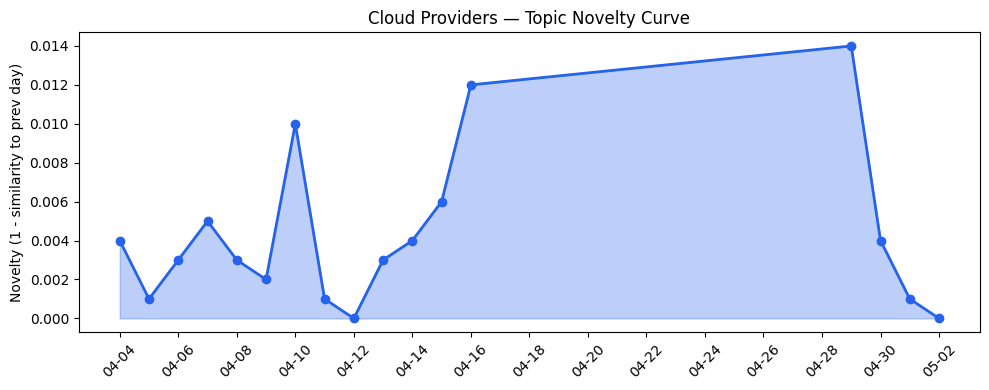
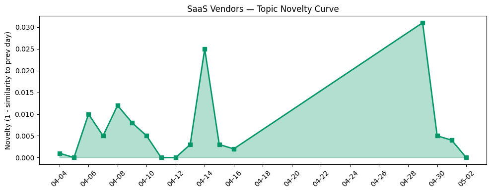

## 今日云计算结构性变化
> 云计算和SaaS产业正在经历技术、基础设施、应用层、资本和风险等多个维度的结构性变化，尤其是AI和云的融合进展迅速。
云计算和SaaS产业的结构性变化是多维度的，包括技术层、基础设施、应用层、资本和风险等方面。其中，AI和云的融合进展迅速，是当前产业发展的重要特征。这意味着云计算和SaaS产业正在经历一个重要的变革期，各个维度的变化都在推动产业的发展和演进。

- 📈 **持续趋势**：技术层话题已连续18天增强
- 🆕 **新兴方向**：Anthropic和Strella等新兴公司的出现
- 🔺 **突然升温**：基础设施、技术层和风险信号近3天突然集中出现
- 🔑 **新关键词**：AI、AWS、Adobe、Anthropic、Google Cloud、HubSpot、SaaS、云计算
- 📉 **消退关键词**：AI代理、AI基础设施、AI治理、Agentic AI、Kubernetes、可持续性、可持续计算、数字主权、数据主权、数据安全

## 技术层信号
🔴 重大突破

云原生/容器/K8s/Serverless、数据库/存储/网络、AI与云融合等技术层面都有重要进展。例如，[Top announcements of the What’s Next with AWS, 2026](https://aws.amazon.com/blogs/aws/top-announcements-of-the-whats-next-with-aws-2026/)、[What’s new with Google Cloud](https://cloud.google.com/blog/topics/inside-google-cloud/whats-new-google-cloud/)、[OpenAI’s GPT-5.5 in Microsoft Foundry](https://azure.microsoft.com/en-us/blog/openais-gpt-5-5-in-microsoft-foundry-frontier-intelligence-on-an-enterprise-ready-platform)等文章都体现了技术层面的重要变化。这些变化表明，云计算和SaaS产业正在经历技术层面的重要突破和进展。

## 产业资本信号
🔴 强信号

产业资本信号强烈，表明资本正在流向云计算和SaaS产业。例如，[Musely secures $360M from General Catalyst without giving up equity](https://techcrunch.com/2026/05/01/musely-secures-360m-from-general-catalyst-without-giving-up-equity/)、[Amazon and Chobani adopt Strella's AI interviews for customer research as fast-growing startup raises $14M](https://venturebeat.com/technology/amazon-and-chobani-adopt-strellas-ai-interviews-for-customer-research-as)等文章都体现了资本对云计算和SaaS产业的关注和投资。这些信号表明，资本市场对云计算和SaaS产业的发展前景是乐观的。

## 潜在拐点判断
基于今日信号和历史趋势，判断当前云计算和SaaS产业可能存在潜在拐点。技术层面的重大突破、产业资本信号的强烈、应用层面的重大进展等都表明，云计算和SaaS产业正在经历一个重要的变革期。如果这些趋势能够持续，可能会带来产业格局的重大变化和新一轮的发展机会。

## 明日观察点
1. 观察技术层面的进一步进展，尤其是AI和云的融合。
2. 关注产业资本信号的变化，尤其是对云计算和SaaS产业的投资和并购活动。
3. 分析应用层面的变化，尤其是企业上云和数字化转型的进展。

## 长期趋势坐标
从月/季尺度来看，云计算和SaaS产业的发展趋势仍然强劲。技术层面的进展、产业资本信号的强烈、应用层面的重大进展等都表明，云计算和SaaS产业正在经历一个长期的发展过程。如果这些趋势能够持续，可能会带来产业格局的重大变化和新一轮的发展机会。

## 数据洞察
### 云厂商话题演化
云厂商话题演化表明，当前云计算产业的发展趋势仍然强劲。[Top announcements of the What’s Next with AWS, 2026](https://aws.amazon.com/blogs/aws/top-announcements-of-the-whats-next-with-aws-2026/)、[What’s new with Google Cloud](https://cloud.google.com/blog/topics/inside-google-cloud/whats-new-google-cloud/)等文章都体现了云厂商的重要变化和进展。

### SaaS厂商话题演化
SaaS厂商话题演化表明，当前SaaS产业的发展趋势仍然强劲。[Scaling the Agentforce Life Sciences Ecosystem to Drive the Future of Pharma and MedTech](https://www.salesforce.com/blog/salesforce-scales-agentforce-life-sciences/)、[Do customers care about your brand’s integrity?](https://blog.adobe.com/en/publish/2022/06/28/do-customers-care-about-your-brands-integrity)等文章都体现了SaaS厂商的重要变化和进展。

### 趋势图

## 参考来源
- [Top announcements of the What’s Next with AWS, 2026](https://aws.amazon.com/blogs/aws/top-announcements-of-the-whats-next-with-aws-2026/) — AWS Blog
- [What’s new with Google Cloud](https://cloud.google.com/blog/topics/inside-google-cloud/whats-new-google-cloud/) — Google Cloud Blog
- [OpenAI’s GPT-5.5 in Microsoft Foundry](https://azure.microsoft.com/en-us/blog/openais-gpt-5-5-in-microsoft-foundry-frontier-intelligence-on-an-enterprise-ready-platform) — Microsoft Azure Blog
- [火山引擎正式推出四款数据产品](https://www.cnblogs.com/volcengine/p/15640481.html) — 火山引擎博客
- [Building the agentic cloud: everything we launched during Agents Week 2026](https://blog.cloudflare.com/agents-week-in-review/) — Cloudflare Blog
- [Optimize object storage costs automatically with smart tier](https://azure.microsoft.com/en-us/blog/optimize-object-storage-costs-automatically-with-smart-tier-now-generally-available) — Microsoft Azure Blog
- [Post-quantum encryption for Cloudflare IPsec is generally available](https://blog.cloudflare.com/post-quantum-ipsec/) — Cloudflare Blog
- [AWS Interconnect is now generally available, with a new option to simplify last-mile connectivity](https://aws.amazon.com/blogs/aws/aws-interconnect-is-now-generally-available-with-a-new-option-to-simplify-last-mile-connectivity/) — AWS Blog
- [Scaling the Agentforce Life Sciences Ecosystem to Drive the Future of Pharma and MedTech](https://www.salesforce.com/blog/salesforce-scales-agentforce-life-sciences/) — Salesforce Blog
- [Do customers care about your brand’s integrity?](https://blog.adobe.com/en/publish/2022/06/28/do-customers-care-about-your-brands-integrity) — Adobe Blog
- [AEO prompt tracking for marketing teams](https://blog.hubspot.com/marketing/aeo-prompt-tracking) — HubSpot Blog
- [Musely secures $360M from General Catalyst without giving up equity](https://techcrunch.com/2026/05/01/musely-secures-360m-from-general-catalyst-without-giving-up-equity/) — TechCrunch
- [Amazon and Chobani adopt Strella's AI interviews for customer research as fast-growing startup raises $14M](https://venturebeat.com/technology/amazon-and-chobani-adopt-strellas-ai-interviews-for-customer-research-as) — VentureBeat Enterprise
- [Tokenization takes the lead in the fight for data security](https://venturebeat.com/technology/tokenization-takes-the-lead-in-the-fight-for-data-security) — VentureBeat Enterprise
- [Shutdowns, power outages, and conflict: a review of Q1 2026 Internet disruptions](https://blog.cloudflare.com/q1-2026-internet-disruption-summary/) — Cloudflare Blog