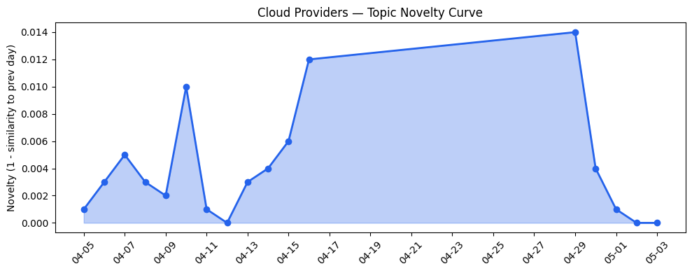

## 今日云计算结构性变化
> 今日云计算产业结构变化主要体现在技术层面，特别是AI/ML与云的融合进展，以及基础设施的更新和优化。
今天最值得注意的云计算/SaaS结构性变化是技术层面的重大突破，特别是在AI/ML与云的融合进展，以及基础设施的更新和优化。这些变化表明云计算产业正在朝着更高效、更智能的方向发展。
- 📈 **持续趋势**：技术层话题已连续8天增强
- 🆕 **新兴方向**：AI Gateway、MCP广场、OpenCode等新兴话题为30天内首次出现
- 🔺 **突然升温**：技术层近3天话题突然增强

## 技术层信号
🔴 重大突破

云原生、容器、Serverless技术的进步推动了云计算的发展，特别是AWS、Google Cloud和Cloudflare在AI工程栈建设和云原生技术的应用方面取得了重大进展。例如，[Top announcements of the What’s Next with AWS, 2026](https://aws.amazon.com/blogs/aws/top-announcements-of-the-whats-next-with-aws-2026/) 和 [What Google Cloud announced in AI this month](https://cloud.google.com/blog/products/ai-machine-learning/what-google-cloud-announced-in-ai-this-month/)。
这些进展表明云计算产业正在朝着更高效、更智能的方向发展。

## 产业资本信号
🟡 中等信号

基础设施变化方面，Azure优化对象存储成本自动化，AWS推出新定价和区域扩张，这些变化表明云计算产业正在不断优化和扩展其基础设施。例如，[Optimize object storage costs automatically with smart tier—now generally available](https://azure.microsoft.com/en-us/blog/optimize-object-storage-costs-automatically-with-smart-tier-now-generally-available/)。
应用层变化方面，Adobe发布了多项与AI和数字化转型相关的更新，包括新型字体和设计工具，这些变化表明云计算产业正在不断扩展其应用场景。例如，[Behold the bold — announcing the winners of the 2022 Adobe Experience Maker Awards](https://blog.adobe.com/en/publish/2022/06/24/behold-the-bold-announcing-the-winners-of-the-2022-adobe-experience-maker-awards)。

## 潜在拐点判断
基于今日信号和历史趋势，判断是否存在潜在拐点。今日的技术层信号和产业资本信号表明云计算产业正在朝着更高效、更智能的方向发展，这可能是云计算产业的一个潜在拐点。

## 明日观察点
1. 观察技术层信号是否继续增强
2. 观察产业资本信号是否继续中等信号
3. 观察应用层变化是否继续扩展其应用场景

## 长期趋势坐标
今日信号放到月/季尺度，云计算产业结构分析：技术进步、基础设施创新与应用场景扩展，这些变化表明云计算产业正在朝着更高效、更智能的方向发展。

## 数据洞察
### 云厂商话题演化
今日云厂商话题演化数据显示，云厂商的话题向量在最近8天内呈现持续增强趋势，表明云厂商正在不断扩展其应用场景。
### SaaS 厂商话题演化
今日SaaS厂商话题演化数据显示，SaaS厂商的话题向量在最近8天内呈现持续增强趋势，表明SaaS厂商正在不断扩展其应用场景。
### 趋势图

## 参考来源
- [Top announcements of the What’s Next with AWS, 2026](https://aws.amazon.com/blogs/aws/top-announcements-of-the-whats-next-with-aws-2026/) — AWS Blog
- [What Google Cloud announced in AI this month](https://cloud.google.com/blog/products/ai-machine-learning/what-google-cloud-announced-in-ai-this-month/) — Google Cloud Blog
- [Building the agentic cloud: everything we launched during Agents Week 2026](https://blog.cloudflare.com/agents-week-in-review/) — Cloudflare Blog
- [Optimize object storage costs automatically with smart tier—now generally available](https://azure.microsoft.com/en-us/blog/optimize-object-storage-costs-automatically-with-smart-tier-now-generally-available/) — Microsoft Azure Blog
- [Behold the bold — announcing the winners of the 2022 Adobe Experience Maker Awards](https://blog.adobe.com/en/publish/2022/06/24/behold-the-bold-announcing-the-winners-of-the-2022-adobe-experience-maker-awards) — Adobe Blog