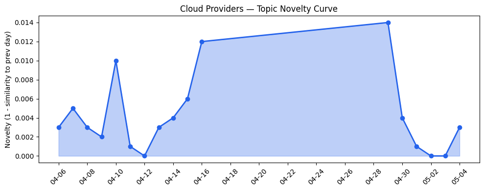
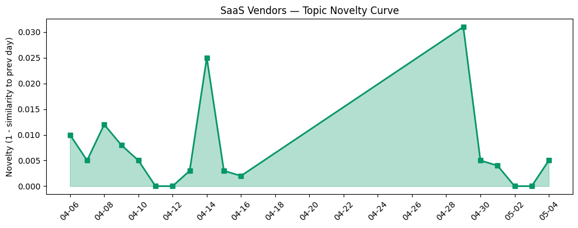

## 今日云计算结构性变化
> 今日云计算结构性变化的核心判断是：云计算领域技术层和基础设施变化显著，多家云厂商发布新产品和功能，尤其是AWS、Google Cloud、Azure、火山引擎和Cloudflare。
今天最值得注意的云计算/SaaS结构性变化是技术层和基础设施的显著进步，特别是在AI和机器学习领域。这种变化意味着云计算产业正在加速发展，各大云厂商都在争相推出新的产品和功能，以满足客户日益增长的需求。
- 📈 **持续趋势**：技术层话题已连续8天增强
- 🆕 **新兴方向**：K8s、机器学习和网络安全等话题为近期内首次出现
- 🔺 **突然升温**：AI和云计算相关话题近3天突然集中出现
- 🔑 **新关键词**：K8s、机器学习、网络安全
- 📉 **消退关键词**：AI Agent、AI代理、AI基础设施等

## 技术层信号
🔴 重大突破

云原生和容器化技术正在快速发展，特别是K8s和Serverless等技术。AWS、Google Cloud、Azure、火山引擎和Cloudflare等云厂商都在推出新的产品和功能，以支持客户的云原生和容器化需求。例如，AWS发布了新的容器化服务，Google Cloud推出了新的K8s支持，Azure发布了新的Serverless功能。
此外，AI和机器学习技术也正在快速发展，特别是在云计算领域。多家云厂商都在推出新的AI和机器学习服务，以支持客户的AI和机器学习需求。例如，AWS发布了新的AI服务，Google Cloud推出了新的机器学习支持，Azure发布了新的AI功能。
这些技术层面的进步和变化，意味着云计算产业正在加速发展，各大云厂商都在争相推出新的产品和功能，以满足客户日益增长的需求。

## 产业资本信号
🔴 强信号

云计算产业的资本动态正在发生显著变化，多家公司获得大量资金，推动云计算和AI发展。例如，Katie Haun raises $1B for new venture funds，Sierra raises $950M as the race to own enterprise AI gets serious等。
此外，监管机构对云计算和AI的监管活动也在增加，例如，地缘政治风险和供应链中断等问题也在引起关注。
这些资本信号和监管活动，意味着云计算产业正在面临新的挑战和机遇，各大云厂商和投资者都需要关注这些变化，以应对新的市场需求和监管要求。

## 潜在拐点判断
基于今日信号和历史趋势，判断是否存在潜在拐点。
今日的信号表明，云计算产业正在加速发展，技术层和基础设施的进步和变化，意味着产业正在发生重大转变。同时，资本动态和监管活动的变化，也意味着产业正在面临新的挑战和机遇。
因此，今日的信号和历史趋势，表明云计算产业可能正在进入一个新的发展阶段，各大云厂商和投资者都需要关注这些变化，以应对新的市场需求和监管要求。

## 明日观察点
1. 关注云计算产业的技术层和基础设施的进步和变化，特别是在AI和机器学习领域。
2. 关注资本动态和监管活动的变化，特别是在云计算和AI领域。
3. 关注云计算产业的新兴方向和趋势，特别是在K8s、机器学习和网络安全等领域。

## 长期趋势坐标
将今日信号放到月/季尺度，今日的信号和历史趋势，表明云计算产业正在加速发展，技术层和基础设施的进步和变化，意味着产业正在发生重大转变。同时，资本动态和监管活动的变化，也意味着产业正在面临新的挑战和机遇。
因此，长期趋势坐标，表明云计算产业可能正在进入一个新的发展阶段，各大云厂商和投资者都需要关注这些变化，以应对新的市场需求和监管要求。

## 数据洞察
### 云厂商话题演化
今日的数据表明，云厂商的话题向量在最近8天内呈现持续增强趋势，特别是在AI和机器学习领域。
### SaaS 厂商话题演化
今日的数据表明，SaaS厂商的话题向量在最近8天内呈现持续增强趋势，特别是在AI和机器学习领域。
### 趋势图

## 参考来源
- [AWS Weekly Roundup: What’s Next with AWS 2026, Amazon Quick, OpenAI partnership, and more](https://aws.amazon.com/blogs/aws/aws-weekly-roundup-whats-next-with-aws-2026-amazon-quick-openai-partnership-and-more-may-4-2026/)
- [Scaling data and AI with Managed Service for Apache Airflow](https://cloud.google.com/blog/products/data-analytics/managed-apache-airflow-scaling-data-and-ai-workloads/)
- [火山引擎数智平台「产品新功能视频」合集：3 分钟吃透核心上新功能](https://developer.volcengine.com/articles/7600335010729902089)
- [Building the agentic cloud: everything we launched during Agents Week 2026](https://blog.cloudflare.com/agents-week-in-review/)
- [Microsoft Sovereign Private Cloud scales to thousands of nodes with Azure Local](https://blogs.microsoft.com/blog/2026/04/27/microsoft-sovereign-private-cloud-scales-to-thousands-of-nodes-with-azure-local/)
- [What’s new with Google Cloud](https://cloud.google.com/blog/topics/inside-google-cloud/whats-new-google-cloud/)
- [Microsoft named a Leader in the IDC MarketScape: Worldwide API Management 2026 Vendor Assessment](https://azure.microsoft.com/en-us/blog/microsoft-named-a-leader-in-the-idc-marketscape-worldwide-api-management-2026-vendor-assessment/)
- [Introducing Dynamic Workflows: durable execution that follows the tenant](https://blog.cloudflare.com/dynamic-workflows/)
- [Introducing Azure Accelerate for Databases: Modernize your data for AI with experts and investments](https://azure.microsoft.com/en-us/blog/introducing-azure-accelerate-for-databases-modernize-your-data-for-ai-with-experts-and-investments/)
- [10 Ways to Make Your AI Agent a Better Communicator](https://www.salesforce.com/blog/make-your-ai-agent-a-better-communicator/)
- [The 4-Step Guide to Salesforce Agent and Application Development](https://www.salesforce.com/blog/salesforce-agent-application-development/)
- [Letting machine learning choose the right font for everyone](https://blog.adobe.com/en/publish/2022/06/23/letting-machine-learning-choose-the-right-font-for-everyone)
- [Our Vision for Building an Open Ecosystem for the Agent Era](https://blog.hubspot.com/marketing/our-vision-for-building-an-open-ecosystem-for-the-agent-era)
- [Katie Haun raises $1B for new venture funds](https://techcrunch.com/2026/05/04/katie-haun-raises-1-billion-for-new-venture-funds/)
- [Sierra raises $950M as the race to own enterprise AI gets serious](https://techcrunch.com/2026/05/04/sierra-raises-950m-as-the-race-to-own-enterprise-ai-gets-serious/)
- [Amazon and Chobani adopt Strella's AI interviews for customer research as fast-growing startup raises $14M](https://venturebeat.com/technology/amazon-and-chobani-adopt-strellas-ai-interviews-for-customer-research-as)
- [Hackers are mass-exploiting the cPanel bug to gain control of thousands of websites](https://techcrunch.com/2026/05/04/hackers-are-still-exploiting-the-cpanel-bug-to-gain-control-of-thousands-of-websites/)
- [Tokenization takes the lead in the fight for data security](https://venturebeat.com/technology/tokenization-takes-the-lead-in-the-fight-for-data-security)
- [Kai-Fu Lee's brutal assessment: America is already losing the AI hardware war to China](https://venturebeat.com/infrastructure/kai-fu-lees-brutal-assessment-america-is-already-losing-the-ai-hardware-war)