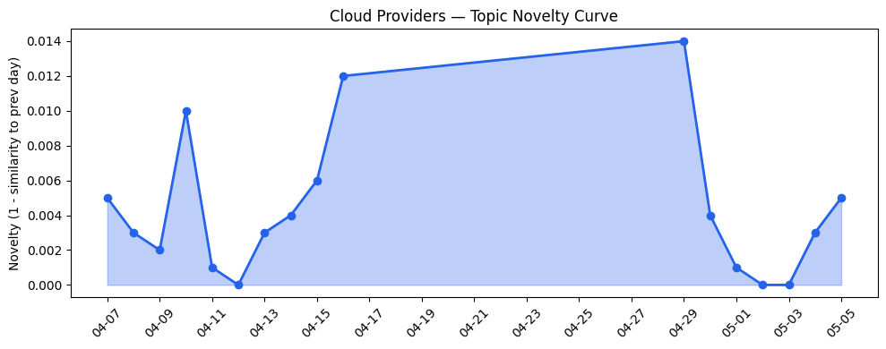
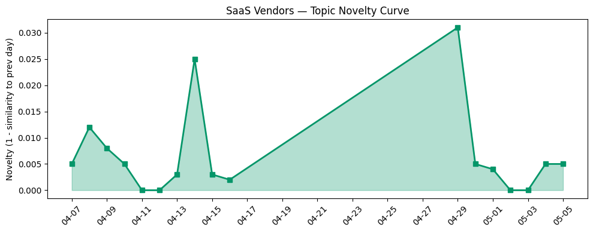

## 今日云计算结构性变化
> 云计算与SaaS产业结构变化主要体现在技术层面，尤其是AI与云的融合进展，以及基础设施的更新和优化，推动了企业的数字化转型。
今天最值得注意的云计算/SaaS结构性变化是技术层面的重大突破，特别是在AI与云的融合方面。Azure Accelerate for Databases帮助组织现代化数据库和构建AI-ready能力，Google Cloud推出Agent Gateway ISV生态系统，增强安全和治理能力。这些变化表明云计算和SaaS产业正在加速向AI驱动的数字化转型。
- 📈 **持续趋势**：基础设施的话题向量在最近8天内呈现持续增强趋势，表明该方向正在持续升温。
- 🆕 **新兴方向**：Agentforce Marketing和S3 Files为30天内首次出现的新关键词。
- 🔺 **突然升温**：AI、AWS、Adobe、Anthropic、Azure、Cloudflare、Google Cloud、HubSpot、SaaS、Salesforce等关键词近期突然集中出现。
- 🔑 **新关键词**：Agentforce Marketing、S3 Files。
- 📉 **消退关键词**：AI Agent、AI代理、AI基础设施、AI治理、主权AI、主权云、多云架构、数字主权、数据安全、数据治理等关键词近期出现消退趋势。

## 技术层信号
🔴 重大突破

云原生和容器技术的进展，特别是Azure Accelerate for Databases和Google Cloud的Agent Gateway ISV生态系统的推出，表明云计算和SaaS产业正在加速向云原生和AI驱动的数字化转型。这些技术进步不仅提高了企业的IT效率，也推动了企业的数字化转型和业务创新。
例如，[Introducing Azure Accelerate for Databases](https://azure.microsoft.com/en-us/blog/introducing-azure-accelerate-for-databases-modernize-your-data-for-ai-with-experts-and-investments/) 和 [Optimize object storage costs automatically with smart tier—now generally available](https://azure.microsoft.com/en-us/blog/optimize-object-storage-costs-automatically-with-smart-tier-now-generally-available/) 等文章，展示了Azure在云原生和AI驱动的数字化转型方面的进展。

## 产业资本信号
🔴 强信号

云计算和SaaS产业的资本流向主要体现在AI和加密货币领域的投资，例如a16z crypto获得2.2亿美元融资，继续投资AI和加密货币领域。同时，Strella获得1400万美元A轮融资，用于扩展其AI采访业务，表明AI驱动的业务创新正在获得资本的青睐。
例如，[As crypto cools, a16z crypto raises a $2.2B fund](https://techcrunch.com/2026/05/05/as-crypto-cools-a16zcrypto-raises-a-2-2b-fund/) 和 [Amazon and Chobani adopt Strella's AI interviews for customer research as fast-growing startup raises $14M](https://venturebeat.com/technology/amazon-and-chobani-adopt-strellas-ai-interviews-for-customer-research-as) 等文章，展示了云计算和SaaS产业的资本流向。

## 潜在拐点判断
基于今日信号和历史趋势，判断是否存在潜在拐点。今日的信号表明，云计算和SaaS产业正在加速向AI驱动的数字化转型，基础设施的更新和优化推动了企业的数字化转型。同时，资本流向AI和加密货币领域的投资，表明AI驱动的业务创新正在获得资本的青睐。
因此，今日的信号和历史趋势表明，云计算和SaaS产业可能正在进入一个新的发展阶段，AI驱动的数字化转型和业务创新将成为新的增长点。

## 明日观察点
1. 观察AI驱动的数字化转型的进展，特别是Azure Accelerate for Databases和Google Cloud的Agent Gateway ISV生态系统的推出。
2. 关注云计算和SaaS产业的资本流向，特别是AI和加密货币领域的投资。
3. 关注基础设施的更新和优化，特别是对象存储成本的优化和智能分层的推出。

## 长期趋势坐标
云计算和SaaS产业的长期趋势坐标主要体现在AI驱动的数字化转型和业务创新方面。今日的信号和历史趋势表明，云计算和SaaS产业正在加速向AI驱动的数字化转型，基础设施的更新和优化推动了企业的数字化转型。同时，资本流向AI和加密货币领域的投资，表明AI驱动的业务创新正在获得资本的青睐。
因此，长期趋势坐标表明，云计算和SaaS产业将继续向AI驱动的数字化转型和业务创新方向发展。

## 数据洞察
### 云厂商话题演化
云厂商的话题演化主要体现在AI驱动的数字化转型和基础设施的更新和优化方面。今日的信号表明，Azure Accelerate for Databases和Google Cloud的Agent Gateway ISV生态系统的推出，表明云厂商正在加速向AI驱动的数字化转型。
### SaaS厂商话题演化
SaaS厂商的话题演化主要体现在AI驱动的业务创新和数字化转型方面。今日的信号表明，HubSpot发布多篇关于AI和SEO的博客文章，包括AEO竞争对手分析和零点击搜索的未来，表明SaaS厂商正在加速向AI驱动的业务创新。
### 趋势图

## 参考来源
- [Introducing Azure Accelerate for Databases](https://azure.microsoft.com/en-us/blog/introducing-azure-accelerate-for-databases-modernize-your-data-for-ai-with-experts-and-investments/) — Microsoft Azure Blog
- [Optimize object storage costs automatically with smart tier—now generally available](https://azure.microsoft.com/en-us/blog/optimize-object-storage-costs-automatically-with-smart-tier-now-generally-available/) — Microsoft Azure Blog
- [As crypto cools, a16z crypto raises a $2.2B fund](https://techcrunch.com/2026/05/05/as-crypto-cools-a16zcrypto-raises-a-2-2b-fund/) — TechCrunch
- [Amazon and Chobani adopt Strella's AI interviews for customer research as fast-growing startup raises $14M](https://venturebeat.com/technology/amazon-and-chobani-adopt-strellas-ai-interviews-for-customer-research-as) — VentureBeat Enterprise