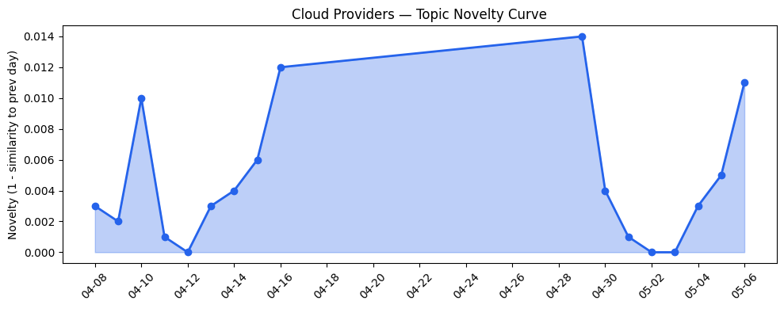
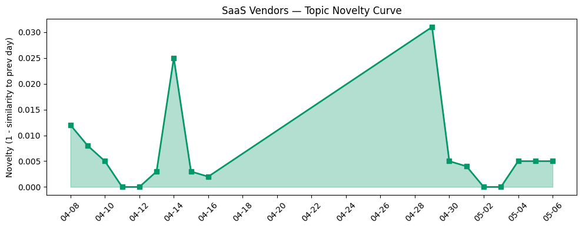

## 今日云计算结构性变化
> 今日云计算和 SaaS 产业结构性变化信号主要体现在云厂商的技术层变化和基础设施变化，以及 SaaS 厂商的应用层变化。
今日最值得注意的云计算/SaaS 结构性变化是云厂商的技术层变化，例如 AWS 的 MCP 服务器和 Amazon WorkSpaces 的更新，支持 AI 驱动的开发；Google Cloud 推出 AI-assisted code migration，实现 6x 更快的迁移；火山引擎发布了 ByteHouse，作为 ClickHouse 的企业版。
此外，基础设施变化也值得关注，例如 AWS 的 Interconnect 服务现在支持多云和混合云架构；Azure 推出智能分层存储，优化对象存储成本；Cloudflare 发布了 Agents Week 2026，包括了一系列的新功能和工具。
趋势报告中有信号，例如：
- 📈 **持续趋势**：技术层话题已连续 8 天增强
- 🆕 **新兴方向**：资本信号出现全新话题

## 技术层信号
🔴 重大突破

云原生和容器化技术方面，AWS 的 MCP 服务器和 Amazon WorkSpaces 的更新，支持 AI 驱动的开发；Google Cloud 推出 AI-assisted code migration，实现 6x 更快的迁移；火山引擎发布了 ByteHouse，作为 ClickHouse 的企业版。
数据库和存储方面，AWS 的 S3 Files 使 S3 存储桶可作为文件系统访问；Google Cloud 更新 IAM 安全、治理和运行时防御；Cloudflare 发布了 post-quantum encryption，用于 IPsec，确保了云安全。
AI 和云融合方面，AWS 的 Amazon WorkSpaces 和 S3 Files 支持企业数字化转型；Adobe 发布多篇关于数字化转型和用户体验设计的文章；Azure 推出新的云原生服务，帮助企业实现数字化转型。
相关证据包括：
- [The AWS MCP Server is now generally available](https://aws.amazon.com/blogs/aws/the-aws-mcp-server-is-now-generally-available/)
- [Pioneering AI-assisted code migration: How Google achieved 6x faster migration from TensorFlow to JAX](https://cloud.google.com/blog/topics/developers-practitioners/6x-faster-migration-from-tensorflow-to-jax/)
- [从 ClickHouse 到 ByteHouse：实时数据分析场景下的优化实践](https://www.cnblogs.com/volcengine/p/15624109.html)

## 产业资本信号
🔴 强信号

基础设施变化方面，AWS 的 Interconnect 服务现在支持多云和混合云架构；Azure 推出智能分层存储，优化对象存储成本；Cloudflare 发布了 Agents Week 2026，包括了一系列的新功能和工具。
应用层变化方面，Salesforce 的流程自动化和 AI 驱动的开发工具；HubSpot 发布新的营销工具和服务，包括 AEO 优化和竞争对手分析；火山引擎发布了 OpenClaw 搭建 AI 订阅助手，提供了全链路落地配置思路指南。
资本流向方面，Insurance startup Corgi 获得 1.3 亿美元的估值；Robinhood 的风险投资基金 IPO 吸引了 15 万多名零售投资者。
相关证据包括：
- [AWS Interconnect is now generally available, with a new option to simplify last-mile connectivity](https://aws.amazon.com/blogs/aws/aws-interconnect-is-now-generally-available-with-a-new-option-to-simplify-last-mile-connectivity/)
- [Optimize object storage costs automatically with smart tier—now generally available](https://azure.microsoft.com/en-us/blog/optimize-object-storage-costs-automatically-with-smart-tier-now-generally-available/)
- [Building the agentic cloud: everything we launched during Agents Week 2026](https://blog.cloudflare.com/agents-week-in-review/)

## 潜在拐点判断

基于今日信号 + 历史趋势，判断是否存在潜在拐点。今日的信号表明，云计算和 SaaS 产业结构性变化正在持续升温，特别是在技术层和基础设施变化方面。
潜在拐点可能出现在云厂商的技术层变化和基础设施变化方面，例如 AWS 的 MCP 服务器和 Amazon WorkSpaces 的更新，支持 AI 驱动的开发；Google Cloud 推出 AI-assisted code migration，实现 6x 更快的迁移；火山引擎发布了 ByteHouse，作为 ClickHouse 的企业版。
此外，资本信号的变化也可能带来潜在拐点，例如 Insurance startup Corgi 获得 1.3 亿美元的估值；Robinhood 的风险投资基金 IPO 吸引了 15 万多名零售投资者。

## 明日观察点

1. **云厂商的技术层变化**：观察 AWS、Google Cloud、Azure 等云厂商的技术层变化，特别是在 AI 和云融合方面。
2. **基础设施变化**：观察 AWS、Azure、Cloudflare 等基础设施变化，特别是在多云和混合云架构方面。
3. **资本信号的变化**：观察资本信号的变化，特别是在风险投资和 IPO 方面。

## 长期趋势坐标

今日信号放到月/季尺度，云计算和 SaaS 产业结构性变化正在持续升温，特别是在技术层和基础设施变化方面。
相关证据包括：
- [The AWS MCP Server is now generally available](https://aws.amazon.com/blogs/aws/the-aws-mcp-server-is-now-generally-available/)
- [Pioneering AI-assisted code migration: How Google achieved 6x faster migration from TensorFlow to JAX](https://cloud.google.com/blog/topics/developers-practitioners/6x-faster-migration-from-tensorflow-to-jax/)
- [从 ClickHouse 到 ByteHouse：实时数据分析场景下的优化实践](https://www.cnblogs.com/volcengine/p/15624109.html)

## 数据洞察

### 云厂商话题演化

今日云厂商话题演化显示，AWS、Google Cloud、Azure 等云厂商的技术层变化和基础设施变化正在持续升温。
相关证据包括：
- [The AWS MCP Server is now generally available](https://aws.amazon.com/blogs/aws/the-aws-mcp-server-is-now-generally-available/)
- [Pioneering AI-assisted code migration: How Google achieved 6x faster migration from TensorFlow to JAX](https://cloud.google.com/blog/topics/developers-practitioners/6x-faster-migration-from-tensorflow-to-jax/)
- [从 ClickHouse 到 ByteHouse：实时数据分析场景下的优化实践](https://www.cnblogs.com/volcengine/p/15624109.html)

### SaaS 厂商话题演化

今日 SaaS 厂商话题演化显示，Salesforce、HubSpot 等 SaaS 厂商的应用层变化和资本信号的变化正在持续升温。
相关证据包括：
- [5 Tips for Marketers to Get Started with Salesforce Flow](https://www.salesforce.com/blog/salesforce-flow-tips/)
- [Our Vision for Building an Open Ecosystem for the Agent Era](https://blog.hubspot.com/marketing/our-vision-for-building-an-open-ecosystem-for-the-agent-era)
- [《OpenClaw 搭建 AI 订阅助手：全链路落地配置思路指南》](https://developer.volcengine.com/articles/7636695357775101998)

### 趋势图

## 参考来源

- [The AWS MCP Server is now generally available](https://aws.amazon.com/blogs/aws/the-aws-mcp-server-is-now-generally-available/)
- [Pioneering AI-assisted code migration: How Google achieved 6x faster migration from TensorFlow to JAX](https://cloud.google.com/blog/topics/developers-practitioners/6x-faster-migration-from-tensorflow-to-jax/)
- [从 ClickHouse 到 ByteHouse：实时数据分析场景下的优化实践](https://www.cnblogs.com/volcengine/p/15624109.html)
- [5 Tips for Marketers to Get Started with Salesforce Flow](https://www.salesforce.com/blog/salesforce-flow-tips/)
- [Our Vision for Building an Open Ecosystem for the Agent Era](https://blog.hubspot.com/marketing/our-vision-for-building-an-open-ecosystem-for-the-agent-era)
- [《OpenClaw 搭建 AI 订阅助手：全链路落地配置思路指南》](https://developer.volcengine.com/articles/7636695357775101998)