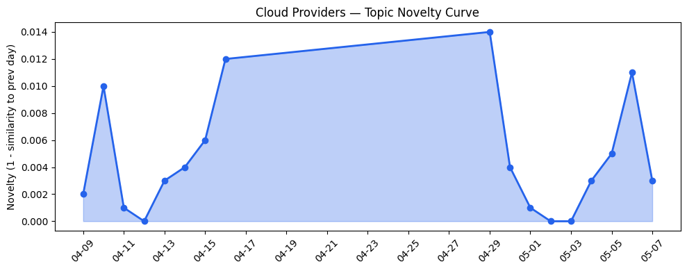
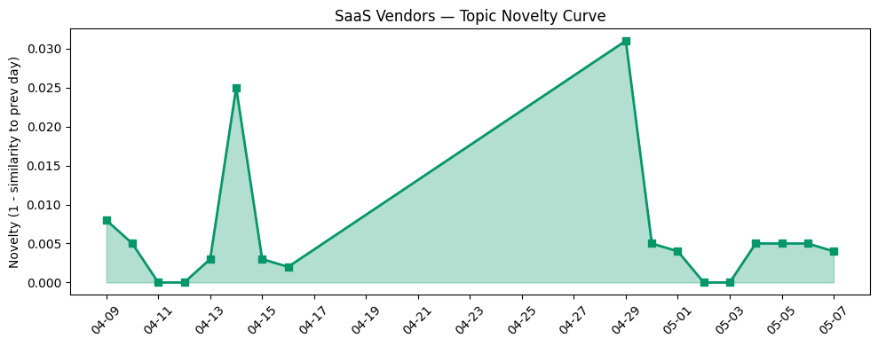

## 今日云计算结构性变化
> 今日云计算和SaaS产业结构性变化信号主要体现在云厂商的技术层变化和基础设施变化，以及SaaS厂商的应用层变化，AI驱动的开发和数字化转型成为主要趋势。
今日最值得注意的云计算/SaaS结构性变化是云厂商和SaaS厂商在技术层和应用层的持续升温，特别是AI驱动的开发和数字化转型的推动。同时，资本信号也出现了新兴方向的早期信号，表明市场正在发生变化。趋势报告中，技术层和应用层的话题向量在最近8天内呈现持续增强趋势，资本信号出现全新话题，新兴关键词包括数字签名和用户体验设计。

- 📈 **持续趋势**：技术层话题已连续8天增强
- 🆕 **新兴方向**：资本信号出现全新话题
- 🔺 **突然升温**：应用层话题近8天突然集中出现
- 🔑 **新关键词**：数字签名、用户体验设计
- 📉 **消退关键词**：AI Agent、AI代理、AI基础设施等

## 技术层信号
🔴 重大突破

云原生、容器、K8s、Serverless等技术层面变化是今日结构性变化的重要组成部分。AWS推出MCP Server和Claude Opus 4.7模型，Google Cloud推出Gemini 3.1 Flash-Lite，火山引擎推出ByteHouse等新产品和服务，表明云厂商在技术层面上持续创新。同时，基础设施变化也在推动云计算的发展，AWS推出S3 Files和AWS Interconnect，Google Cloud推出Bigtable内存层，Cloudflare推出post-quantum encryption和Dynamic Workflows等。这些变化表明云计算和SaaS产业正在快速发展，技术层面上的创新是推动这一发展的重要动力。

## 产业资本信号
🔴 强信号

今日产业资本信号主要体现在资本流向和基础设施变化上。Kodiak AI获得1亿美元融资，Gusto达到10亿美元收入，OpenAI推出新安全措施等资本信号表明市场正在发生变化。同时，云厂商和SaaS厂商在基础设施变化上也表现出强信号，AWS推出新区域和定价策略，Google Cloud推出新产品和服务，火山引擎推出全系云产品等。这些变化表明产业资本正在向云计算和SaaS领域流动，基础设施变化是推动这一流动的重要因素。

## 潜在拐点判断
今日结构性变化信号表明云计算和SaaS产业可能正在经历一个潜在的拐点。技术层面上的创新和基础设施变化推动了云计算的发展，而资本信号的变化则表明市场正在发生变化。这些变化可能会带来新的发展机会和挑战，云厂商和SaaS厂商需要紧跟这些变化，创新和适应以保持竞争力。

## 明日观察点
1. 观察技术层面上的变化，特别是AI驱动的开发和数字化转型的推动。
2. 关注资本信号的变化，特别是新兴方向的早期信号。
3. 密切关注云厂商和SaaS厂商在基础设施变化上的动态。

## 长期趋势坐标
今日结构性变化信号表明云计算和SaaS产业正在快速发展，技术层面上的创新和基础设施变化是推动这一发展的重要动力。长期来看，云计算和SaaS产业可能会继续发展，技术层面上的创新和基础设施变化将继续推动这一发展。同时，资本信号的变化也将继续影响市场，新兴方向的早期信号可能会带来新的发展机会和挑战。

## 数据洞察
### 云厂商话题演化
今日云厂商话题演化呈现延续趋势，新颖度评分为0.022，平均相似度为0.978。历史数据显示，云厂商话题演化在最近18天内呈现稳定趋势，今日的变化主要体现在技术层面上的创新和基础设施变化上。
### SaaS厂商话题演化
今日SaaS厂商话题演化呈现延续趋势，新颖度评分为0.029，平均相似度为0.971。历史数据显示，SaaS厂商话题演化在最近18天内呈现稳定趋势，今日的变化主要体现在应用层面的创新和数字化转型的推动上。
### 趋势图

## 参考来源
- [The AWS MCP Server is now generally available](https://aws.amazon.com/blogs/aws/the-aws-mcp-server-is-now-generally-available/)
- [Introducing Anthropic’s Claude Opus 4.7 model in Amazon Bedrock](https://aws.amazon.com/blogs/aws/introducing-anthropics-claude-opus-4-7-model-in-amazon-bedrock/)
- [Gemini 3.1 Flash-Lite is now generally available on Gemini Enterprise Agent Platform](https://cloud.google.com/blog/products/ai-machine-learning/gemini-3-1-flash-lite-is-now-generally-available/)
- [New Bigtable in-memory tier for sub-millisecond read latency](https://cloud.google.com/blog/products/databases/scaling-real-time-performance-with-bigtable-in-memory-tier/)
- [从 ClickHouse 到 ByteHouse：实时数据分析场景下的优化实践](https://www.cnblogs.com/volcengine/p/15624109.html)
- [Post-quantum encryption for Cloudflare IPsec is generally available](https://blog.cloudflare.com/post-quantum-ipsec/)
- [Enforcing trust and transparency: Open-sourcing the Azure Integrated HSM](https://azure.microsoft.com/en-us/blog/enforcing-trust-and-transparency-open-sourcing-the-azure-integrated-hsm/)
- [火山引擎正式推出四款数据产品 将持续完善敏捷数智引擎矩阵](https://www.cnblogs.com/volcengine/p/15640481.html)
- [Introducing Dynamic Workflows: durable execution that follows the tenant](https://blog.cloudflare.com/dynamic-workflows/)
- [veStack × DeepSeek-V4：从模型到企业级 Agent，一步到位](https://developer.volcengine.com/articles/7636975041591214086)
- [Architect the Future UI: Slack as Your Agentic Surface](https://www.salesforce.com/blog/slack-agentic-enterprise-architecture/)
- [Using certified digital signatures on documents to increase trust in online information](https://blog.adobe.com/en/publish/2022/06/30/using-certified-digital-signatures-on-documents-to-increase-trust-in-online-information)
- [How to get started in user experience design](https://blog.adobe.com/en/publish/2022/06/27/how-to-get-started-in-ux-design)
- [Digital Marketing Optimization: 10 Best Strategies to Increase Marketing ROI](https://blog.hubspot.com/marketing/digital-marketing-optimization)
- [Our Vision for Building an Open Ecosystem for the Agent Era](https://blog.hubspot.com/marketing/our-vision-for-building-an-open-ecosystem-for-the-agent-era)
- [Kodiak AI raises $100M at a steep discount, sending its stock tumbling 37%](https://techcrunch.com/2026/05/07/kodiak-ai-raises-100m-at-a-steep-discount-sending-its-stock-tumbling-37/)
- [Elon Musk’s lawsuit is putting OpenAI’s safety record under the microscope](https://techcrunch.com/2026/05/07/elon-musks-lawsuit-is-putting-openais-safety-record-under-the-microscope/)
- [60% of MD5 password hashes are crackable in under an hour](https://www.theregister.com/security/2026/05/07/60-of-md5-password-hashes-are-crackable-in-under-an-hour/5234954)
- [IBM Cloud evaporates as datacenter loses power](https://www.theregister.com/off-prem/2026/05/07/ibm-cloud-evaporates-as-datacenter-loses-power/5234835)
- [Fake IT workers rented laptops to Nork scammers, got prison time](https://www.theregister.com/cyber-crime/2026/05/07/fake-it-workers-rented-laptops-to-nork-scammers-got-prison-time/5235342)