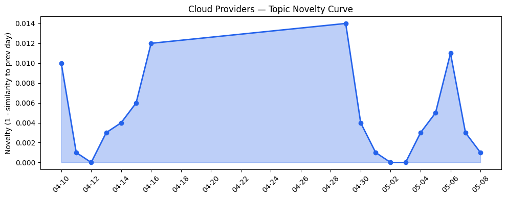
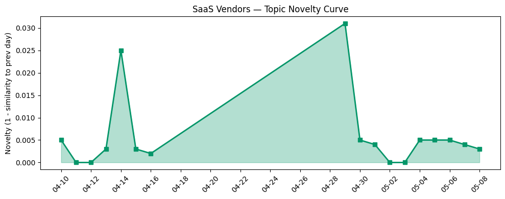

## 今日云计算结构性变化
> 云计算和SaaS领域持续创新，特别是在技术层和基础设施层的进展，包括AWS、Google Cloud、Microsoft Azure和火山引擎的云产品发布和技术更新。
今天最值得注意的云计算/SaaS结构性变化是技术层和基础设施层的重大突破，特别是AWS、Google Cloud和Microsoft Azure的云原生服务和火山引擎的新产品发布。这些变化表明云计算和SaaS领域的创新步伐正在加快，这意味着企业和开发者将拥有更多的选择和工具来构建和部署应用程序。
- 📈 **持续趋势**：技术层话题已连续8天增强
- 🆕 **新兴方向**：资本信号出现全新话题
- 🔺 **突然升温**：技术层近3天内容相似度显著高于更早期均值
- 🔑 **新关键词**：ByteHouse, ClickHouse, 数据分析
- 📉 **消退关键词**：AI Agent, AI代理, AI基础设施等

## 技术层信号
🔴 重大突破

云原生/容器/K8s/Serverless方面，AWS、Google Cloud和Microsoft Azure推出新的云原生服务，例如AWS的MCP Server和Google Cloud的Gemini CLI DevOps Extension。数据库/存储/网络方面，火山引擎和Cloudflare推出新产品和技术，增强云计算和安全能力。AI与云融合方面，Adobe和Salesforce推出新的解决方案，例如Adobe的UX设计工具和Salesforce的Slack集成。
这些信号表明技术层的创新步伐正在加快，企业和开发者将拥有更多的选择和工具来构建和部署应用程序。例如，[The AWS MCP Server is now generally available](https://aws.amazon.com/blogs/aws/the-aws-mcp-server-is-now-generally-available/) 和 [Scaling cloud and AI: Microsoft Azure’s commitment to Europe’s digital future](https://azure.microsoft.com/en-us/blog/scaling-cloud-and-ai-microsoft-azures-commitment-to-europes-digital-future/)。

## 产业资本信号
🔴 强信号

基础设施变化方面，Microsoft Azure推出新的定价策略和计算服务，火山引擎和Google Cloud推出新的计算服务和数据产品。应用层变化方面，Adobe和Salesforce推出新的解决方案，例如Adobe的UX设计工具和Salesforce的Slack集成。资本流向方面，投资者关注云计算和SaaS领域的创新，估值和并购活动保持活跃。
这些信号表明产业资本正在积极流向云计算和SaaS领域，企业和开发者将拥有更多的选择和工具来构建和部署应用程序。例如，[Optimize object storage costs automatically with smart tier—now generally available](https://azure.microsoft.com/en-us/blog/optimize-object-storage-costs-automatically-with-smart-tier-now-generally-available/) 和 [With faster node startup for GKE, say goodbye to cold-start latency](https://cloud.google.com/blog/products/containers-kubernetes/gke-node-startup-gets-faster/)。

## 潜在拐点判断
基于今日信号和历史趋势，判断是否存在潜在拐点。目前，技术层和基础设施层的重大突破，表明云计算和SaaS领域的创新步伐正在加快，这可能是一个潜在的拐点信号。

## 明日观察点
1. 观察技术层和基础设施层的进一步发展，特别是AWS、Google Cloud和Microsoft Azure的云原生服务和火山引擎的新产品发布。
2. 关注资本流向云计算和SaaS领域的变化，特别是投资者对创新领域的关注。
3. 跟踪应用层的变化，特别是Adobe和Salesforce的新解决方案。

## 长期趋势坐标
将今日信号放到月/季尺度，云计算和SaaS领域的创新步伐正在加快，技术层和基础设施层的重大突破，表明企业和开发者将拥有更多的选择和工具来构建和部署应用程序。

## 数据洞察
### 云厂商话题演化
云厂商话题向量在最近8天内呈现持续增强趋势，表明该方向正在持续升温。
### SaaS 厂商话题演化
SaaS厂商话题向量在最近8天内呈现持续增强趋势，表明该方向正在持续升温。
### 趋势图

## 参考来源
- [The AWS MCP Server is now generally available](https://aws.amazon.com/blogs/aws/the-aws-mcp-server-is-now-generally-available/) — AWS Blog
- [Scaling cloud and AI: Microsoft Azure’s commitment to Europe’s digital future](https://azure.microsoft.com/en-us/blog/scaling-cloud-and-ai-microsoft-azures-commitment-to-europes-digital-future/) — Microsoft Azure Blog
- [火山引擎正式推出四款数据产品 将持续完善敏捷数智引擎矩阵](https://www.cnblogs.com/volcengine/p/15640481.html) — 火山引擎博客
- [Ship code within minutes with the Gemini CLI DevOps Extension](https://cloud.google.com/blog/topics/developers-practitioners/ship-code-within-minutes-with-the-gemini-cli-devops-extension/) — Google Cloud Blog
- [New Bigtable in-memory tier for sub-millisecond read latency](https://cloud.google.com/blog/products/databases/scaling-real-time-performance-with-bigtable-in-memory-tier/) — Google Cloud Blog
- [从 ClickHouse 到 ByteHouse：实时数据分析场景下的优化实践](https://www.cnblogs.com/volcengine/p/15624109.html) — 火山引擎博客
- [Post-quantum encryption for Cloudflare IPsec is generally available](https://blog.cloudflare.com/post-quantum-ipsec/) — Cloudflare Blog
- [Optimize object storage costs automatically with smart tier—now generally available](https://azure.microsoft.com/en-us/blog/optimize-object-storage-costs-automatically-with-smart-tier-now-generally-available/) — Microsoft Azure Blog
- [With faster node startup for GKE, say goodbye to cold-start latency](https://cloud.google.com/blog/products/containers-kubernetes/gke-node-startup-gets-faster/) — Google Cloud Blog
- [字节跳动是如何建设云的？](https://www.cnblogs.com/volcengine/p/15633967.html) — 火山引擎博客
- [How to Make Your Email Marketing Accessible for Everyone](https://www.salesforce.com/blog/accessible-email-marketing/) — Salesforce Blog
- [Architect the Future UI: Slack as Your Agentic Surface](https://www.salesforce.com/blog/slack-agentic-enterprise-architecture/) — Salesforce Blog
- [Fresh new foundries and fonts from the Americas, and Hidden Treasures revisited](https://blog.adobe.com/en/publish/2022/06/30/fresh-new-foundries-fonts-from-americas-hidden-treasures-revisited) — Adobe Blog
- [How to get started in user experience design](https://blog.adobe.com/en/publish/2022/06/27/how-to-get-started-in-ux-design) — Adobe Blog
- [Mother Ventures is looking at moms as the ‘economic engine’](https://techcrunch.com/2026/05/08/mother-ventures-is-looking-at-moms-as-the-economic-engine/) — TechCrunch
- [Poland says hackers breached water treatment plants, and the US is facing the same threat](https://techcrunch.com/2026/05/08/poland-says-hackers-breached-water-treatment-plants-and-the-u-s-is-facing-the-same-threat/) — TechCrunch
- [Trump jumps from 'anything goes' to 'strict regulation' AI policy](https://www.theregister.com/ai-and-ml/2026/05/08/trump-jumps-from-anything-goes-to-strict-regulation-ai-policy/5234687) — The Register