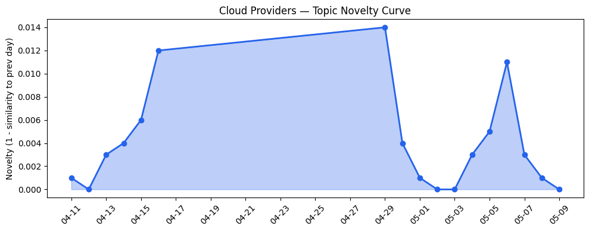
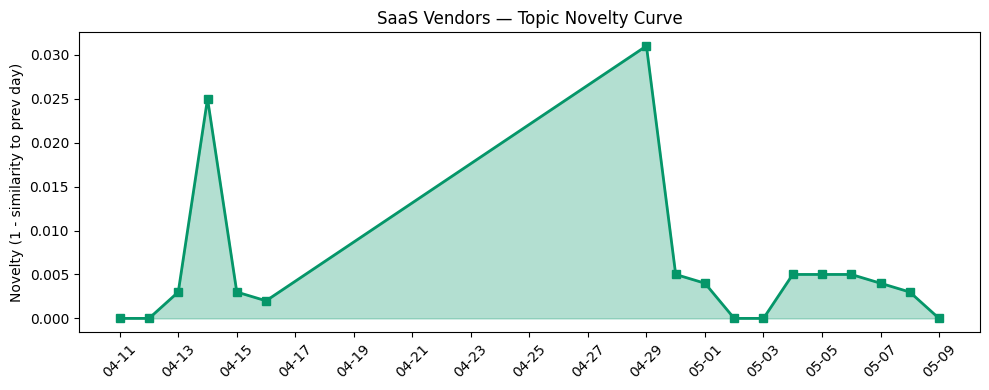

## 今日云计算结构性变化
> 今日云计算和SaaS产业结构变化主要体现在技术层面的AI和云原生应用的推进，以及基础设施层的扩张和安全性的增强。
今日最值得注意的云计算/SaaS结构性变化是技术层面的突破，尤其是在AI和云原生应用方面。AWS、Google Cloud和Azure推出了新的云原生服务，火山引擎发布ByteHouse，作为ClickHouse企业版。同时，基础设施层的扩张和安全性的增强也体现在AWS、Google Cloud和Azure推出的新的基础设施更新，包括智能存储层和Post-quantum encryption。
- 📈 **持续趋势**：技术层话题已连续8天增强
- 🆕 **新兴方向**：资本信号和风险信号出现全新话题
- 🔺 **突然升温**：技术层近3天内容相似度显著高于更早期均值
- 🔑 **新关键词**：Post-quantum encryption, 云成本优化
- 📉 **消退关键词**：AI Agent, 主权云, 数据安全等

## 技术层信号
🔴 重大突破

云原生和AI技术的推进是今日技术层信号的主要内容。AWS、Google Cloud和Azure推出了新的云原生服务，火山引擎发布ByteHouse，作为ClickHouse企业版。这些推进表明云计算和SaaS产业正在朝着更高效、更安全的方向发展。同时，Post-quantum encryption的出现也体现了产业对安全性的重视。
根据趋势报告，技术层的话题向量在最近8天内呈现持续增强趋势，表明该方向正在持续升温。同时，技术层近3天内容相似度显著高于更早期均值，表明该方向话题突然增强。
参考文献：
- [The AWS MCP Server is now generally available](https://aws.amazon.com/blogs/aws/the-aws-mcp-server-is-now-generally-available/)
- [Ship code within minutes with the Gemini CLI DevOps Extension](https://cloud.google.com/blog/topics/developers-practitioners/ship-code-within-minutes-with-the-gemini-cli-devops-extension/)
- [Scaling cloud and AI: Microsoft Azure’s commitment to Europe’s digital future](https://azure.microsoft.com/en-us/blog/scaling-cloud-and-ai-microsoft-azures-commitment-to-europes-digital-future/)
- [从 ClickHouse 到 ByteHouse：实时数据分析场景下的优化实践](https://www.cnblogs.com/volcengine/p/15624109.html)
- [Post-quantum encryption for Cloudflare IPsec is generally available](https://blog.cloudflare.com/post-quantum-ipsec/)

## 产业资本信号
🟡 中等信号

今日产业资本信号主要体现在Nvidia已经投资了40亿美元于AI领域，Cloudflare的收入创历史新高，但也宣布了大规模裁员。同时，AWS和Salesforce的战略投资和收购继续推动行业发展。
这些信号表明产业资本仍然积极投入于云计算和SaaS领域，尤其是在AI和云原生应用方面。然而，Cloudflare的裁员也表明产业仍然存在风险和不确定性。
参考文献：
- [Nvidia has already committed $40B to equity AI deals this year](https://techcrunch.com/2026/05/09/nvidia-has-already-committed-40b-to-equity-ai-deals-this-year/)

## 潜在拐点判断
根据今日信号和历史趋势，判断是否存在潜在拐点。技术层面的突破和资本信号的中等信号表明产业正在朝着更高效、更安全的方向发展。然而，风险信号的出现也表明产业仍然存在风险和不确定性。因此，今日未观察到明显的拐点信号。

## 明日观察点
1. 观察技术层面的进一步推进，尤其是在AI和云原生应用方面。
2. 关注资本信号的变化，尤其是在Nvidia和Cloudflare的投资和裁员方面。
3. 密切关注风险信号的发展，尤其是在数据隐私和安全方面。

## 长期趋势坐标
今日信号放到月/季尺度，技术层面的突破和资本信号的中等信号表明产业正在朝着更高效、更安全的方向发展。然而，风险信号的出现也表明产业仍然存在风险和不确定性。因此，长期趋势坐标仍然需要密切关注技术层面的推进和资本信号的变化。

## 数据洞察
### 云厂商话题演化
今日云厂商话题演化主要体现在AWS、Google Cloud和Azure推出的新的云原生服务和基础设施更新。这些推进表明云计算和SaaS产业正在朝着更高效、更安全的方向发展。
### SaaS 厂商话题演化
今日SaaS厂商话题演化主要体现在Salesforce、Adobe和HubSpot推出的新的行业解决方案和产品。这些推进表明SaaS产业正在朝着更高效、更安全的方向发展。
### 趋势图

## 参考来源
- [The AWS MCP Server is now generally available](https://aws.amazon.com/blogs/aws/the-aws-mcp-server-is-now-generally-available/)
- [Ship code within minutes with the Gemini CLI DevOps Extension](https://cloud.google.com/blog/topics/developers-practitioners/ship-code-within-minutes-with-the-gemini-cli-devops-extension/)
- [Scaling cloud and AI: Microsoft Azure’s commitment to Europe’s digital future](https://azure.microsoft.com/en-us/blog/scaling-cloud-and-ai-microsoft-azures-commitment-to-europes-digital-future/)
- [从 ClickHouse 到 ByteHouse：实时数据分析场景下的优化实践](https://www.cnblogs.com/volcengine/p/15624109.html)
- [Post-quantum encryption for Cloudflare IPsec is generally available](https://blog.cloudflare.com/post-quantum-ipsec/)
- [Nvidia has already committed $40B to equity AI deals this year](https://techcrunch.com/2026/05/09/nvidia-has-already-committed-40b-to-equity-ai-deals-this-year/)
- [Point of Sale Innovations to Modernize the Shopper Experience](https://www.salesforce.com/blog/point-of-sale-innovations/)
- [Our Vision for Building an Open Ecosystem for the Agent Era](https://blog.hubspot.com/marketing/our-vision-for-building-an-open-ecosystem-for-the-agent-era)
- [AI 重构测试行业！火山引擎云手机应用助手重磅来袭！](https://developer.volcengine.com/articles/7636726376603041833)