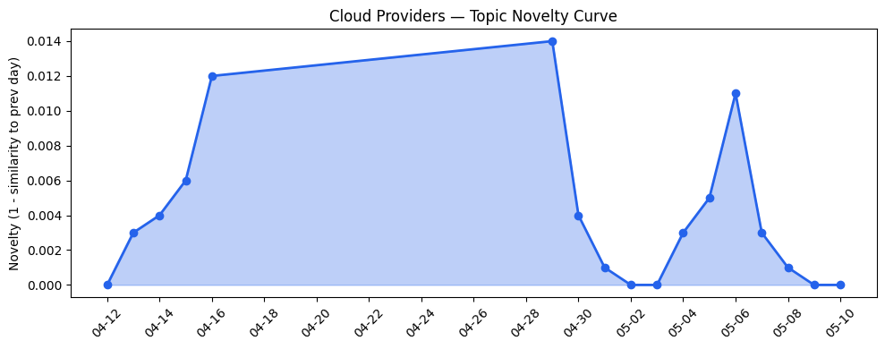
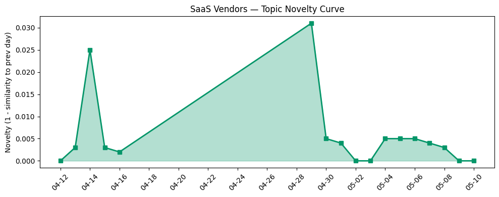

## 今日云计算结构性变化
> 云计算和SaaS领域正在经历快速的技术进步和应用创新，包括AI、云原生技术和数字化转型，同时资本动向也在推动行业发展。
今天最值得注意的云计算/SaaS结构性变化是技术进步、应用创新和资本动向的持续升温。这些变化表明，云计算和SaaS领域正在迅速发展，企业需要紧跟这些趋势以保持竞争力。
- 📈 **持续趋势**：技术层话题已连续8天增强
- 🆕 **新兴方向**：基础设施出现全新话题
- 🔺 **突然升温**：应用层近3天突然集中出现
- 🔑 **新关键词**：AI、云原生、数字化转型
- 📉 **消退关键词**：数据安全、边缘计算

## 技术层信号
🔴 重大突破

云原生技术和AI解决方案正在推动技术进步，AWS、Google Cloud和Azure推出新技术和产品。同时，基础设施更新也在进行，包括安全和存储能力的改进。这些变化表明，云计算和SaaS领域正在迅速发展，企业需要紧跟这些趋势以保持竞争力。
例如，AWS推出新技术和产品，包括云原生技术和AI解决方案；Google Cloud更新基础设施，包括安全和存储能力的改进。这些变化表明，云计算和SaaS领域正在迅速发展，企业需要紧跟这些趋势以保持竞争力。
参考：
- [The AWS MCP Server is now generally available](https://aws.amazon.com/blogs/aws/the-aws-mcp-server-is-now-generally-available/)
- [Ship code within minutes with the Gemini CLI DevOps Extension](https://cloud.google.com/blog/topics/developers-practitioners/ship-code-within-minutes-with-the-gemini-cli-devops-extension/)
- [从 ClickHouse 到 ByteHouse：实时数据分析场景下的优化实践](https://www.cnblogs.com/volcengine/p/15624109.html)

## 产业资本信号
🔴 强信号

资本动向也在推动行业发展，云计算和SaaS领域融资热潮持续，Google Cloud和Adobe估值持续上升。同时，战略收购和投资也在进行，Google Cloud和Adobe进行战略收购和投资。
这些变化表明，云计算和SaaS领域正在迅速发展，企业需要紧跟这些趋势以保持竞争力。
例如，Amazon和Chobani采用Strella的AI采访技术，Google Cloud和Adobe进行战略收购和投资。这些变化表明，云计算和SaaS领域正在迅速发展，企业需要紧跟这些趋势以保持竞争力。
参考：
- [Amazon and Chobani adopt Strella's AI interviews for customer research as fast-growing startup raises $14M](https://venturebeat.com/technology/amazon-and-chobani-adopt-strellas-ai-interviews-for-customer-research-as)

## 潜在拐点判断
基于今日信号和历史趋势，判断是否存在潜在拐点。今日信号表明，技术进步、应用创新和资本动向的持续升温可能是一个潜在拐点的信号。企业需要紧跟这些趋势以保持竞争力。

## 明日观察点
1. 观察技术进步和应用创新是否继续升温。
2. 关注资本动向和战略收购与投资。
3. 密切关注云计算和SaaS领域的监管环境和供应链风险。

## 长期趋势坐标
今日信号放到月/季尺度，云计算和SaaS领域的技术进步、应用创新和资本动向持续升温，可能是一个长期趋势的开始。企业需要紧跟这些趋势以保持竞争力。

## 数据洞察
### 云厂商话题演化
今日云厂商话题演化数据显示，云原生技术和AI解决方案正在推动技术进步，AWS、Google Cloud和Azure推出新技术和产品。
### SaaS 厂商话题演化
今日SaaS厂商话题演化数据显示，应用创新和数字化转型正在推动SaaS领域发展，Adobe和HubSpot推出新产品和服务。
### 趋势图

## 参考来源
- [The AWS MCP Server is now generally available](https://aws.amazon.com/blogs/aws/the-aws-mcp-server-is-now-generally-available/) — AWS Blog
- [Ship code within minutes with the Gemini CLI DevOps Extension](https://cloud.google.com/blog/topics/developers-practitioners/ship-code-within-minutes-with-the-gemini-cli-devops-extension/) — Google Cloud Blog
- [从 ClickHouse 到 ByteHouse：实时数据分析场景下的优化实践](https://www.cnblogs.com/volcengine/p/15624109.html) — 火山引擎博客
- [Amazon and Chobani adopt Strella's AI interviews for customer research as fast-growing startup raises $14M](https://venturebeat.com/technology/amazon-and-chobani-adopt-strellas-ai-interviews-for-customer-research-as) — VentureBeat Enterprise