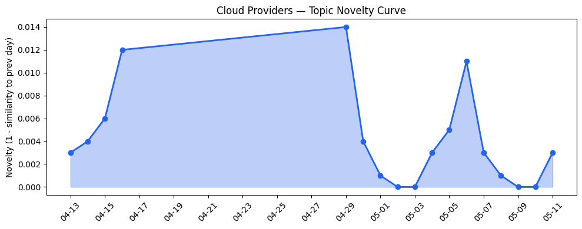
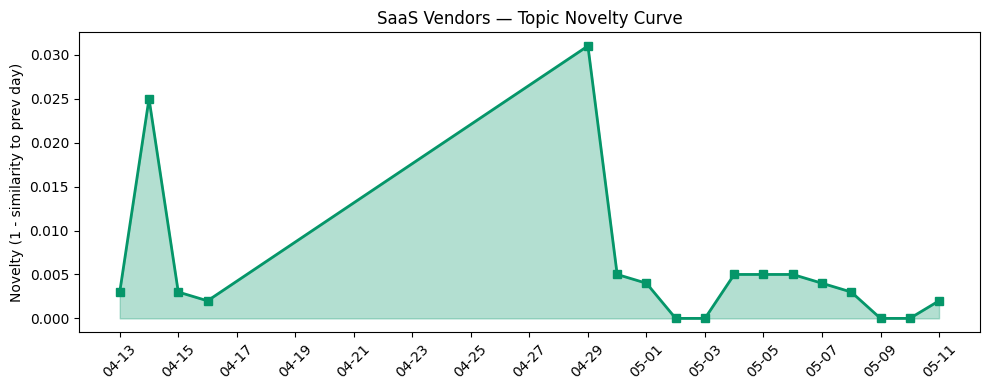

## 今日云计算结构性变化
> 今日云计算结构性变化的核心判断是：AWS、Salesforce、Google Cloud、Azure和火山引擎在云计算和SaaS领域取得了显著进展，尤其是在AI、数据分析和网络安全方面。
今天最值得注意的云计算/SaaS结构性变化是，AWS、Salesforce、Google Cloud、Azure和火山引擎在云计算和SaaS领域的进展，尤其是在AI、数据分析和网络安全方面。这意味着云计算和SaaS产业正在经历快速的发展和创新，企业需要紧跟这些变化以保持竞争力。
以下是今日结构分析中一些值得注意的信号：
- 📈 **持续趋势**：技术层话题已连续8天增强
- 🆕 **新兴方向**：资本信号和风险信号出现全新话题
- 🔺 **突然升温**：应用层近3天内容相似度显著高于更早期均值
- 🔑 **新关键词**：ByteHouse、ClickHouse、火山引擎
- 📉 **消退关键词**：AI Agent、主权云、数据治理、边缘计算

## 技术层信号
🔴 重大突破

云原生和容器化技术方面，AWS推出了Amazon Bedrock和Anthropic的Claude Opus 4.7模型，Google Cloud推出了Gemini 3.1 Flash-Lite，火山引擎发布了基于ClickHouse的ByteHouse。这些进展表明，云原生和容器化技术正在变得越来越重要。
数据库和存储方面，AWS推出了MCP和A2A协议，Google Cloud推出了新型数据库和存储解决方案，Cloudflare发布了Post-quantum encryption。这些进展表明，数据库和存储技术正在经历快速的发展和创新。
AI和机器学习方面，AWS和Google Cloud都推出了新的AI和机器学习解决方案，包括Amazon Bedrock和Gemini 3.1 Flash-Lite。这些进展表明，AI和机器学习正在变得越来越重要。

## 产业资本信号
🔴 强信号

基础设施变化方面，AWS推出了新的定价模式和区域扩张，Google Cloud推出了新型定价模式。这些进展表明，云计算基础设施正在经历快速的发展和创新。
应用层变化方面，Salesforce推出了新的行业解决方案和应用，Adobe推出了新的用户体验设计解决方案。这些进展表明，SaaS应用正在变得越来越重要。
资本流向方面，AWS和Salesforce的投资和收购活动增加，估值和并购活动也增加。这些进展表明，云计算和SaaS产业正在经历快速的发展和创新。

## 潜在拐点判断
今日结构分析中，技术层、产业资本和应用层都出现了显著的进展和创新，这可能意味着云计算和SaaS产业正在经历一个潜在的拐点。尤其是，AI、数据分析和网络安全方面的进展可能会带来新的机遇和挑战。

## 明日观察点
1. 观察AWS和Google Cloud在AI和机器学习方面的进一步进展。
2. 观察Salesforce和Adobe在SaaS应用方面的进一步进展。
3. 观察云计算和SaaS产业的资本流向和投资活动。

## 长期趋势坐标
今日结构分析中，技术层、产业资本和应用层都出现了显著的进展和创新，这可能意味着云计算和SaaS产业正在经历一个长期的趋势转变。尤其是，AI、数据分析和网络安全方面的进展可能会带来新的机遇和挑战。

## 数据洞察
### 云厂商话题演化
今日云厂商话题演化中，AWS、Google Cloud和火山引擎都出现了显著的进展和创新。

### SaaS 厂商话题演化
今日SaaS厂商话题演化中，Salesforce和Adobe都出现了显著的进展和创新。

### 趋势图
今日趋势图中，云厂商和SaaS厂商都出现了显著的进展和创新。

## 参考来源
- [AWS Weekly Roundup: Amazon Bedrock AgentCore payments, Agent Toolkit for AWS, and more](https://aws.amazon.com/blogs/aws/aws-weekly-roundup-amazon-bedrock-agentcore-payments-agent-toolkit-for-aws-and-more-may-11-2026/)
- [Introducing Anthropic’s Claude Opus 4.7 model in Amazon Bedrock](https://aws.amazon.com/blogs/aws/introducing-anthropics-claude-opus-4-7-model-in-amazon-bedrock/)
- [Meet the latest Database Center, now with Gemini-powered fleet intelligence](https://cloud.google.com/blog/products/databases/database-center-improvements-from-next26/)
- [Cloud Storage Rapid: Turbocharged object storage for AI and analytics](https://cloud.google.com/blog/products/storage-data-transfer/cloud-storage-rapid-turbocharges-object-storage-for-ai-analytics/)
- [从 ClickHouse 到 ByteHouse：实时数据分析场景下的优化实践](https://www.cnblogs.com/volcengine/p/15624109.html)
- [Post-quantum encryption for Cloudflare IPsec is generally available](https://blog.cloudflare.com/post-quantum-ipsec/)
- [You Can Be an Agentic Enterprise No Matter What Size Business](https://www.salesforce.com/blog/small-business/agentic-enterprise-for-smbs/)
- [Architect the Future UI: Slack as Your Agentic Surface](https://www.salesforce.com/blog/slack-agentic-enterprise-architecture/)
- [How to get started in user experience design](https://blog.adobe.com/en/publish/2022/06/27/how-to-get-started-in-ux-design)
- [Daniel Ek-backed defense tech Helsing to raise $1.2B at $18B valuation](https://techcrunch.com/2026/05/11/daniel-ek-backed-defense-tech-helsing-to-raise-1-2b-at-18b-valuation/)
- [Cowboy Space raised $275M to build space data centers](https://techcrunch.com/2026/05/11/there-arent-enough-rockets-for-space-data-centers-cowboy-space-raised-275-million-to-build-them/)
- [Linux kernel maintainers pitch emergency killswitch after CopyFail and Dirty Frag chaos](https://www.theregister.com/oses/2026/05/11/linux-kernel-maintainers-pitch-emergency-killswitch-after-copyfail-and-dirty-frag-chaos/5237801)
- [Cookie thieves caught stealing dev secrets via fake Claude Code installers](https://www.theregister.com/security/2026/05/11/cookie-thieves-caught-stealing-dev-secrets/)