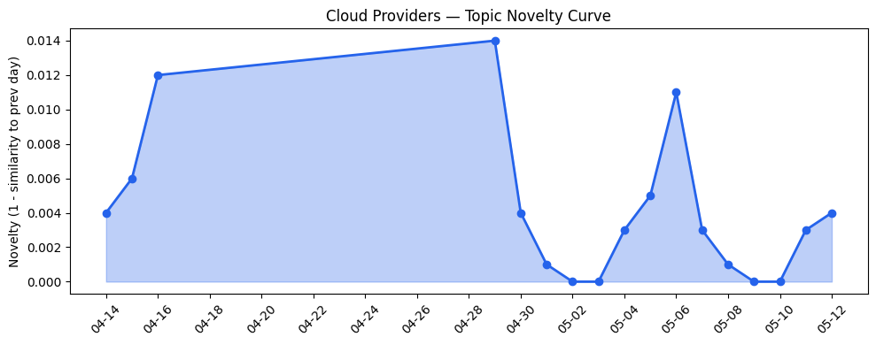
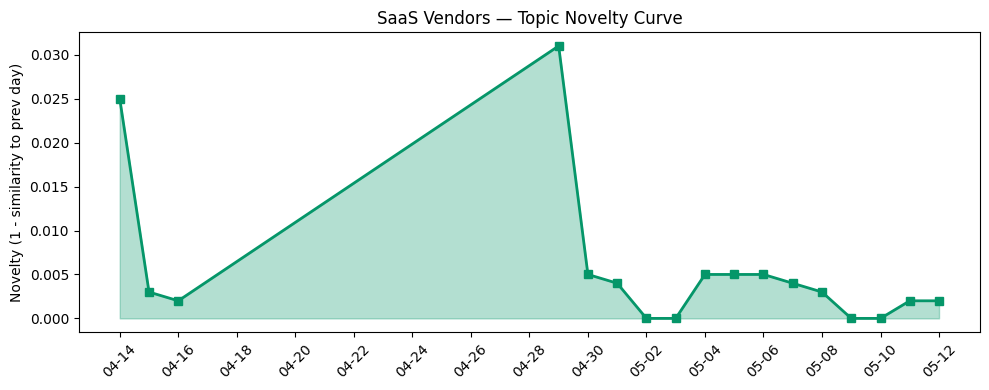

## 今日云计算结构性变化
> 今日的核心判断是：云计算和SaaS行业正在经历快速的技术进步和应用层面的扩张，尤其是在AI和数据分析领域，同时伴随着供应链安全风险和监管加强的挑战。
今天最值得注意的云计算/SaaS结构性变化是技术进步和应用扩张的同时升级。AWS、Google Cloud和Microsoft Azure推出了新的云原生技术和AI能力，基础设施和算力供应也取得了显著进展。同时，企业上云和数字化转型取得了进展，Adobe、HubSpot和Salesforce等公司在用户体验设计、数字签名和AI驱动的创新方面进行了扩张。
- 📈 **持续趋势**：技术层话题已连续8天增强
- 🆕 **新兴方向**：资本信号和风险信号出现全新话题
- 🔺 **突然升温**：基础设施的话题向量在最近8天内呈现持续增强趋势

## 技术层信号
🔴 重大突破

云原生、容器化、K8s和Serverless技术正在快速发展。AWS、Google Cloud和Microsoft Azure推出了新的云原生技术和AI能力，例如Amazon Redshift引入了AWS Graviton-based RG instances，Google Cloud推出了统一的AI视觉，Microsoft Azure推出了Azure Red Hat OpenShift。这些技术进步将推动云计算和SaaS行业的进一步发展。
同时，数据库和基础设施也取得了显著进展。AWS、Google Cloud和Microsoft Azure的数据库和基础设施更新为企业提供了更好的性能和安全性。例如，AWS的Amazon Redshift引入了AWS Graviton-based RG instances，Google Cloud的SAP SAPPHIRE 2026推出了统一的AI视觉，Microsoft Azure的Red Hat Summit 2026推出了Azure Red Hat OpenShift。
这些技术进步和应用扩张将推动云计算和SaaS行业的进一步发展。

## 产业资本信号
🔴 强信号

Anthropic和A\* Capital等公司正在获得大量资金，支持AI驱动的创新。Google和SpaceX正在合作，推动AI驱动的创新。这些资本信号表明，云计算和SaaS行业正在经历快速的技术进步和应用层面的扩张。
同时，监管机构对云计算和SaaS行业的监管力度加强，供应链安全风险也加大。Congress调查了Canvas的数据泄露事件，Foxconn确认了网络攻击。这些风险信号表明，云计算和SaaS行业需要加强安全性和合规性。

## 潜在拐点判断
基于今日信号和历史趋势，判断是否存在潜在拐点。今日的信号表明，云计算和SaaS行业正在经历快速的技术进步和应用层面的扩张，尤其是在AI和数据分析领域，同时伴随着供应链安全风险和监管加强的挑战。这些信号可能预示着行业的潜在拐点。

## 明日观察点
1. 观察AWS、Google Cloud和Microsoft Azure的云原生技术和AI能力的进一步发展。
2. 关注Adobe、HubSpot和Salesforce等公司在用户体验设计、数字签名和AI驱动的创新方面的扩张。
3. 监测供应链安全风险和监管加强的挑战。

## 长期趋势坐标
今日的信号放到月/季尺度，云计算和SaaS行业的技术进步和应用扩张将继续推动行业的发展。同时，供应链安全风险和监管加强的挑战也将继续存在。

## 数据洞察
### 云厂商话题演化
今日的数据表明，云厂商的话题向量在最近8天内呈现持续增强趋势，表明该方向正在持续升温。
### SaaS 厂商话题演化
今日的数据表明，SaaS厂商的话题向量在最近8天内呈现持续增强趋势，表明该方向正在持续升温。
### 趋势图

## 参考来源
- [Amazon Redshift introduces AWS Graviton-based RG instances with an integrated data lake query engine](https://aws.amazon.com/blogs/aws/amazon-redshift-introduces-aws-graviton-based-rg-instances-with-an-integrated-data-lake-query-engine/)
- [SAP SAPPHIRE 2026: Google Cloud unveils unified agentic vision and massive compute scaling](https://cloud.google.com/blog/products/sap-google-cloud/sap-sapphire-2026-the-future-of-google-cloud-ai-agents/)
- [Red Hat Summit 2026: Platform modernization and AI on Microsoft Azure Red Hat OpenShift](https://azure.microsoft.com/en-us/blog/red-hat-summit-2026-platform-modernization-and-ai-on-azure-microsoft-red-hat-openshift/)
- [布局云计算，火山引擎的技术发展之路](https://www.cnblogs.com/volcengine/p/15632953.html)
- [When \"idle\" isn't idle: how a Linux kernel optimization became a QUIC bug](https://blog.cloudflare.com/quic-death-spiral-fix/)
- [Kevin Hartz’s A\* just closed its third fund with $450 million](https://techcrunch.com/2026/05/12/kevin-hartzs-a-just-closed-its-third-fund-with-450-million/)
- [Congress investigates Canvas breach as company pays ransom](https://www.theregister.com/cyber-crime/2026/05/12/congress-investigates-canvas-breach-after-instructure-cuts-deal-with-shinyhunters/5238927)
- [Foxconn confirms cyberattack after ransomware crew claims it stole confidential Apple, Nvidia files](https://www.theregister.com/cyber-crime/2026/05/12/foxconn-confirms-cyberattack-after-nitrogen-claims-apple-nvidia-data-theft/5239144)