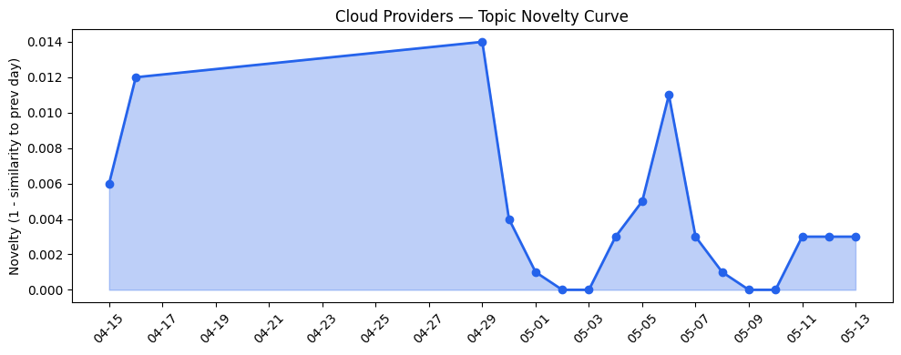
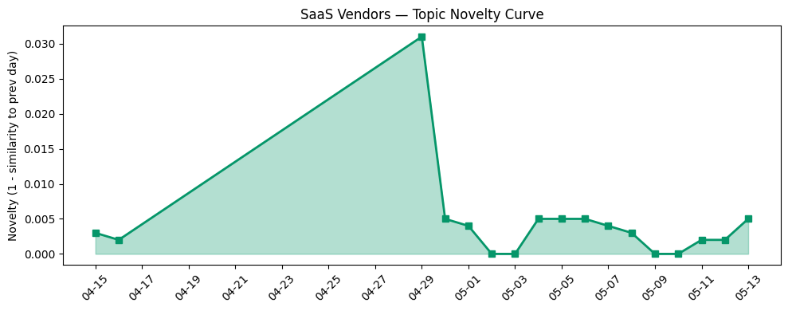

## 今日云计算结构性变化
> 今日云计算和SaaS行业结构性变化信号主要集中在技术层面和基础设施层面，特别是AWS、Google Cloud、Microsoft Azure和火山引擎的云产品和服务发布，以及Salesforce、Adobe和HubSpot的数字营销优化策略。
今天最值得注意的云计算/SaaS结构性变化是技术层面和基础设施层面的重大突破，包括AWS、Google Cloud和Microsoft Azure的云原生和容器技术、基础设施更新，以及Salesforce、Adobe和HubSpot的数字营销优化策略。这些变化表明云计算和SaaS行业正在持续升温，企业正在加速上云和数字化转型。
- 📈 **持续趋势**：技术层话题已连续8天增强
- 🆕 **新兴方向**：资本信号出现全新话题
- 🔺 **突然升温**：基础设施话题近3天突然集中出现
- 🔑 **新关键词**：云基础设施、实时数据、数字营销
- 📉 **消退关键词**：AI Agent、主权云、数据治理、边缘计算

## 技术层信号
🔴 重大突破

云原生和容器技术是今日技术层信号的主要焦点，特别是AWS、Google Cloud和Microsoft Azure的云原生和容器技术的发布和更新。例如，[Amazon Redshift introduces AWS Graviton-based RG instances with an integrated data lake query engine](https://aws.amazon.com/blogs/aws/amazon-redshift-introduces-aws-graviton-based-rg-instances-with-an-integrated-data-lake-query-engine/)和[Google Named a Leader in the Gartner Magic Quadrant for AI Application Development Platforms](https://cloud.google.com/blog/products/ai-machine-learning/google-named-a-leader-in-the-gartner-magic-quadrant/)。这些变化表明云计算和SaaS行业正在加速采用云原生和容器技术，企业正在寻求更灵活、更可扩展的IT基础设施。
此外，AI和数据分析也是技术层信号的重要组成部分，特别是Salesforce、Adobe和HubSpot的数字营销优化策略。例如，[How BCU Is Transforming Banking Service with Agentforce](https://www.salesforce.com/blog/how-bcu-is-transforming-banking-service-with-agentforce/)和[6 generative engine optimization benefits every marketer should know](https://blog.hubspot.com/marketing/6-generative-engine-optimization-benefits-every-marketer-should-know)。这些变化表明企业正在加速采用AI和数据分析技术，寻求更好的营销和客户服务体验。

## 产业资本信号
🔴 强信号

今日产业资本信号主要集中在资本信号的变化，特别是Mind Robotics获得400M美元融资和Fervo Energy上市。这些变化表明资本市场正在加速投资云计算和SaaS行业，特别是AI驱动的创新和数字营销优化策略。例如，[Rivian spinoff Mind Robotics raises another $400M](https://techcrunch.com/2026/05/13/rivian-spinoff-mind-robotics-raises-another-400m/)和[Geothermal startup Fervo Energy pops 33% in IPO debut fueled by AI data center demand](https://techcrunch.com/2026/05/13/geothermal-startup-fervo-energy-pops-33-in-ipo-debut-fueled-by-ai-data-center-demand/)。
此外，基础设施变化也是产业资本信号的重要组成部分，特别是AWS、Google Cloud和Microsoft Azure的基础设施更新。例如，[Amazon Redshift introduces AWS Graviton-based RG instances with an integrated data lake query engine](https://aws.amazon.com/blogs/aws/amazon-redshift-introduces-aws-graviton-based-rg-instances-with-an-integrated-data-lake-query-engine/)和[How Imgix processes 8 billion images daily with G4 VMs powered by NVIDIA Blackwell](https://cloud.google.com/blog/products/infrastructure/how-imgix-processes-8-billion-images-daily-with-g4-vms-powered-by-nvidia-blackwell/)。这些变化表明企业正在加速采用云基础设施，寻求更灵活、更可扩展的IT基础设施。

## 潜在拐点判断
今日信号和历史趋势表明，云计算和SaaS行业正在持续升温，企业正在加速上云和数字化转型。技术层面和基础设施层面的重大突破，特别是AWS、Google Cloud和Microsoft Azure的云原生和容器技术、基础设施更新，以及Salesforce、Adobe和HubSpot的数字营销优化策略，表明云计算和SaaS行业正在加速采用云原生和容器技术、AI和数据分析技术。
此外，资本信号的变化，特别是Mind Robotics获得400M美元融资和Fervo Energy上市，表明资本市场正在加速投资云计算和SaaS行业，特别是AI驱动的创新和数字营销优化策略。这些变化可能会导致云计算和SaaS行业的进一步增长和扩张。

## 明日观察点
1. 观察AWS、Google Cloud和Microsoft Azure的云原生和容器技术的进一步发展和更新。
2. 关注Salesforce、Adobe和HubSpot的数字营销优化策略的进一步发展和更新。
3. 密切关注资本信号的变化，特别是Mind Robotics和Fervo Energy的进一步发展和更新。

## 长期趋势坐标
今日信号和历史趋势表明，云计算和SaaS行业正在持续升温，企业正在加速上云和数字化转型。技术层面和基础设施层面的重大突破，特别是AWS、Google Cloud和Microsoft Azure的云原生和容器技术、基础设施更新，以及Salesforce、Adobe和HubSpot的数字营销优化策略，表明云计算和SaaS行业正在加速采用云原生和容器技术、AI和数据分析技术。
此外，资本信号的变化，特别是Mind Robotics获得400M美元融资和Fervo Energy上市，表明资本市场正在加速投资云计算和SaaS行业，特别是AI驱动的创新和数字营销优化策略。这些变化可能会导致云计算和SaaS行业的进一步增长和扩张。

## 数据洞察
### 云厂商话题演化
今日云厂商话题演化主要集中在AWS、Google Cloud和Microsoft Azure的云原生和容器技术、基础设施更新。这些变化表明云计算和SaaS行业正在加速采用云原生和容器技术、AI和数据分析技术。
### SaaS厂商话题演化
今日SaaS厂商话题演化主要集中在Salesforce、Adobe和HubSpot的数字营销优化策略。这些变化表明企业正在加速采用AI和数据分析技术，寻求更好的营销和客户服务体验。
### 趋势图

## 参考来源
- [Amazon Redshift introduces AWS Graviton-based RG instances with an integrated data lake query engine](https://aws.amazon.com/blogs/aws/amazon-redshift-introduces-aws-graviton-based-rg-instances-with-an-integrated-data-lake-query-engine/)
- [Google Named a Leader in the Gartner Magic Quadrant for AI Application Development Platforms](https://cloud.google.com/blog/products/ai-machine-learning/google-named-a-leader-in-the-gartner-magic-quadrant/)
- [How BCU Is Transforming Banking Service with Agentforce](https://www.salesforce.com/blog/how-bcu-is-transforming-banking-service-with-agentforce/)
- [6 generative engine optimization benefits every marketer should know](https://blog.hubspot.com/marketing/6-generative-engine-optimization-benefits-every-marketer-should-know)
- [Rivian spinoff Mind Robotics raises another $400M](https://techcrunch.com/2026/05/13/rivian-spinoff-mind-robotics-raises-another-400m/)
- [Geothermal startup Fervo Energy pops 33% in IPO debut fueled by AI data center demand](https://techcrunch.com/2026/05/13/geothermal-startup-fervo-energy-pops-33-in-ipo-debut-fueled-by-ai-data-center-demand/)