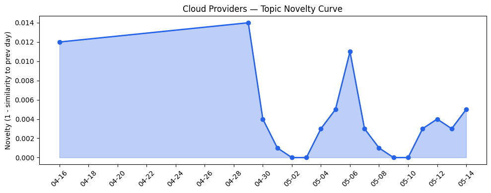
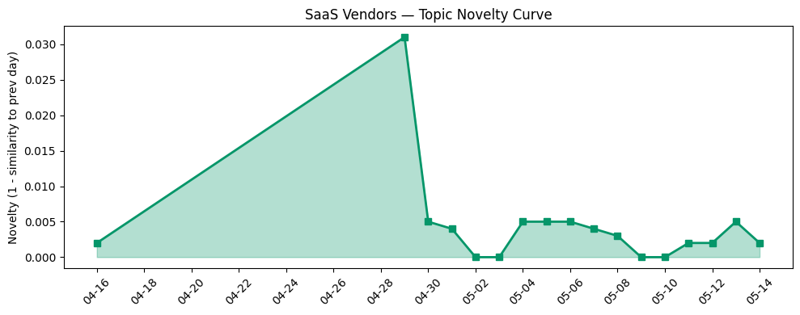

## 今日云计算结构性变化
> 今日核心判断：云厂商和SaaS厂商继续推动技术创新和应用场景扩展，重点关注AI、云原生和数据分析等领域。
今日最值得注意的云计算/SaaS结构性变化是云厂商和SaaS厂商的技术创新和应用场景扩展。AWS、Google Cloud和火山引擎推动云原生技术发展，数据分析和AI能力得到增强。Salesforce推出新的AI功能和应用，提高了客户服务和自动化能力。
- 📈 **持续趋势**：基础设施、资本信号和风险信号话题向量在最近8天内呈现持续增强趋势。
- 🆕 **新兴方向**：资本信号出现全新话题，这可能是一个新兴方向的早期信号。
- 🔺 **突然升温**：基础设施近3天内容相似度显著高于更早期均值，表明该方向话题突然增强。

## 技术层信号
🔴 重大突破

云原生/容器/K8s/Serverless、数据库/存储/网络、AI与云融合有显著进展。AWS、Google Cloud和火山引擎推动云原生技术发展，数据分析和AI能力得到增强。例如，[Amazon Bedrock introduces new advanced prompt optimization and migration tool](https://aws.amazon.com/blogs/aws/amazon-bedrock-introduces-new-advanced-prompt-optimization-and-migration-tool/)、[Introducing Anthropic’s Claude Opus 4.7 model in Amazon Bedrock](https://aws.amazon.com/blogs/aws/introducing-anthropics-claude-opus-4-7-model-in-amazon-bedrock/)和[从 ClickHouse 到 ByteHouse：实时数据分析场景下的优化实践](https://www.cnblogs.com/volcengine/p/15624109.html)。
历史趋势显示，基础设施、资本信号和风险信号话题向量在最近8天内呈现持续增强趋势。

## 产业资本信号
🔴 强信号

云厂商和SaaS厂商的资本流向和估值有显著变化。Cerebras的IPO和OpenAI的融资活动表明，云计算和AI行业正在吸引大量投资。AWS和Salesforce的战略合作和收购活动表明，云计算和SaaS行业正在进行战略性整合。例如，[Cerebras raises $5.5B, then stock pops $108%, in the first huge tech IPO of 2026](https://techcrunch.com/2026/05/14/cerebras-raises-5-5b-kicking-off-2026s-ipo-season-with-a-bang/)和[KDE bags €1.3M as Europe realizes it might need an OS of its own](https://www.theregister.com/oses/2026/05/14/kde-bags-13m-as-europe-realizes-it-might-need-an-os-of-its-own/5240562)。

## 潜在拐点判断
今日信号和历史趋势表明，云计算和SaaS行业可能正在经历潜在拐点。云厂商和SaaS厂商的技术创新和应用场景扩展，资本流向和估值的变化，可能会导致行业格局的变化。

## 明日观察点
1. 云厂商和SaaS厂商的技术创新和应用场景扩展。
2. 资本流向和估值的变化。
3. 行业格局的变化。

## 长期趋势坐标
今日信号放到月/季尺度，云计算和SaaS行业的长期趋势坐标显示，技术创新和应用场景扩展将继续推动行业发展，资本流向和估值的变化将影响行业格局。

## 数据洞察
### 云厂商话题演化
云厂商的话题向量在最近8天内呈现持续增强趋势，表明云厂商的技术创新和应用场景扩展正在持续升温。
### SaaS 厂商话题演化
SaaS厂商的话题向量在最近8天内呈现持续增强趋势，表明SaaS厂商的技术创新和应用场景扩展正在持续升温。
### 趋势图

## 参考来源
- [Amazon Bedrock introduces new advanced prompt optimization and migration tool](https://aws.amazon.com/blogs/aws/amazon-bedrock-introduces-new-advanced-prompt-optimization-and-migration-tool/) — AWS Blog
- [Introducing Anthropic’s Claude Opus 4.7 model in Amazon Bedrock](https://aws.amazon.com/blogs/aws/introducing-anthropics-claude-opus-4-7-model-in-amazon-bedrock/) — AWS Blog
- [从 ClickHouse 到 ByteHouse：实时数据分析场景下的优化实践](https://www.cnblogs.com/volcengine/p/15624109.html) — 火山引擎博客
- [Cerebras raises $5.5B, then stock pops $108%, in the first huge tech IPO of 2026](https://techcrunch.com/2026/05/14/cerebras-raises-5-5b-kicking-off-2026s-ipo-season-with-a-bang/) — TechCrunch
- [KDE bags €1.3M as Europe realizes it might need an OS of its own](https://www.theregister.com/oses/2026/05/14/kde-bags-13m-as-europe-realizes-it-might-need-an-os-of-its-own/5240562) — The Register