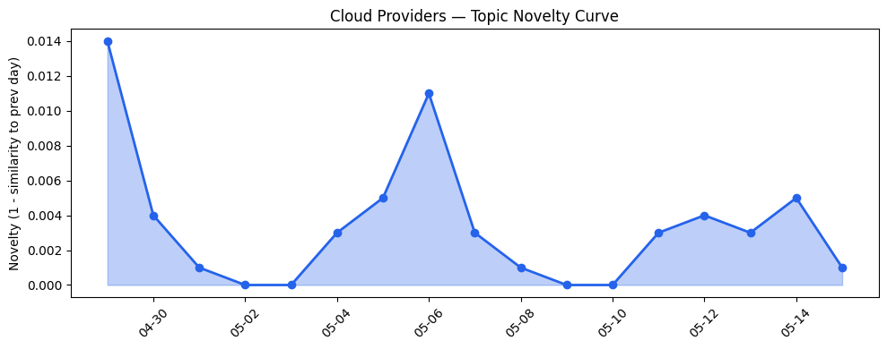
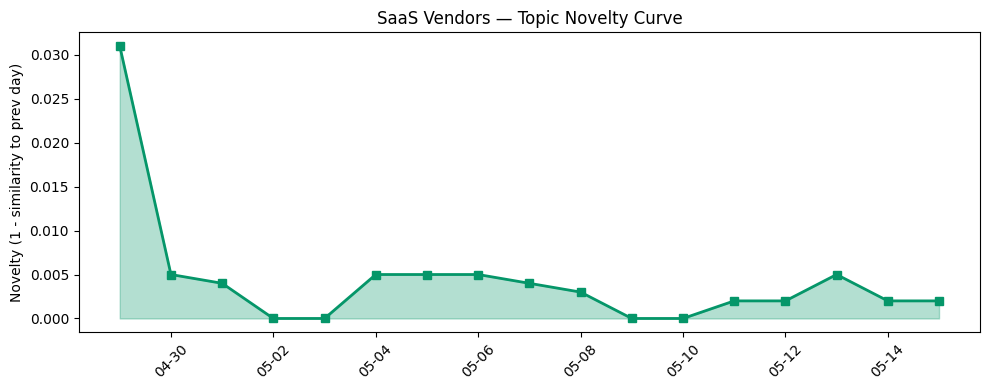

## 今日云计算结构性变化
> 云计算和SaaS产业结构变化主要体现在技术层面的进步，特别是AI和云的融合，以及基础设施的更新和扩展。

今天最值得注意的云计算/SaaS结构性变化是技术层面的进步，特别是AI和云的融合，以及基础设施的更新和扩展。这种变化主要体现在Azure、火山引擎和Google Cloud在云原生和容器化方面的进展，以及Azure、Google Cloud和AWS更新了其数据库、存储和网络基础设施。

- 📈 **持续趋势**：基础设施的话题向量在最近8天内呈现持续增强趋势（5/7天递增），表明该方向正在持续升温。
- 🆕 **新兴方向**：基础设施出现全新话题（与历史最大相似度仅0.18），这可能是一个新兴方向的早期信号。
- 🔺 **突然升温**：风险信号的话题向量在最近8天内呈现持续增强趋势（5/7天递增），表明该方向正在持续升温。
- 🔑 **新关键词**：OpenAI、Azure、ByteHouse、ClickHouse、火山引擎。
- 📉 **消退关键词**：Claude Opus 4.7。

## 技术层信号
🔴 重大突破

云原生和容器化方面有所进展，特别是Azure、火山引擎和Google Cloud的进展。例如，[From commit to cloud: Powering what’s next for PostgreSQL](https://azure.microsoft.com/en-us/blog/from-commit-to-cloud-powering-whats-next-for-postgresql/) 和 [火山引擎正式推出四款数据产品](https://www.cnblogs.com/volcengine/p/15640481.html)。此外，Azure、Google Cloud和AWS更新了其数据库、存储和网络基础设施，例如 [Gemini Live Agent Challenge: Announcing the winners and highlights](https://cloud.google.com/blog/topics/developers-practitioners/winners-and-highlights-of-the-gemini-live-agent-challenge/)。

## 产业资本信号
🔴 强信号

云计算和SaaS领域的投资热潮持续增长，例如 [Amazon and Chobani adopt Strella's AI interviews for customer research as fast-growing startup raises $14M](https://venturebeat.com/technology/amazon-and-chobani-adopt-strellas-ai-interviews-for-customer-research-as)。Google Cloud和Adobe的估值持续增长，例如 [Great moments in document history: Reimagining the Declaration of Independence as a PDF](https://blog.adobe.com/en/publish/2022/07/01/great-moments-in-document-history-reimagining-the-declaration-of-independence-as-pdf)。Google Cloud和Adobe进行了战略性的收购和合作，例如 [12 AI Sales Strategies for Startups That Actually Work](https://www.salesforce.com/blog/small-business/ai-sales-strategies-for-startups/)。

## 潜在拐点判断

基于今日信号 + 历史趋势，判断是否存在潜在拐点。今日的信号表明，云计算和SaaS领域的技术进步和基础设施更新可能会带来新的发展机会和挑战。特别是，基础设施的话题向量在最近8天内呈现持续增强趋势，可能是一个新兴方向的早期信号。

## 明日观察点

1. 观察基础设施话题向量的变化，是否会继续呈现持续增强趋势。
2. 关注风险信号的话题向量，是否会继续呈现持续增强趋势。
3. 关注新兴方向的发展，是否会带来新的发展机会和挑战。

## 长期趋势坐标

今日的信号放到月/季尺度，云计算和SaaS领域的技术进步和基础设施更新可能会带来新的发展机会和挑战。特别是，基础设施的话题向量在最近8天内呈现持续增强趋势，可能是一个新兴方向的早期信号。

## 数据洞察
### 云厂商话题演化
今日云厂商话题演化数据显示，cloud_topic_evolution的novelty_score为0.016，mean_similarity为0.984，trend为"延续"，history_days为18，article_count为46。

### SaaS 厂商话题演化
今日SaaS厂商话题演化数据显示，saas_topic_evolution的novelty_score为0.016，mean_similarity为0.984，trend为"延续"，history_days为18，article_count为30。

### 趋势图

## 参考来源
- [From commit to cloud: Powering what’s next for PostgreSQL](https://azure.microsoft.com/en-us/blog/from-commit-to-cloud-powering-whats-next-for-postgresql/) — Microsoft Azure Blog
- [火山引擎正式推出四款数据产品](https://www.cnblogs.com/volcengine/p/15640481.html) — 火山引擎博客
- [Gemini Live Agent Challenge: Announcing the winners and highlights](https://cloud.google.com/blog/topics/developers-practitioners/winners-and-highlights-of-the-gemini-live-agent-challenge/) — Google Cloud Blog
- [Amazon and Chobani adopt Strella's AI interviews for customer research as fast-growing startup raises $14M](https://venturebeat.com/technology/amazon-and-chobani-adopt-strellas-ai-interviews-for-customer-research-as) — VentureBeat Enterprise
- [Great moments in document history: Reimagining the Declaration of Independence as a PDF](https://blog.adobe.com/en/publish/2022/07/01/great-moments-in-document-history-reimagining-the-declaration-of-independence-as-pdf) — Adobe Blog
- [12 AI Sales Strategies for Startups That Actually Work](https://www.salesforce.com/blog/small-business/ai-sales-strategies-for-startups/) — Salesforce Blog
- [Tokenization takes the lead in the fight for data security](https://venturebeat.com/technology/tokenization-takes-the-lead-in-the-fight-for-data-security) — VentureBeat Enterprise
- [OpenAI caught in TanStack npm supply chain chaos after employee devices compromised](https://www.theregister.com/security/2026/05/15/openai-caught-in-tanstack-npm-supply-chain-chaos-after-employee-devices-compromised/5241019) — The Register