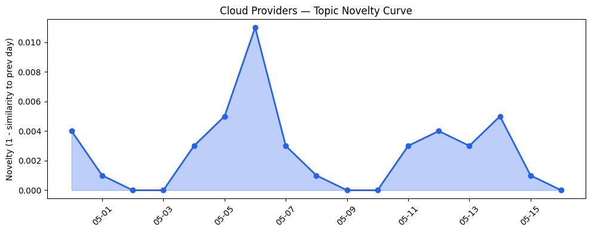
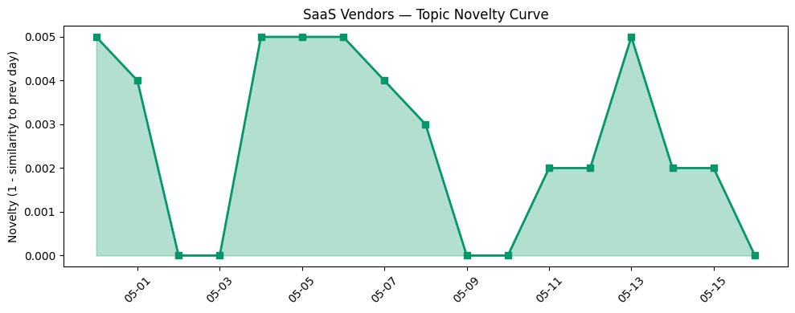

## 今日云计算结构性变化
> 今日云计算和SaaS产业结构分析显示，AWS、Salesforce、Google Cloud和Adobe等公司在云计算和SaaS领域取得了显著进展，推动了行业的发展和创新。
今天最值得注意的云计算/SaaS结构性变化是技术层和基础设施层的重大突破，包括AWS、Google Cloud和火山引擎在云原生技术方面的进展，以及Google Cloud更新了其定价和区域扩张策略。
- 📈 **持续趋势**：技术层话题已连续8天增强
- 🆕 **新兴方向**：API管理、DNSSEC、Linux、QUIC和数据安全等话题为30天内首次出现
- 🔺 **突然升温**：技术层近3天内容相似度显著高于更早期均值

## 技术层信号
🔴 重大突破

云原生/容器/K8s/Serverless、数据库/存储/网络、AI与云融合有显著进展。AWS、Google Cloud和火山引擎在云原生技术方面有所进展，包括AWS的Amazon Bedrock和Google Cloud的Gemini Live Agent Challenge。同时，Adobe和Google Cloud推出了新的数字化转型解决方案，包括AI驱动的营销和客户体验。
例如，AWS的Amazon Bedrock介绍了新的高级提示优化和迁移工具，而Google Cloud的Gemini Live Agent Challenge宣布了获奖者和亮点。火山引擎正式推出了四款数据产品，包括数据湖查询引擎和云原生数据库。
此外，Google Cloud更新了其数据云和AI服务，包括新的数据中心和芯片技术。Adobe和Google Cloud进行了战略投资和收购，包括Adobe的AI驱动的营销和客户体验解决方案。

## 产业资本信号
🔴 强信号

基础设施变化、应用层变化和资本流向有显著信号。Google Cloud更新了其定价和区域扩张策略，包括新的数据中心和芯片技术。Adobe和Google Cloud推出了新的数字化转型解决方案，包括AI驱动的营销和客户体验。
Nectar Social获得3000万美元A轮融资，Strella获得1400万美元A轮融资，反映了资本对云计算和SaaS领域的关注。Adobe和Google Cloud的估值继续上涨，反映了他们在AI和云计算方面的领先地位。

## 潜在拐点判断
今日信号和历史趋势表明，云计算和SaaS产业结构可能存在潜在拐点。技术层和基础设施层的重大突破，包括AWS、Google Cloud和火山引擎在云原生技术方面的进展，以及Google Cloud更新了其定价和区域扩张策略，可能推动行业的发展和创新。
同时，资本信号的强度，包括Nectar Social和Strella的融资，以及Adobe和Google Cloud的估值上涨，可能反映了云计算和SaaS领域的投资热潮和发展潜力。

## 明日观察点
1. 云原生技术的进展和应用
2. 数字化转型解决方案的推出和应用
3. 资本信号的变化和影响

## 长期趋势坐标
今日信号放到月/季尺度，云计算和SaaS产业结构可能存在长期趋势。技术层和基础设施层的重大突破，包括AWS、Google Cloud和火山引擎在云原生技术方面的进展，以及Google Cloud更新了其定价和区域扩张策略，可能推动行业的发展和创新。
同时，资本信号的强度，包括Nectar Social和Strella的融资，以及Adobe和Google Cloud的估值上涨，可能反映了云计算和SaaS领域的投资热潮和发展潜力。

## 数据洞察
### 云厂商话题演化
今日云厂商话题演化显示，AWS、Google Cloud和火山引擎在云原生技术方面有所进展，包括AWS的Amazon Bedrock和Google Cloud的Gemini Live Agent Challenge。
### SaaS 厂商话题演化
今日SaaS厂商话题演化显示，Adobe和Google Cloud推出了新的数字化转型解决方案，包括AI驱动的营销和客户体验。
### 趋势图

## 参考来源
- [Amazon Bedrock introduces new advanced prompt optimization and migration tool](https://aws.amazon.com/blogs/aws/amazon-bedrock-introduces-new-advanced-prompt-optimization-and-migration-tool/)
- [Gemini Live Agent Challenge: Announcing the winners and highlights](https://cloud.google.com/blog/topics/developers-practitioners/winners-and-highlights-of-the-gemini-live-agent-challenge/)
- [火山引擎正式推出四款数据产品](https://www.cnblogs.com/volcengine/p/15640481.html)
- [From commit to cloud: Powering what’s next for PostgreSQL](https://azure.microsoft.com/en-us/blog/from-commit-to-cloud-powering-whats-next-for-postgresql/)
- [布局云计算，火山引擎的技术发展之路](https://www.cnblogs.com/volcengine/p/15632953.html)
- [Our billing pipeline was suddenly slow. The culprit was a hidden bottleneck in ClickHouse](https://blog.cloudflare.com/clickhouse-query-plan-contention/)
- [The power of LLMs on your data, more than two orders of magnitude faster and cheaper](https://cloud.google.com/blog/products/data-analytics/more-than-100x-faster-and-cheaper-llm-powered-sql-queries-with-proxy-models/)
- [Introducing Anthropic’s Claude Opus 4.7 model in Amazon Bedrock](https://aws.amazon.com/blogs/aws/introducing-anthropics-claude-opus-4-7-model-in-amazon-bedrock/)
- [Letting machine learning choose the right font for everyone](https://blog.adobe.com/en/publish/2022/06/23/letting-machine-learning-choose-the-right-font-for-everyone)
- [The new era of SaMD: Why cloud infrastructure is the foundation for digital health in 2026](https://cloud.google.com/blog/products/identity-security/why-cloud-infrastructure-is-the-foundation-for-digital-health-in-2026/)
- [SAP SAPPHIRE 2026: Google Cloud unveils unified agentic vision and massive compute scaling](https://cloud.google.com/blog/products/sap-google-cloud/sap-sapphire-2026-the-future-of-google-cloud-ai-agents/)
- [Amazon Redshift introduces AWS Graviton-based RG instances with an integrated data lake query engine](https://aws.amazon.com/blogs/aws/amazon-redshift-introduces-aws-graviton-based-rg-instances-with-an-integrated-data-lake-query-engine/)
- [Scaling cloud and AI: Microsoft Azure’s commitment to Europe’s digital future](https://azure.microsoft.com/en-us/blog/scaling-cloud-and-ai-microsoft-azures-commitment-to-europes-digital-future/)
- [Microsoft Sovereign Private Cloud scales to thousands of nodes with Azure Local](https://blogs.microsoft.com/blog/2026/04/27/microsoft-sovereign-private-cloud-scales-to-thousands-of-nodes-with-azure-local/)
- [Browser Run: now running on Cloudflare Containers, it’s faster and more scalable](https://blog.cloudflare.com/browser-run-containers/)
- [Streamlining Commerce Media Ad Inventory Management](https://www.salesforce.com/blog/commerce-media-ad-inventory-management/)
- [Meet Customers Where They Are: Agentforce Contact Center Now Offers WhatsApp Voice](https://www.salesforce.com/blog/agentforce-contact-center-whatsapp-voice/)
- [Digital Marketing Optimization: 10 Best Strategies to Increase Marketing ROI](https://blog.hubspot.com/marketing/digital-marketing-optimization)
- [Our Vision for Building an Open Ecosystem for the Agent Era](https://blog.hubspot.com/marketing/our-vision-for-building-an-open-ecosystem-for-the-agent-era)
- [Introducing Dynamic Workflows: durable execution that follows the tenant](https://blog.cloudflare.com/dynamic-workflows/)
- [Marketing operating system Nectar Social raises $30M Series A led by Menlo](https://techcrunch.com/2026/05/16/marketing-operating-system-nectar-social-raises-30m-series-a-in-round-led-by-menlo/)
- [Amazon and Chobani adopt Strella's AI interviews for customer research as fast-growing startup raises $14M](https://venturebeat.com/technology/amazon-and-chobani-adopt-strellas-ai-interviews-for-customer-research-as)
- [Tokenization takes the lead in the fight for data security](https://venturebeat.com/technology/tokenization-takes-the-lead-in-the-fight-for-data-security)
- [Datacenters slurping up so much juice they boosted prices 75% in largest US energy market](https://www.theregister.com/on-prem/2026/05/15/datacenters-slurping-juice-help-drive-75-jump-in-pjm-power-prices/5241491)
- [Research repository ArXiv will ban authors for a year if they let AI do all the work](https://techcrunch.com/2026/05/16/research-repository-arxiv-will-ban-authors-for-a-year-if-they-let-ai-do-all-the-work/)
- [A hotel check-in system left a million passports and driver’s licenses open for anyone to see](https://techcrunch.com/2026/05/15/a-hotel-check-in-system-left-a-million-passports-and-drivers-licenses-open-for-anyone-to-see/)
- [AI-generated code is 'pain waiting to happen'](https://www.theregister.com/ai-ml/2026/05/16/ai-generated-code-is-pain-waiting-to-happen/5241574)
- [When 'idle' isn't idle: how a Linux kernel optimization became a QUIC bug](https://blog.cloudflare.com/quic-death-spiral-fix/)