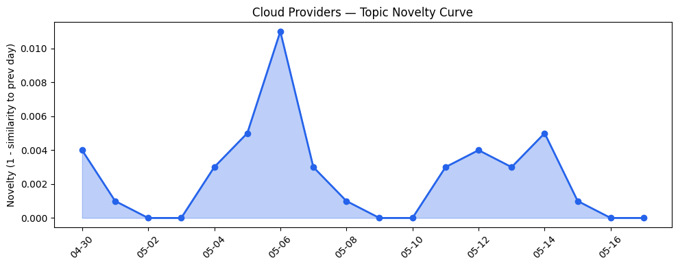
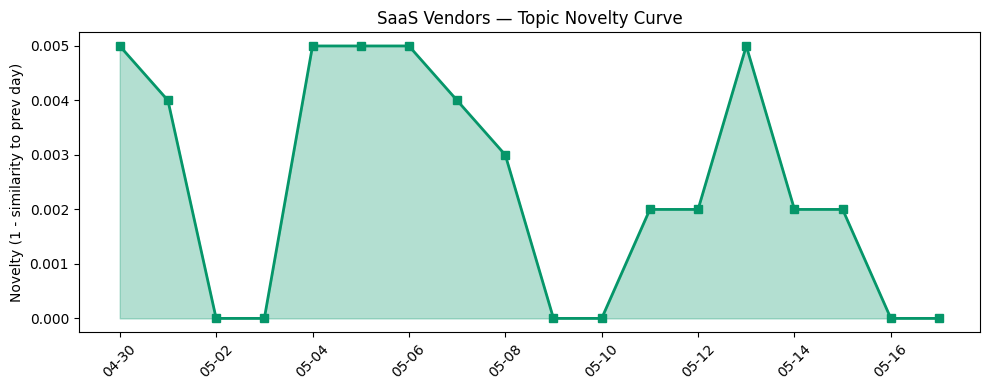

## 今日云计算结构性变化
> 今日云计算和SaaS产业结构变化主要体现在技术层面的进步，特别是AI和云原生技术的融合，以及基础设施的扩张和升级。
今日最值得注意的云计算/SaaS结构性变化是技术层面的重大突破，特别是AWS、Google Cloud和Azure推出了新的云原生功能，包括Amazon Bedrock、Gemini和Wiz。同时，基础设施的扩张和升级也在持续进行，包括数据云和AI应用开发平台的更新。
- 📈 **持续趋势**：技术层话题已连续8天增强
- 🆕 **新兴方向**：应用层话题向量在最近8天内呈现持续增强趋势

## 技术层信号
🔴 重大突破

云原生/容器/K8s/Serverless、数据库/存储/网络、AI与云融合有显著进展。AWS、Google Cloud和Azure推出了新的云原生功能，包括Amazon Bedrock、Gemini和Wiz。同时，基础设施的更新也在持续进行，包括数据云和AI应用开发平台的更新。火山引擎和Cloudflare也在不断地更新其产品和服务，包括实时数据分析场景下的优化实践和动态工作流。
例如，[Amazon Bedrock introduces new advanced prompt optimization and migration tool](https://aws.amazon.com/blogs/aws/amazon-bedrock-introduces-new-advanced-prompt-optimization-and-migration-tool/)、[Gemini Live Agent Challenge: Announcing the winners and highlights](https://cloud.google.com/blog/topics/developers-practitioners/winners-and-highlights-of-the-gemini-live-agent-challenge/)、[Red Hat Summit 2026: Platform modernization and AI on Microsoft Azure Red Hat OpenShift](https://azure.microsoft.com/en-us/blog/red-hat-summit-2026-platform-modernization-and-ai-on-azure-microsoft-red-hat-openshift/)。

## 产业资本信号
🔴 强信号

基础设施变化、应用层变化、资本流向有显著变化。Nectar Social获得3000万美元A轮融资，OpenAI的估值继续上涨。同时，OpenAI的联合创始人Greg Brockman接管了产品策略。
例如，[Marketing operating system Nectar Social raises $30M Series A led by Menlo](https://techcrunch.com/2026/05/16/marketing-operating-system-nectar-social-raises-30m-series-a-in-round-led-by-menlo/)、[OpenAI co-founder Greg Brockman takes charge of product strategy](https://techcrunch.com/2026/05/16/openai-co-founder-greg-brockman-reportedly-takes-charge-of-product-strategy/)。

## 潜在拐点判断
根据今日信号和历史趋势，判断是否存在潜在拐点。今日观察到技术层面的重大突破和应用层话题向量的持续增强趋势，表明云计算和SaaS产业结构变化正在持续升温。

## 明日观察点
1. 观察AWS、Google Cloud和Azure的云原生功能更新。
2. 关注基础设施的扩张和升级。
3. 注意应用层话题向量的变化。

## 长期趋势坐标
今日信号放到月/季尺度，云计算和SaaS产业结构变化正在持续升温。技术层面的进步和基础设施的扩张和升级将继续推动产业的发展。

## 数据洞察
### 云厂商话题演化
云厂商话题向量在最近18天内呈现延续趋势，novelty_score为0.014，mean_similarity为0.986。
### SaaS 厂商话题演化
SaaS厂商话题向量在最近18天内呈现延续趋势，novelty_score为0.013，mean_similarity为0.987。
### 趋势图

## 参考来源
- [Amazon Bedrock introduces new advanced prompt optimization and migration tool](https://aws.amazon.com/blogs/aws/amazon-bedrock-introduces-new-advanced-prompt-optimization-and-migration-tool/) — AWS Blog
- [Gemini Live Agent Challenge: Announcing the winners and highlights](https://cloud.google.com/blog/topics/developers-practitioners/winners-and-highlights-of-the-gemini-live-agent-challenge/) — Google Cloud Blog
- [Red Hat Summit 2026: Platform modernization and AI on Microsoft Azure Red Hat OpenShift](https://azure.microsoft.com/en-us/blog/red-hat-summit-2026-platform-modernization-and-ai-on-azure-microsoft-red-hat-openshift/) — Microsoft Azure Blog
- [Marketing operating system Nectar Social raises $30M Series A led by Menlo](https://techcrunch.com/2026/05/16/marketing-operating-system-nectar-social-raises-30m-series-a-in-round-led-by-menlo/) — TechCrunch
- [OpenAI co-founder Greg Brockman takes charge of product strategy](https://techcrunch.com/2026/05/16/openai-co-founder-greg-brockman-reportedly-takes-charge-of-product-strategy/) — TechCrunch