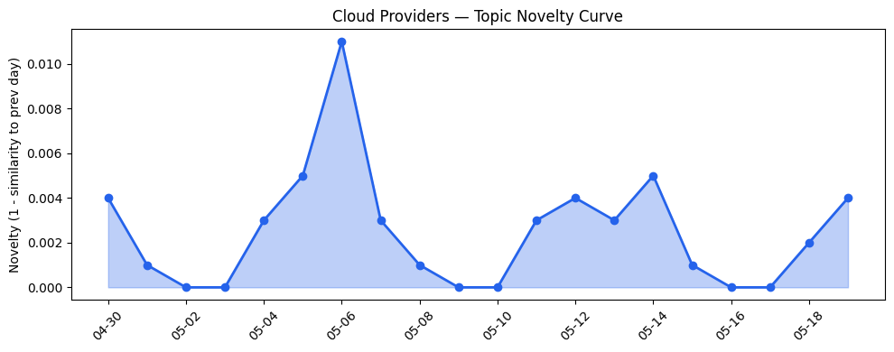
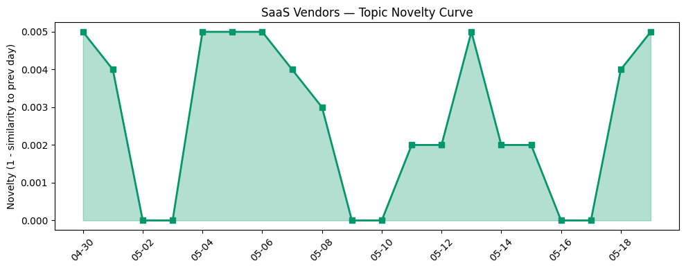

## 今日云计算结构性变化
> 今日云计算和SaaS领域出现多项技术和应用层面的进展，尤其是AWS、Salesforce、Google Cloud、Adobe、微软Azure和火山引擎在云基础设施、AI应用以及数据产品方面的推进。
今日最值得注意的云计算/SaaS结构性变化是AWS、Salesforce和Google Cloud在技术层面的重大突破，尤其是在云原生、AI应用和数据产品方面的创新。同时，微软Azure和火山引擎也在云基础设施和数据产品方面取得了进展。这些变化表明云计算和SaaS领域正在不断演进和创新。
- 📈 **持续趋势**：技术层话题已连续8天增强
- 🆕 **新兴方向**：微软Azure为30天内首次出现
- 🔺 **突然升温**：风险信号的话题向量近8天突然集中出现
- 🔑 **新关键词**：微软Azure
- 📉 **消退关键词**：Anthropic、Claude Opus 4.7

## 技术层信号
🔴 重大突破

今日技术层信号显示，AWS、Salesforce和Google Cloud在云原生、AI应用和数据产品方面取得了重大突破。AWS推出Amazon Bedrock和Claude Opus 4.7，Salesforce发布Headless 360和Agentforce，Google Cloud推出agentic era架构和Data Agent Kit。这些创新表明云计算和SaaS领域正在不断演进和创新。
例如，AWS的Amazon Bedrock是一个基于云的数据仓库和分析平台，能够帮助企业更好地管理和分析数据。Salesforce的Headless 360是一个基于AI的客户服务平台，能够帮助企业更好地理解和满足客户需求。Google Cloud的agentic era架构是一个基于云的AI平台，能够帮助企业更好地开发和部署AI应用。
这些技术层面的进展表明，云计算和SaaS领域正在不断创新和演进，企业需要跟上这些变化以保持竞争力。

## 产业资本信号
🔴 强信号

今日产业资本信号显示，云计算和SaaS领域的资本流动性强劲。Ocean获得2800万美元融资，Mach Industries收购一家公司，Strella的AI采访技术获得1400万美元的Series A融资。这些资本流动性表明，云计算和SaaS领域仍然是投资者关注的重点。
例如，Ocean的2800万美元融资将用于扩大其云计算平台的开发和部署。Mach Industries的收购将帮助其扩大其云计算服务的覆盖范围。Strella的AI采访技术获得1400万美元的Series A融资，将用于进一步开发和部署其AI采访平台。
这些资本流动性表明，云计算和SaaS领域仍然是投资者关注的重点，企业需要跟上这些变化以保持竞争力。

## 潜在拐点判断
今日信号显示，云计算和SaaS领域可能存在潜在拐点。技术层面的重大突破和产业资本信号的强劲性表明，云计算和SaaS领域正在不断创新和演进。然而，风险信号的话题向量近8天突然集中出现，表明企业需要关注潜在风险和挑战。
例如，云计算和SaaS领域的安全性和合规性问题可能会成为潜在拐点。企业需要关注这些问题以保持竞争力。

## 明日观察点
1. 云计算和SaaS领域的技术层面进展：关注AWS、Salesforce和Google Cloud的技术层面进展，例如云原生、AI应用和数据产品方面的创新。
2. 产业资本信号的变化：关注云计算和SaaS领域的资本流动性，例如融资、收购和投资等。
3. 风险信号的话题向量：关注风险信号的话题向量，例如安全性和合规性问题等。

## 长期趋势坐标
今日信号显示，云计算和SaaS领域的长期趋势坐标仍然是创新和演进。技术层面的重大突破和产业资本信号的强劲性表明，云计算和SaaS领域正在不断创新和演进。
例如，云原生、AI应用和数据产品方面的创新将继续推动云计算和SaaS领域的发展。产业资本信号的强劲性将继续支持云计算和SaaS领域的创新和演进。

## 数据洞察
### 云厂商话题演化
今日云厂商话题演化显示，AWS、Salesforce和Google Cloud在技术层面上的进展。AWS推出Amazon Bedrock和Claude Opus 4.7，Salesforce发布Headless 360和Agentforce，Google Cloud推出agentic era架构和Data Agent Kit。

### SaaS厂商话题演化
今日SaaS厂商话题演化显示，Salesforce和Adobe在应用层面上的进展。Salesforce发布Headless 360和Agentforce，Adobe的创意工具应用在各个行业的深入应用。

### 趋势图
今日趋势图显示，云计算和SaaS领域的技术层面进展和产业资本信号的强劲性。

## 参考来源
- [AWS Weekly Roundup: AWS Transform at 1 year, Claude Platform on AWS, EC2 M3 Ultra Mac instances, and more](https://aws.amazon.com/blogs/aws/aws-weekly-roundup-aws-transform-at-1-year-claude-platform-on-aws-ec2-m3-ultra-mac-instances-and-more-may-18-2026/) — AWS Blog
- [Headless Doesn’t Mean Ungoverned: How Trust Works When Agents Call Salesforce](https://www.salesforce.com/blog/headless-trust-model-agentic-architecture/) — Salesforce Blog
- [The agentic era: Architecting the blueprint for mission impact across the public sector](https://cloud.google.com/blog/topics/public-sector/the-agentic-era-architecting-the-blueprint-for-mission-impact-across-the-public-sector/) — Google Cloud Blog
- [What Google I/O '26 means for developing agents on Google Cloud](https://cloud.google.com/blog/topics/developers-practitioners/io26-news-for-agent-developers-on-google-cloud/) — Google Cloud Blog
- [From commit to cloud: Powering what’s next for PostgreSQL](https://azure.microsoft.com/en-us/blog/from-commit-to-cloud-powering-whats-next-for-postgresql/) — Microsoft Azure Blog
- [火山引擎正式推出四款数据产品](https://www.cnblogs.com/volcengine/p/15640481.html) — 火山引擎博客
- [Browser Run: now running on Cloudflare Containers, it’s faster and more scalable](https://blog.cloudflare.com/browser-run-containers/) — Cloudflare Blog
- [从 ClickHouse 到 ByteHouse：实时数据分析场景下的优化实践](https://www.cnblogs.com/volcengine/p/15624109.html) — 火山引擎博客
- [Code Orange: Fail Small is complete. The result is a stronger Cloudflare network](https://blog.cloudflare.com/code-orange-fail-small-complete/) — Cloudflare Blog
- [Our Vision for Building an Open Ecosystem for the Agent Era](https://blog.hubspot.com/marketing/our-vision-for-building-an-open-ecosystem-for-the-agent-era) — HubSpot Blog
- [Run Every HCP Event On Time, On Budget, and In Compliance with Agentforce](https://www.salesforce.com/blog/hcp-event-management/) — Salesforce Blog
- [Amazon Redshift introduces AWS Graviton-based RG instances with an integrated data lake query engine](https://aws.amazon.com/blogs/aws/amazon-redshift-introduces-aws-graviton-based-rg-instances-with-an-integrated-data-lake-query-engine/) — AWS Blog
- [Cloud CISO Perspectives: How Google + Wiz changes multicloud strategy for CISOs](https://cloud.google.com/blog/products/identity-security/cloud-ciso-perspectives-how-google-wiz-changes-multicloud-strategy-for-cisos/) — Google Cloud Blog
- [Scaling cloud and AI: Microsoft Azure’s commitment to Europe’s digital future](https://azure.microsoft.com/en-us/blog/scaling-cloud-and-ai-microsoft-azures-commitment-to-europes-digital-future/) — Microsoft Azure Blog
- [字节跳动是如何建设云的？](https://www.cnblogs.com/volcengine/p/15633967.html) — 火山引擎博客
- [How SharkNinja Turned Product Unboxing Into a Guided AI Conversation](https://www.salesforce.com/blog/sharkninja-agentforce/) — Salesforce Blog
- [Great moments in document history: Reimagining the Declaration of Independence as a PDF](https://blog.adobe.com/en/publish/2022/07/01/great-moments-in-document-history-reimagining-the-declaration-of-independence-as-pdf) — Adobe Blog
- [Brand mentions: How to track and measure visibility](https://blog.hubspot.com/marketing/brand-mentions) — HubSpot Blog
- [From teen hacker to Iron Dome researcher, this founder raised $28M to fight AI phishing](https://techcrunch.com/2026/05/19/from-teen-hacker-to-iron-dome-researcher-this-founder-raised-28m-to-fight-ai-phishing/) — TechCrunch
- [Amazon and Chobani adopt Strella's AI interviews for customer research as fast-growing startup raises $14M](https://venturebeat.com/technology/amazon-and-chobani-adopt-strellas-ai-interviews-for-customer-research-as) — VentureBeat Enterprise
- [Forensic Behavioral Analysis: Finding Anomalies in Salesforce Logs](https://www.salesforce.com/blog/forensic-behavioral-analysis-finding-anomalies-in-salesforce-logs/) — Salesforce Blog
- [Tokenization takes the lead in the fight for data security](https://venturebeat.com/technology/tokenization-takes-the-lead-in-the-fight-for-data-security) — VentureBeat Enterprise
- [America's top cyber-defense agency left a GitHub repo open with with passwords, keys, tokens – and incredibly obvious filenames](https://www.theregister.com/security/2026/05/19/americas-top-cyber-defense-agency-left-a-github-repo-open-with-with-passwords-keys-tokens-and-incredibly-obvious-filenames/5242915) — The Register