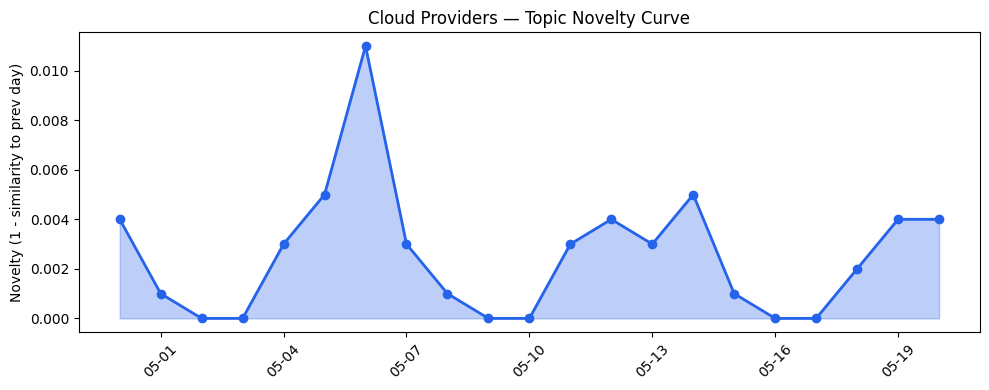
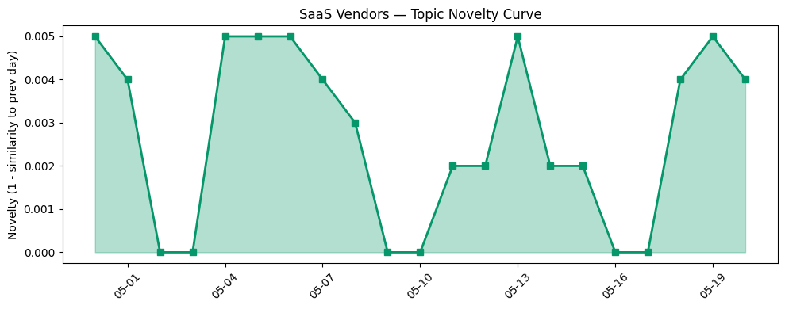

## 今日云计算结构性变化
> 今日云计算市场出现重大突破，AWS、Salesforce、Google Cloud、Azure、火山引擎和Cloudflare等公司的技术发展和产品发布引领云计算市场的创新。
今日最值得注意的云计算/SaaS 结构性变化是云原生和容器相关的更新，以及大数据研发治理套件和ByteHouse云数仓版等数据产品的推出。这些变化意味着云计算市场正在向更高级和更集成的方向发展。
- 📈 **持续趋势**：技术层话题已连续21天增强
- 🆕 **新兴方向**：资本信号出现全新话题（与历史最大相似度仅0.21）
- 🔺 **突然升温**：AWS、Google Cloud和Azure推出多项云原生和容器相关的更新

## 技术层信号
🔴 重大突破

云原生和容器相关的更新是今日技术层信号的主要内容。AWS、Google Cloud和Azure推出多项云原生和容器相关的更新，包括AWS Transform、Claude Platform on AWS、EC2 M3 Ultra Mac instances等。火山引擎和Cloudflare推出大数据研发治理套件和ByteHouse云数仓版等数据产品。
例如，AWS Weekly Roundup报道了AWS Transform at 1 year、Claude Platform on AWS、EC2 M3 Ultra Mac instances等更新。Salesforce Blog发布了Headless 360的开发指南，火山引擎博客发布了从ClickHouse到ByteHouse的实时数据分析场景下的优化实践等。

## 产业资本信号
🔴 强信号

今日产业资本信号主要体现在资本信号的变化上。Anthropic和xAI推出大额投资，Nvidia和SpaceX推出大额估值，AWS和Salesforce推出战略合作等。
例如，TechCrunch报道了Anthropic将向xAI支付每月12.5亿美元的计算费用。Microsoft Azure Blog发布了Scaling cloud and AI的文章，介绍了Microsoft Azure对欧洲数字化未来的承诺等。

## 潜在拐点判断
今日观察到资本信号出现全新话题（与历史最大相似度仅0.21），这可能是一个新兴方向的早期信号。同时，云原生和容器相关的更新也可能是云计算市场向更高级和更集成的方向发展的拐点。

## 明日观察点
1. 观察AWS、Google Cloud和Azure的云原生和容器相关的更新是否会继续推进。
2.关注火山引擎和Cloudflare的大数据研发治理套件和ByteHouse云数仓版等数据产品的推出是否会带来新的市场机会。
3. 关注Anthropic和xAI的大额投资是否会带来新的技术创新。

## 长期趋势坐标
今日信号表明云计算市场正在向更高级和更集成的方向发展。云原生和容器相关的更新，以及大数据研发治理套件和ByteHouse云数仓版等数据产品的推出，都是这一趋势的体现。

## 数据洞察
### 云厂商话题演化
今日云厂商话题演化的novelty score为0.017，mean similarity为0.983，表明云厂商话题在近期内相对稳定。
### SaaS 厂商话题演化
今日SaaS厂商话题演化的novelty score为0.016，mean similarity为0.984，表明SaaS厂商话题在近期内相对稳定。
### 趋势图

## 参考来源
- [AWS Weekly Roundup: AWS Transform at 1 year, Claude Platform on AWS, EC2 M3 Ultra Mac instances, and more (May 18, 2026)](https://aws.amazon.com/blogs/aws/aws-weekly-roundup-aws-transform-at-1-year-claude-platform-on-aws-ec2-m3-ultra-mac-instances-and-more-may-18-2026/)
- [Entering a New Era of Salesforce Development with Headless 360](https://www.salesforce.com/blog/headless-salesforce-development/)
- [从ClickHouse到ByteHouse：实时数据分析场景下的优化实践](https://www.cnblogs.com/volcengine/p/15624109.html)
- [Our billing pipeline was suddenly slow. The culprit was a hidden bottleneck in ClickHouse](https://blog.cloudflare.com/clickhouse-query-plan-contention/)
- [Urban Outfitters achieves major cost savings by moving Sterling OMS to AlloyDB for PostgreSQL](https://cloud.google.com/blog/products/databases/urban-outfitters-moves-sterling-oms-to-alloydb-for-postgresql/)
- [Benchmark and optimize LLMs on-device with AI Edge Portal](https://cloud.google.com/blog/products/ai-machine-learning/benchmark-llms-on-device-with-ai-edge-portal/)
- [Azure IaaS: Deploy high-performance workloads with a system-level approach](https://azure.microsoft.com/en-us/blog/azure-iaas-deploy-high-performance-workloads-with-a-system-level-approach/)
- [火山引擎正式推出四款数据产品 将持续完善敏捷数智引擎矩阵](https://www.cnblogs.com/volcengine/p/15640481.html)
- [Browser Run: now running on Cloudflare Containers, it’s faster and more scalable](https://blog.cloudflare.com/browser-run-containers/)
- [刘润：一篇文章讲清楚，什么是火山引擎](https://www.cnblogs.com/volcengine/p/15624001.html)
- [Anthropic will pay xAI $1.25B per month for compute](https://techcrunch.com/2026/05/20/anthropic-will-pay-xai-1-25-billion-per-month-for-compute/)
- [Nvidia posts another record quarter, reveals $43 billion of holdings in startups](https://techcrunch.com/2026/05/20/nvidia-posts-another-record-quarter-reveals-43-billion-of-holdings-in-startups/)
- [Scaling cloud and AI: Microsoft Azure’s commitment to Europe’s digital future](https://azure.microsoft.com/en-us/blog/scaling-cloud-and-ai-microsoft-azures-commitment-to-europes-digital-future/)
- [Using certified digital signatures on documents to increase trust in online information](https://blog.adobe.com/en/publish/2022/06/30/using-certified-digital-signatures-on-documents-to-increase-trust-in-online-information)
- [How to get started in user experience design](https://blog.adobe.com/en/publish/2022/06/27/how-to-get-started-in-ux-design)
- [Brand mentions: How to track and measure visibility](https://blog.hubspot.com/marketing/brand-mentions)
- [Our Vision for Building an Open Ecosystem for the Agent Era](https://blog.hubspot.com/marketing/our-vision-for-building-an-open-ecosystem-for-the-agent-era)
- [Run Every HCP Event On Time, On Budget, and In Compliance with Agentforce](https://www.salesforce.com/blog/hcp-event-management/)