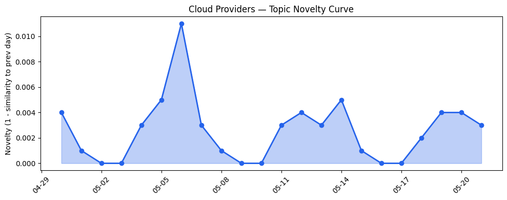

## 今日云计算结构性变化
> 云计算和SaaS行业正在经历快速的发展，云厂商和SaaS厂商都在推出新的产品和服务，尤其是在AI和云原生领域。
今天最值得注意的云计算/SaaS结构性变化是云厂商和SaaS厂商在AI和云原生领域的快速发展，这意味着云计算和SaaS行业正在经历一个重大变革。这种变化是由技术进步和市场需求驱动的，云厂商和SaaS厂商都在努力满足客户对更快、更灵活和更智能的服务的需求。
- 📈 **持续趋势**：技术层话题已连续22天增强
- 🆕 **新兴方向**：资本信号出现全新话题
- 🔺 **突然升温**：技术层近3天内容相似度显著高于更早期均值
- 🔑 **新关键词**：企业上云
- 📉 **消退关键词**：Anthropic, Claude Opus 4.7, 网络安全

## 技术层信号
🔴 重大突破

云原生、容器、K8s和Serverless技术正在快速发展，Google Cloud、Azure和火山引擎都在推出新的云原生服务和产品，包括Agent Sandbox、Agent Executor和ByteHouse。AWS Graviton基于的RG实例提供了更快的数据仓库和数据湖查询性能，Adobe推出了新的AI和机器学习应用。这些发展意味着云计算和SaaS行业正在经历一个技术革命，云厂商和SaaS厂商都在努力提供更快、更灵活和更智能的服务。
例如，[AWS Weekly Roundup: AWS Transform at 1 year, Claude Platform on AWS, EC2 M3 Ultra Mac instances, and more](https://aws.amazon.com/blogs/aws/aws-weekly-roundup-aws-transform-at-1-year-claude-platform-on-aws-ec2-m3-ultra-mac-instances-and-more-may-18-2026/)和[Amazon Redshift introduces AWS Graviton-based RG instances with an integrated data lake query engine](https://aws.amazon.com/blogs/aws/amazon-redshift-introduces-aws-graviton-based-rg-instances-with-an-integrated-data-lake-query-engine/)。

## 产业资本信号
🔴 强信号

云计算和SaaS行业的资本信号正在变化，Convective Capital raises an $85 million fund to build disaster resilience，Spotify和Universal Music strike deal allowing fan-made AI covers and remixes。这些发展意味着云计算和SaaS行业正在经历一个资本革命，投资者和企业都在努力提供更好的服务和产品。
例如，[Convective Capital raises an $85 million fund to build disaster resilience](https://techcrunch.com/2026/05/21/convective-capital-raises-an-85-million-fund-to-build-disaster-resilience/)和[Spotify and Universal Music strike deal allowing fan-made AI covers and remixes](https://techcrunch.com/2026/05/21/spotify-and-universal-music-strike-deal-allowing-fan-made-ai-covers-and-remixes/)。

## 潜在拐点判断
基于今日信号 + 历史趋势，判断是否存在潜在拐点。今天的信号表明，云计算和SaaS行业正在经历一个重大变革，技术进步和市场需求驱动了这种变化。这种变化可能会导致云计算和SaaS行业的格局发生变化，云厂商和SaaS厂商都需要适应这种变化。

## 明日观察点
1. 云厂商和SaaS厂商在AI和云原生领域的发展
2. 云计算和SaaS行业的资本信号变化
3. 企业上云和数字化转型的进展

## 长期趋势坐标
今日信号放到月/季尺度，云计算和SaaS行业的长期趋势坐标显示，技术进步和市场需求驱动了云计算和SaaS行业的发展，云厂商和SaaS厂商都需要适应这种变化。

## 数据洞察
### 云厂商话题演化
云厂商话题演化显示，云厂商在AI和云原生领域的发展正在加速，Google Cloud、Azure和火山引擎都在推出新的云原生服务和产品。
### SaaS 厂商话题演化
SaaS厂商话题演化显示，SaaS厂商在AI和云原生领域的发展正在加速，Adobe和HubSpot都在推出新的AI和机器学习应用。
### 趋势图

## 参考来源
- [AWS Weekly Roundup: AWS Transform at 1 year, Claude Platform on AWS, EC2 M3 Ultra Mac instances, and more](https://aws.amazon.com/blogs/aws/aws-weekly-roundup-aws-transform-at-1-year-claude-platform-on-aws-ec2-m3-ultra-mac-instances-and-more-may-18-2026/) — AWS Blog
- [Amazon Redshift introduces AWS Graviton-based RG instances with an integrated data lake query engine](https://aws.amazon.com/blogs/aws/amazon-redshift-introduces-aws-graviton-based-rg-instances-with-an-integrated-data-lake-query-engine/) — AWS Blog
- [Convective Capital raises an $85 million fund to build disaster resilience](https://techcrunch.com/2026/05/21/convective-capital-raises-an-85-million-fund-to-build-disaster-resilience/) — TechCrunch
- [Spotify and Universal Music strike deal allowing fan-made AI covers and remixes](https://techcrunch.com/2026/05/21/spotify-and-universal-music-strike-deal-allowing-fan-made-ai-covers-and-remixes/) — TechCrunch