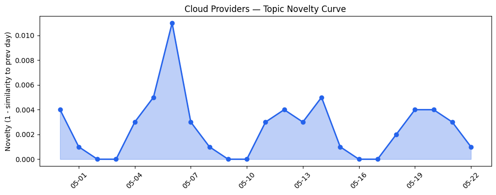
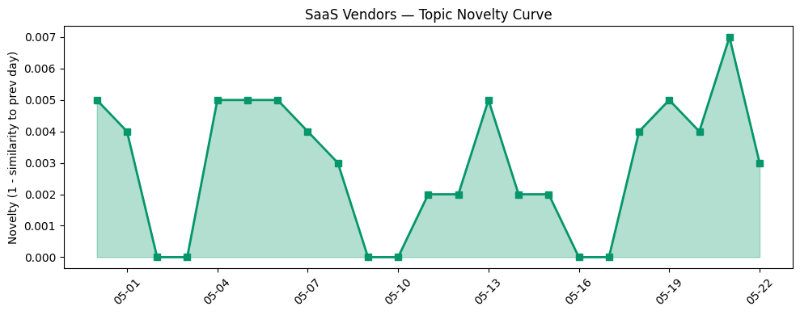

## 今日云计算结构性变化
> 云计算和SaaS行业正在经历快速的技术和应用层面的变化，尤其是在AI、云原生和数字化转型方面。
今天最值得注意的云计算/SaaS结构性变化是技术层和基础设施层的重大突破，尤其是在云原生、AI和数字化转型方面。这些变化表明云计算和SaaS行业正在经历快速的技术和应用层面的进步。
- 📈 **持续趋势**：技术层和基础设施层的话题向量在最近8天内呈现持续增强趋势。
- 🆕 **新兴方向**：Workday等新关键词的出现，表明云计算和SaaS行业正在扩展到新的领域。
- 🔺 **突然升温**：技术层近3天内容相似度显著高于更早期均值，表明该方向话题突然增强。

## 技术层信号
🔴 重大突破

云原生、容器和Serverless技术的进步是技术层信号的主要驱动力。AWS、Google Cloud、Azure和火山引擎在云原生和容器方面有新进展，例如AWS的EC2 M3 Ultra Mac instances和Google Cloud的AlloyDB for PostgreSQL。这些进展表明云计算和SaaS行业正在经历快速的技术进步。
例如，[AWS Weekly Roundup: AWS Transform at 1 year, Claude Platform on AWS, EC2 M3 Ultra Mac instances, and more](https://aws.amazon.com/blogs/aws/aws-weekly-roundup-aws-transform-at-1-year-claude-platform-on-aws-ec2-m3-ultra-mac-instances-and-more-may-18-2026/) 和 [The Blueprint: How Movix fills a gap in dental skills with specialized agentic AI](https://cloud.google.com/blog/topics/startups/filling-the-gaps-in-dental-skills-with-specialized-agentic-ai/) 等文章表明了云计算和SaaS行业的技术进步。

## 产业资本信号
🔴 强信号

云计算和SaaS行业的资本信号表明VC和创业者对AI和云计算领域的投资热情持续高涨。估值和并购活动频繁，反映出市场对云计算和SaaS的信心。例如，[How VCs and founders use inflated ‘ARR’ to crown AI startups](https://techcrunch.com/2026/05/22/how-vcs-and-founders-use-inflated-arr-to-kingmake-ai-startups/) 和 [Amazon and Chobani adopt Strella's AI interviews for customer research as fast-growing startup raises $14M](https://venturebeat.com/technology/amazon-and-chobani-adopt-strellas-ai-interviews-for-customer-research-as) 等文章表明了云计算和SaaS行业的资本信号。

## 潜在拐点判断
基于今日信号 + 历史趋势，判断是否存在潜在拐点。技术层和基础设施层的重大突破，表明云计算和SaaS行业正在经历快速的技术和应用层面的进步。这些变化可能会带来新的机会和挑战，需要密切关注。

## 明日观察点
1. 观察技术层和基础设施层的持续趋势。
2. 关注新关键词的出现和其对云计算和SaaS行业的影响。
3. 密切关注监管环境和数据隐私的变化。

## 长期趋势坐标
云计算和SaaS行业的长期趋势坐标表明技术层和基础设施层的进步将继续推动行业的发展。这些变化可能会带来新的机会和挑战，需要密切关注。

## 数据洞察
### 云厂商话题演化
云厂商的话题向量在最近8天内呈现持续增强趋势，表明云计算和SaaS行业正在经历快速的技术和应用层面的进步。
### SaaS 厂商话题演化
SaaS厂商的话题向量在最近8天内呈现持续增强趋势，表明云计算和SaaS行业正在扩展到新的领域。
### 趋势图

## 参考来源
- [AWS Weekly Roundup: AWS Transform at 1 year, Claude Platform on AWS, EC2 M3 Ultra Mac instances, and more](https://aws.amazon.com/blogs/aws/aws-weekly-roundup-aws-transform-at-1-year-claude-platform-on-aws-ec2-m3-ultra-mac-instances-and-more-may-18-2026/) — AWS Blog
- [The Blueprint: How Movix fills a gap in dental skills with specialized agentic AI](https://cloud.google.com/blog/topics/startups/filling-the-gaps-in-dental-skills-with-specialized-agentic-ai/) — Google Cloud Blog
- [Azure IaaS: Deploy high-performance workloads with a system-level approach](https://azure.microsoft.com/en-us/blog/azure-iaas-deploy-high-performance-workloads-with-a-system-level-approach/) — Microsoft Azure Blog
- [布局云计算，火山引擎的技术发展之路](https://www.cnblogs.com/volcengine/p/15632953.html) — 火山引擎博客
- [Announcing Claude Compliance API support with Cloudflare CASB](https://blog.cloudflare.com/casb-anthropic-integration/) — Cloudflare Blog
- [Datacenter builders face an impossible quandary: Demand to the left of me, protests to the right](https://www.theregister.com/systems/2026/05/22/ai-datacenter-boom-collides-with-us-grid-reality/5245295) — The Register
- [Scaling cloud and AI: Microsoft Azure’s commitment to Europe’s digital future](https://azure.microsoft.com/en-us/blog/scaling-cloud-and-ai-microsoft-azures-commitment-to-europes-digital-future/) — Microsoft Azure Blog
- [火山引擎正式推出四款数据产品 将持续完善敏捷数智引擎矩阵](https://www.cnblogs.com/volcengine/p/15640481.html) — 火山引擎博客
- [Browser Run: now running on Cloudflare Containers, it’s faster and more scalable](https://blog.cloudflare.com/browser-run-containers/) — Cloudflare Blog
- [Urban Outfitters achieves major cost savings by moving Sterling OMS to AlloyDB for PostgreSQL](https://cloud.google.com/blog/products/databases/urban-outfitters-moves-sterling-oms-to-alloydb-for-postgresql/) — Google Cloud Blog
- [Behold the bold — announcing the 2022 Adobe Experience Maker Awards winners](https://blog.adobe.com/en/publish/2022/06/24/behold-the-bold-announcing-the-winners-of-the-2022-adobe-experience-maker-awards) — Adobe Blog
- [Workday wants AI to punch in instead of having to hire new recruits](https://www.theregister.com/saas/2026/05/22/workday-wants-ai-to-punch-in-instead-of-having-to-hire-new-recruits/5245011) — The Register
- [Digital Marketing Optimization: 10 Best Strategies to Increase Marketing ROI](https://blog.hubspot.com/marketing/digital-marketing-optimization) — HubSpot Blog
- [How VCs and founders use inflated ‘ARR’ to crown AI startups](https://techcrunch.com/2026/05/22/how-vcs-and-founders-use-inflated-arr-to-kingmake-ai-startups/) — TechCrunch
- [Amazon and Chobani adopt Strella's AI interviews for customer research as fast-growing startup raises $14M](https://venturebeat.com/technology/amazon-and-chobani-adopt-strellas-ai-interviews-for-customer-research-as) — VentureBeat Enterprise
- [Trump Mobile confirms it exposed customers’ personal data, including phone numbers and home addresses](https://techcrunch.com/2026/05/22/trump-mobile-confirms-it-exposed-customers-personal-data-including-phone-numbers-and-home-addresses/) — TechCrunch
- [Megalodon chums the waters in 5.5K+ GitHub repo poisonings](https://www.theregister.com/security/2026/05/22/megalodon-chums-the-waters-in-55k-github-repo-poisonings/5245342) — The Register
- [FBI warns Kali365 phishing kit is stealing Microsoft OAuth tokens at scale](https://www.theregister.com/cyber-crime/2026/05/22/fbi-warns-of-kali365-as-device-code-phishing-soars/5245024) — The Register