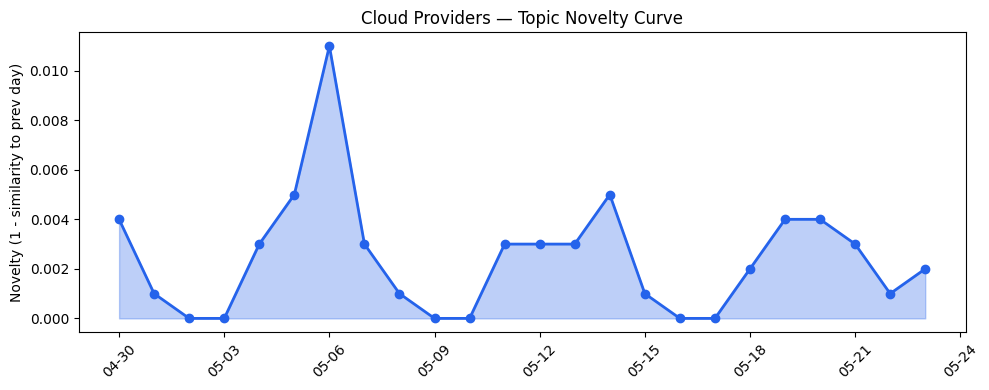
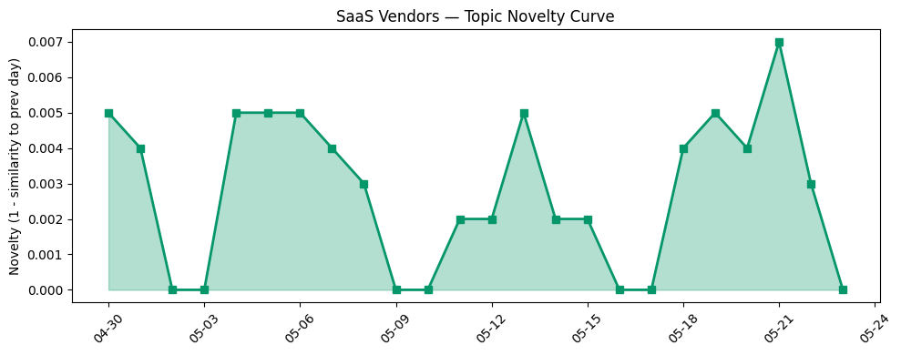

## 今日云计算结构性变化
> 今日云计算和SaaS行业结构性变化分析显示，云原生、AI、数据分析等方面呈现重大突破和渐进改善的趋势。
云计算和SaaS行业正在迅速进化，尤其是在AI、云原生和数据分析等方面，各大厂商如AWS、Salesforce、Google Cloud、Adobe、Azure、火山引擎和Cloudflare等都在推动行业的发展。今日最值得注意的云计算/SaaS结构性变化是云原生技术的进展，包括AWS、Google Cloud和Azure的云原生技术进展，火山引擎发布ByteHouse，解决ClickHouse的企业版问题。
- 📈 **持续趋势**：应用层的话题向量在最近8天内呈现持续增强趋势。
- 🆕 **新兴方向**：安全、Azure、数据分析等话题为近期新兴方向。
- 🔺 **突然升温**：技术层近3天内容相似度显著高于更早期均值，表明该方向话题突然增强。
- 🔑 **新关键词**：安全。
- 📉 **消退关键词**：Anthropic、Claude Opus 4.7、Microsoft Azure、网络安全。

## 技术层信号
🔴 重大突破

云原生、容器、K8s和Serverless等技术层面信号显示，AWS、Google Cloud和Azure的云原生技术进展，火山引擎发布ByteHouse，解决ClickHouse的企业版问题。AWS Graviton基于的RG实例提供了更快的数据处理速度和更低的成本，Cloudflare发布了多篇技术博客，涉及ClickHouse、容器和安全等方面的优化和实践。Google Cloud的AI应用在医疗和教育领域取得进展，Adobe的数字签名解决方案提高在线信息的可信度。
参考文章：
- [AWS Weekly Roundup: AWS Transform at 1 year, Claude Platform on AWS, EC2 M3 Ultra Mac instances, and more](https://aws.amazon.com/blogs/aws/aws-weekly-roundup-aws-transform-at-1-year-claude-platform-on-aws-ec2-m3-ultra-mac-instances-and-more-may-18-2026/)
- [Amazon Redshift introduces AWS Graviton-based RG instances with an integrated data lake query engine](https://aws.amazon.com/blogs/aws/amazon-redshift-introduces-aws-graviton-based-rg-instances-with-an-integrated-data-lake-query-engine/)
- [The Blueprint: How Movix fills a gap in dental skills with specialized agentic AI](https://cloud.google.com/blog/topics/startups/filling-the-gaps-in-dental-skills-with-specialized-agentic-ai/)

## 产业资本信号
🔴 强信号

产业资本信号显示，Strella获得1400万美元的Series A融资，用于扩展其AI采访业务，Amazon和Chobani采用Strella的AI采访技术进行客户研究。AWS和Azure的定价和区域扩张，AWS Graviton基于的RG实例提供了更快的计算速度和更低的成本，Cloudflare发布了多篇技术博客，涉及容器和安全等方面的优化和实践。
参考文章：
- [Amazon and Chobani adopt Strella's AI interviews for customer research as fast-growing startup raises $14M](https://venturebeat.com/technology/amazon-and-chobani-adopt-strellas-ai-interviews-for-customer-research-as)

## 潜在拐点判断

基于今日信号和历史趋势，判断是否存在潜在拐点。今日的信号显示，云原生技术的进展，AI应用在医疗和教育领域的取得进展，Adobe的数字签名解决方案提高在线信息的可信度，Strella获得1400万美元的Series A融资等，都表明云计算和SaaS行业正在迅速进化，尤其是在AI、云原生和数据分析等方面。

## 明日观察点

1. 观察AWS、Google Cloud和Azure的云原生技术进展。
2. 关注Adobe的数字签名解决方案的应用和发展。
3. 注意Strella的AI采访技术的进展和应用。

## 长期趋势坐标

将今日信号放到月/季尺度，云计算和SaaS行业的长期趋势坐标显示，云原生技术、AI应用、数据分析等方面将持续发展和进步。

## 数据洞察
### 云厂商话题演化
云厂商话题演化显示，AWS、Google Cloud和Azure的云原生技术进展，火山引擎发布ByteHouse，解决ClickHouse的企业版问题。
### SaaS 厂商话题演化
SaaS厂商话题演化显示，Salesforce、Adobe和Google Cloud的AI应用在医疗和教育领域取得进展。
### 趋势图

## 参考来源
- [AWS Weekly Roundup: AWS Transform at 1 year, Claude Platform on AWS, EC2 M3 Ultra Mac instances, and more](https://aws.amazon.com/blogs/aws/aws-weekly-roundup-aws-transform-at-1-year-claude-platform-on-aws-ec2-m3-ultra-mac-instances-and-more-may-18-2026/) — AWS Blog
- [Amazon Redshift introduces AWS Graviton-based RG instances with an integrated data lake query engine](https://aws.amazon.com/blogs/aws/amazon-redshift-introduces-aws-graviton-based-rg-instances-with-an-integrated-data-lake-query-engine/) — AWS Blog
- [The Blueprint: How Movix fills a gap in dental skills with specialized agentic AI](https://cloud.google.com/blog/topics/startups/filling-the-gaps-in-dental-skills-with-specialized-agentic-ai/) — Google Cloud Blog
- [Using certified digital signatures on documents to increase trust in online information](https://blog.adobe.com/en/publish/2022/06/30/using-certified-digital-signatures-on-documents-to-increase-trust-in-online-information) — Adobe Blog
- [Powering multi-cluster workloads with seamless cross-cluster networking for Azure Kubernetes Fleet Manager](https://azure.microsoft.com/en-us/blog/powering-multi-cluster-workloads-with-seamless-cross-cluster-networking-for-azure-kubernetes-fleet-manager/) — Microsoft Azure Blog
- [布局云计算，火山引擎的技术发展之路](https://www.cnblogs.com/volcengine/p/15632953.html) — 火山引擎博客
- [Announcing Claude Compliance API support with Cloudflare CASB](https://blog.cloudflare.com/casb-anthropic-integration/) — Cloudflare Blog
- [Amazon and Chobani adopt Strella's AI interviews for customer research as fast-growing startup raises $14M](https://venturebeat.com/technology/amazon-and-chobani-adopt-strellas-ai-interviews-for-customer-research-as) — VentureBeat Enterprise