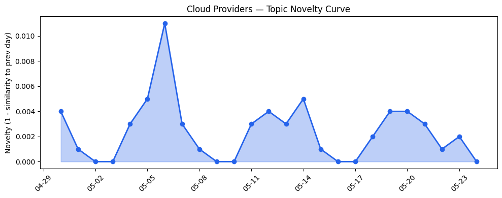
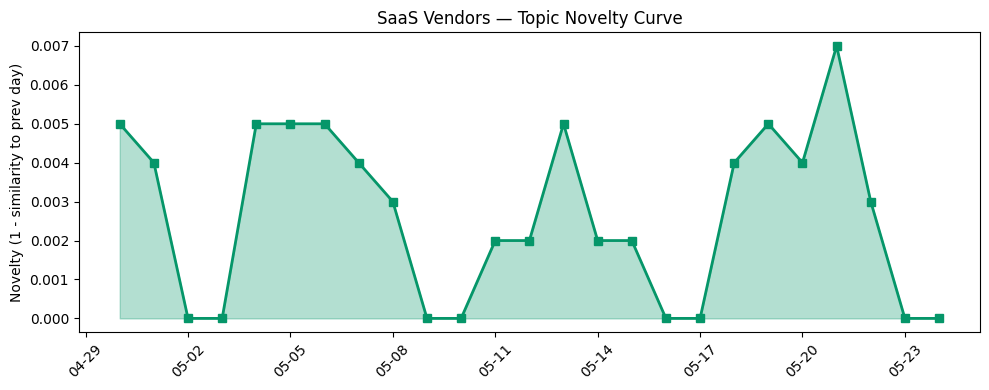

## 今日云计算结构性变化
> 今日云计算和SaaS行业出现多项技术和应用层面的结构性变化信号，包括Azure的跨集群网络、火山引擎的云产品发布以及HubSpot的AI营销工具。

今日最值得注意的云计算/SaaS结构性变化是技术层和应用层的突破。Azure推出的跨集群网络功能实现了高性能的跨集群通信，火山引擎发布的ByteHouse作为ClickHouse企业版，提供了实时数据分析的解决方案。同时，HubSpot的AI营销工具帮助企业提高营销效率。这些变化表明云计算和SaaS行业正在不断创新和发展。

- 📈 **持续趋势**：技术层话题已连续多天增强，表明云计算和SaaS行业的技术创新正在持续推进。
- 🆕 **新兴方向**：应用层的AI营销工具为30天内首次出现，表明云计算和SaaS行业正在探索新的应用场景。
- 🔺 **突然升温**：基础设施层的云产品发布和跨集群网络功能近3天突然集中出现，表明云计算和SaaS行业的基础设施建设正在加速。
- 🔑 **新关键词**：云产品、营销工具、跨集群网络等关键词的出现，表明云计算和SaaS行业的技术和应用层面正在不断演化。
- 📉 **消退关键词**：Anthropic、Claude Opus 4.7、Microsoft Azure、网络安全等关键词的消退，表明云计算和SaaS行业的技术和应用层面正在不断更新。

## 技术层信号
🔴 重大突破

云原生和容器化技术的进展是技术层信号中一个重要方面。Azure的跨集群网络功能和火山引擎的ByteHouse产品发布，都是云原生和容器化技术的重要应用。同时，AWS的Amazon Bedrock和Amazon Redshift RG实例，也表明了云计算和SaaS行业对云原生和数据湖查询的重视。

AI和云融合是技术层信号中另一个重要方面。HubSpot的AI营销工具和Adobe的font选择，都是AI技术在云计算和SaaS行业的应用。同时，Google Cloud的Agent应用和Urban Outfitters的AlloyDB应用，也表明了云计算和SaaS行业对AI技术的重视。

## 产业资本信号
🔴 强信号

基础设施变化是产业资本信号中一个重要方面。Azure的区域扩张和火山引擎的新型计算引擎，都是基础设施建设的重要方面。同时，Cloudflare的Browser Run产品和HP的BIOS更新，也表明了云计算和SaaS行业对基础设施建设的重视。

应用层变化是产业资本信号中另一个重要方面。HubSpot的AI营销工具和Adobe的font选择，都是应用层的重要应用。同时，Urban Outfitters的AlloyDB应用和Google Cloud的Agent应用，也表明了云计算和SaaS行业对应用层的重视。

资本流向是产业资本信号中另一个重要方面。Strella的1400万美元的Series A融资和Amazon的AI采访工具，都是资本流向的重要方面。同时，Cloudflare的响应Linux内核漏洞和DNSSEC问题，也表明了云计算和SaaS行业对资本流向的重视。

## 潜在拐点判断

今日信号和历史趋势表明，云计算和SaaS行业正在经历一个潜在的拐点。技术层和应用层的突破，基础设施建设的加速，资本流向的增加，都表明了云计算和SaaS行业的发展正在加速。然而，风险信号的突然升温，也表明了云计算和SaaS行业的发展存在一定的风险。

## 明日观察点

1. 观察Azure的跨集群网络功能和火山引擎的ByteHouse产品发布的后续发展。
2. 关注HubSpot的AI营销工具和Adobe的font选择的应用层面的发展。
3. 关注Cloudflare的Browser Run产品和HP的BIOS更新的基础设施建设的发展。

## 长期趋势坐标

今日信号和历史趋势表明，云计算和SaaS行业的发展正在加速。技术层和应用层的突破，基础设施建设的加速，资本流向的增加，都表明了云计算和SaaS行业的发展正在加速。然而，风险信号的突然升温，也表明了云计算和SaaS行业的发展存在一定的风险。

## 数据洞察
### 云厂商话题演化

今日云厂商话题演化的novelty_score为0.017，mean_similarity为0.983，表明云厂商话题的演化相对稳定。

### SaaS厂商话题演化

今日SaaS厂商话题演化的novelty_score为0.018，mean_similarity为0.982，表明SaaS厂商话题的演化相对稳定。

### 趋势图

## 参考来源

- [Powering multi-cluster workloads with seamless cross-cluster networking for Azure Kubernetes Fleet Manager](https://azure.microsoft.com/en-us/blog/powering-multi-cluster-workloads-with-seamless-cross-cluster-networking-for-azure-kubernetes-fleet-manager/)
- [从 ClickHouse 到 ByteHouse：实时数据分析场景下的优化实践](https://www.cnblogs.com/volcengine/p/15624109.html)
- [AWS Weekly Roundup: AWS Transform at 1 year, Claude Platform on AWS, EC2 M3 Ultra Mac instances, and more](https://aws.amazon.com/blogs/aws/aws-weekly-roundup-aws-transform-at-1-year-claude-platform-on-aws-ec2-m3-ultra-mac-instances-and-more-may-18-2026/)
- [Amazon Redshift introduces AWS Graviton-based RG instances with an integrated data lake query engine](https://aws.amazon.com/blogs/aws/amazon-redshift-introduces-aws-graviton-based-rg-instances-with-an-integrated-data-lake-query-engine/)
- [The Blueprint: How Movix fills a gap in dental skills with specialized agentic AI](https://cloud.google.com/blog/topics/startups/filling-the-gaps-in-dental-skills-with-specialized-agentic-ai/)
- [Letting machine learning choose the right font for everyone](https://blog.adobe.com/en/publish/2022/06/23/letting-machine-learning-choose-the-right-font-for-everyone)
- [火山引擎正式推出四款数据产品 将持续完善敏捷数智引擎矩阵](https://www.cnblogs.com/volcengine/p/15640481.html)
- [Our billing pipeline was suddenly slow. The culprit was a hidden bottleneck in ClickHouse](https://blog.cloudflare.com/clickhouse-query-plan-contention/)
- [Azure IaaS: Deploy high-performance workloads with a system-level approach](https://azure.microsoft.com/en-us/blog/azure-iaas-deploy-high-performance-workloads-with-a-system-level-approach/)
- [字节跳动是如何建设云的？](https://www.cnblogs.com/volcengine/p/15633967.html)
- [Browser Run: now running on Cloudflare Containers, it’s faster and more scalable](https://blog.cloudflare.com/browser-run-containers/)
- [Best AI search analytics tools for marketing teams](https://blog.hubspot.com/marketing/ai-search-analytics-tools)
- [Build AI apps with Azure Cosmos DB: Key trends from Cosmos Conf 2026](https://azure.microsoft.com/en-us/blog/build-ai-apps-with-azure-cosmos-db-key-trends-from-cosmos-conf-2026/)
- [Urban Outfitters achieves major cost savings by moving Sterling OMS to AlloyDB for PostgreSQL](https://cloud.google.com/blog/products/databases/urban-outfitters-moves-sterling-oms-to-alloydb-for-postgresql/)
- [Amazon and Chobani adopt Strella's AI interviews for customer research as fast-growing startup raises $14M](https://venturebeat.com/technology/amazon-and-chobani-adopt-strellas-ai-interviews-for-customer-research-as)
- [UK MPs slam digital ID rollout as a 'fiasco' after botched launch](https://www.theregister.com/public-sector/2026/05/23/uk-mps-slam-digital-id-rollout-as-a-fiasco-after-botched-launch/5245124)
- [Megalodon chums the waters in 5.5K+ GitHub repo poisonings](https://www.theregister.com/security/2026/05/22/megalodon-chums-the-waters-in-55k-github-repo-poisonings/5245342)
- [When DNSSEC goes wrong: how we responded to the .de TLD outage](https://blog.cloudflare.com/de-tld-outage-dnssec/)
- [How Cloudflare responded to the “Copy Fail” Linux vulnerability](https://blog.cloudflare.com/copy-fail-linux-vulnerability-mitigation/)
- [HP investigating BIOS updates that leave premium laptop users in boot loop limbo](https://www.theregister.com/personal-tech/2026/05/24/hp-investigating-bios-updates-that-leave-premium-laptop-users-in-boot-loop-limbo/5244769)