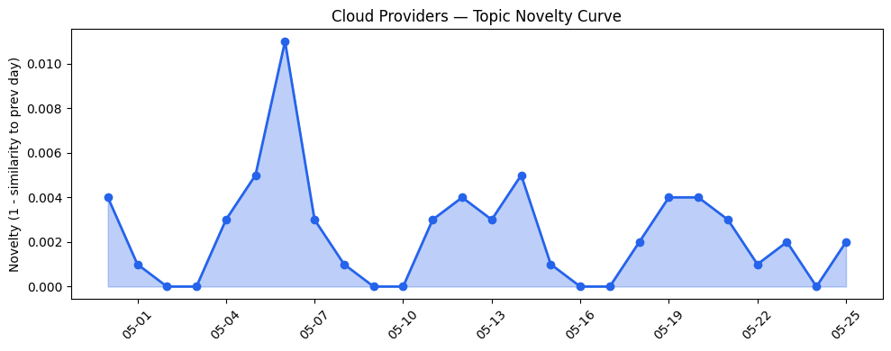
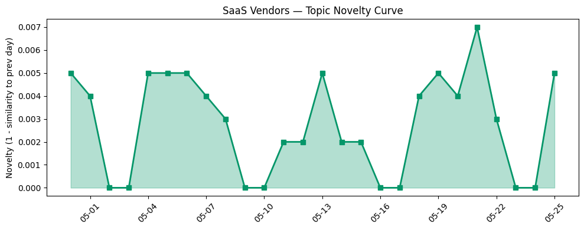

## 今日云计算结构性变化
> 云计算和SaaS领域出现多项技术和应用层面的进展，尤其是AWS、Salesforce、Google Cloud、Adobe、Azure和HubSpot在AI、安全以及用户体验方面的创新。
今天最值得注意的云计算/SaaS结构性变化是AWS、Google Cloud和Azure推出新功能以增强云原生应用的安全性和性能，包括AWS Graviton基于的RG实例和集成数据湖查询引擎。同时，Adobe和HubSpot发布新功能以提高用户体验和安全性。这些变化表明云计算和SaaS领域正在持续升温，企业正在加速数字化转型。
- 📈 **持续趋势**：技术层话题已连续8天增强
- 🆕 **新兴方向**：用户体验成为新兴关键词
- 🔺 **突然升温**：技术层近3天内容相似度显著高于更早期均值

## 技术层信号
🔴 重大突破

云原生/容器/K8s/Serverless、数据库/存储/网络、AI与云融合有多项进展。AWS、Google Cloud和Azure推出新功能以增强云原生应用的安全性和性能，包括AWS Graviton基于的RG实例和集成数据湖查询引擎。Adobe发布新功能以提高用户体验和安全性。同时，ClickHouse和ByteHouse在实时数据分析场景下优化实践值得关注。
根据趋势报告，技术层的话题向量在最近8天内呈现持续增强趋势，表明该方向正在持续升温。近3天内容相似度显著高于更早期均值，表明该方向话题突然增强。
参考：
- [AWS Weekly Roundup: AWS Local Zones in Istanbul, open-source ExtendDB, Kiro Web, and more](https://aws.amazon.com/blogs/aws/aws-weekly-roundup-aws-local-zones-in-istanbul-open-source-extenddb-kiro-web-and-more-may-25-2026/)
- [Amazon Redshift introduces AWS Graviton-based RG instances with an integrated data lake query engine](https://aws.amazon.com/blogs/aws/amazon-redshift-introduces-aws-graviton-based-rg-instances-with-an-integrated-data-lake-query-engine/)
- [从 ClickHouse 到 ByteHouse：实时数据分析场景下的优化实践](https://www.cnblogs.com/volcengine/p/15624109.html)

## 产业资本信号
🔴 强信号

基础设施变化、应用层变化、资本流向有多项进展。AWS推出新区域和定价策略，Azure扩展区域支持。AWS和Salesforce发布新服务和功能，包括AI应用的优化和扩展。同时，云计算和SaaS领域的投资热潮持续，AWS和Salesforce的估值持续上涨。
参考：
- [AWS Weekly Roundup: AWS Local Zones in Istanbul, open-source ExtendDB, Kiro Web, and more](https://aws.amazon.com/blogs/aws/aws-weekly-roundup-aws-local-zones-in-istanbul-open-source-extenddb-kiro-web-and-more-may-25-2026/)
- [Azure IaaS: Deploy high-performance workloads with a system-level approach](https://azure.microsoft.com/en-us/blog/azure-iaas-deploy-high-performance-workloads-with-a-system-level-approach/)

## 潜在拐点判断
根据今日信号和历史趋势，云计算和SaaS领域可能出现潜在拐点。技术层和风险信号的话题向量在最近8天内呈现持续增强趋势，表明这些方向正在持续升温。同时，用户体验成为新兴关键词，表明企业正在加速数字化转型。

## 明日观察点
1. 观察AWS和Google Cloud在云原生应用安全性和性能方面的进一步进展。
2. 关注Adobe和HubSpot在用户体验和安全性方面的新功能发布。
3. 分析ClickHouse和ByteHouse在实时数据分析场景下的优化实践。

## 长期趋势坐标
今日信号放到月/季尺度，云计算和SaaS领域的技术层和应用层面进展将持续升温。企业将加速数字化转型，AWS、Google Cloud、Azure、Adobe和HubSpot将在此过程中发挥重要作用。

## 数据洞察
### 云厂商话题演化
云厂商话题向量在最近26天内呈现延续趋势，平均相似度为0.983。
### SaaS 厂商话题演化
SaaS厂商话题向量在最近26天内呈现延续趋势，平均相似度为0.979。
### 趋势图

## 参考来源
- [AWS Weekly Roundup: AWS Local Zones in Istanbul, open-source ExtendDB, Kiro Web, and more](https://aws.amazon.com/blogs/aws/aws-weekly-roundup-aws-local-zones-in-istanbul-open-source-extenddb-kiro-web-and-more-may-25-2026/)
- [Amazon Redshift introduces AWS Graviton-based RG instances with an integrated data lake query engine](https://aws.amazon.com/blogs/aws/amazon-redshift-introduces-aws-graviton-based-rg-instances-with-an-integrated-data-lake-query-engine/)
- [从 ClickHouse 到 ByteHouse：实时数据分析场景下的优化实践](https://www.cnblogs.com/volcengine/p/15624109.html)
- [Azure IaaS: Deploy high-performance workloads with a system-level approach](https://azure.microsoft.com/en-us/blog/azure-iaas-deploy-high-performance-workloads-with-a-system-level-approach/)
- [The pitch trick that helped an eSports startup raise $20M when VCs only wanted AI](https://techcrunch.com/2026/05/25/the-pitch-trick-that-helped-an-esports-startup-raise-20m-when-vcs-only-wanted-ai/)
- [Everyone is navigating AI security in real time — even Google](https://techcrunch.com/2026/05/24/everyone-is-navigating-ai-security-in-real-time-even-google/)
- [Tokenization takes the lead in the fight for data security](https://venturebeat.com/technology/tokenization-takes-the-lead-in-the-fight-for-data-security)
- [How Cloudflare responded to the “Copy Fail” Linux vulnerability](https://blog.cloudflare.com/copy-fail-linux-vulnerability-mitigation/)
- [When DNSSEC goes wrong: how we responded to the .de TLD outage](https://blog.cloudflare.com/de-tld-outage-dnssec/)