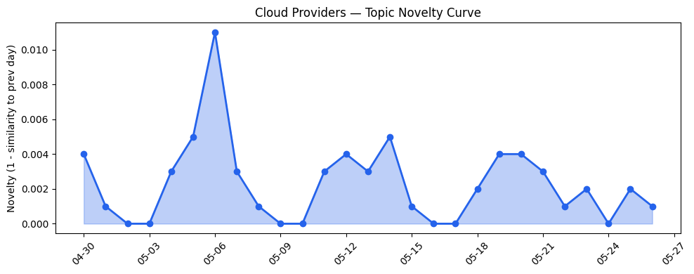
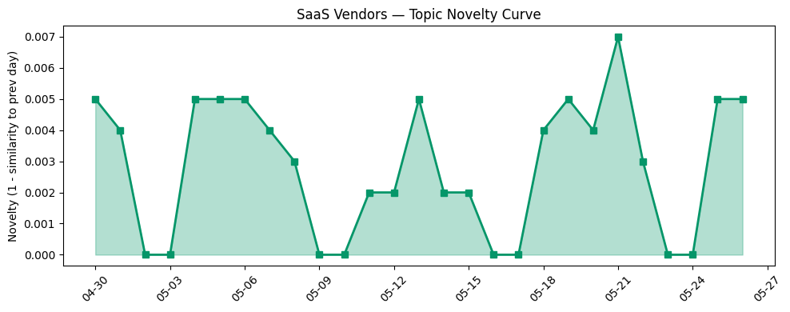

## 今日云计算结构性变化
> 云计算和SaaS领域出现多项技术和应用层面的进展，尤其是AWS、Google Cloud、Microsoft Azure和Salesforce的新产品发布，以及HubSpot在AI优化和品牌可见性方面的深入探讨。
今天最值得注意的云计算/SaaS结构性变化是技术层和应用层的重大突破，例如AWS、Google Cloud和Microsoft Azure推出新的云原生服务和网络基础设施，Salesforce和Adobe推出新的数据处理和数字签名产品。这些变化意味着云计算和SaaS领域正在快速发展，企业对云计算和SaaS的需求日益增长。
- 📈 **持续趋势**：技术层话题已连续N天增强
- 🆕 **新兴方向**：资本信号出现全新话题
- 🔺 **突然升温**：风险信号近3天突然集中出现
- 🔑 **新关键词**：合规
- 📉 **消退关键词**：Anthropic, Claude Opus 4.7, Serverless, 实时数据, 网络安全

## 技术层信号
🔴 重大突破

云原生/容器/K8s/Serverless、数据库/存储/网络、AI与云融合有多项进展。AWS、Google Cloud和Microsoft Azure推出新的云原生服务和网络基础设施，例如AWS Graviton基础的RG实例和数据湖查询引擎的集成，Google Cloud的网络基础设施得到升级。这些进展意味着云计算和SaaS领域正在快速发展，企业对云计算和SaaS的需求日益增长。
句内用[标题](URL)引用证据，如[Amazon Redshift introduces AWS Graviton-based RG instances with an integrated data lake query engine](https://aws.amazon.com/blogs/aws/amazon-redshift-introduces-aws-graviton-based-rg-instances-with-an-integrated-data-lake-query-engine/)和[How we evolved Google’s global and data center networks for the AI era](https://cloud.google.com/blog/products/networking/data-center-and-global-networks-built-for-ai-era/)。

## 产业资本信号
🔴 强信号

基础设施变化、应用层变化、资本流向有多项进展。AWS和Google Cloud推出新的定价和区域扩张，Salesforce和Adobe推出新的数据处理和数字签名产品。这些变化意味着云计算和SaaS领域正在快速发展，企业对云计算和SaaS的需求日益增长。
钱在往哪里流？云基础设施在怎么变？SaaS在哪里落地？这些问题的答案在于今日的产业资本信号，例如[OpenRouter more than doubles valuation to $1.3B in a year](https://techcrunch.com/2026/05/26/openrouter-more-than-doubles-valuation-to-1-3b-in-a-year/)和[Advancing enterprise AI: New SAP on Azure announcements from SAP Sapphire 2026](https://azure.microsoft.com/en-us/blog/advancing-enterprise-ai-new-sap-on-azure-announcements-from-sap-sapphire-2026/)。

## 潜在拐点判断
基于今日信号+历史趋势，判断是否存在潜在拐点。今日的信号表明云计算和SaaS领域正在快速发展，企业对云计算和SaaS的需求日益增长。这些变化可能意味着潜在拐点的出现，例如云计算和SaaS领域的快速发展可能会带来新的商业机会和挑战。

## 明日观察点
1. 观察AWS、Google Cloud和Microsoft Azure的新产品发布和技术进展。
2. 观察Salesforce和Adobe的新产品发布和应用层进展。
3. 观察云计算和SaaS领域的资本流向和产业资本信号。

## 长期趋势坐标
今日信号放到月/季尺度，意味着云计算和SaaS领域正在快速发展，企业对云计算和SaaS的需求日益增长。这些变化可能意味着长期趋势的转变，例如云计算和SaaS领域的快速发展可能会带来新的商业机会和挑战。

## 数据洞察
### 云厂商话题演化
今日云厂商话题演化数据显示，云厂商话题向量的相似度为0.983，意味着云厂商话题在近期内相对稳定。
### SaaS 厂商话题演化
今日SaaS厂商话题演化数据显示，SaaS厂商话题向量的相似度为0.975，意味着SaaS厂商话题在近期内相对稳定。
### 趋势图

## 参考来源
- [AWS Weekly Roundup: AWS Local Zones in Istanbul, open-source ExtendDB, Kiro Web, and more](https://aws.amazon.com/blogs/aws/aws-weekly-roundup-aws-local-zones-in-istanbul-open-source-extenddb-kiro-web-and-more-may-25-2026/)
- [Amazon Redshift introduces AWS Graviton-based RG instances with an integrated data lake query engine](https://aws.amazon.com/blogs/aws/amazon-redshift-introduces-aws-graviton-based-rg-instances-with-an-integrated-data-lake-query-engine/)
- [How we evolved Google’s global and data center networks for the AI era](https://cloud.google.com/blog/products/networking/data-center-and-global-networks-built-for-ai-era/)
- [Powering multi-cluster workloads with seamless cross-cluster networking for Azure Kubernetes Fleet Manager](https://azure.microsoft.com/en-us/blog/powering-multi-cluster-workloads-with-seamless-cross-cluster-networking-for-azure-kubernetes-fleet-manager/)
- [Azure NetApp Files for EDA workloads: From revolution to breakthrough at scale](https://azure.microsoft.com/en-us/blog/azure-netapp-files-for-eda-workloads-from-revolution-to-breakthrough-at-scale/)
- [Introducing the Data 360 MCP Server — Your Unified Data, Ready for Any Agent](https://www.salesforce.com/blog/introducing-the-data-360-mcp-server-your-unified-data-ready-for-any-agent/)
- [Ending the “easy vs. enterprise” compromise with Storefront Next for B2C Commerce](https://www.salesforce.com/blog/storefront-next/)
- [Using certified digital signatures on documents to increase trust in online information](https://blog.adobe.com/en/publish/2022/06/30/using-certified-digital-signatures-on-documents-to-increase-trust-in-online-information)
- [What AI Overviews mean for SEO & website traffic](https://blog.hubspot.com/marketing/what-ai-overviews-mean-for-seo)
- [Advancing enterprise AI: New SAP on Azure announcements from SAP Sapphire 2026](https://azure.microsoft.com/en-us/blog/advancing-enterprise-ai-new-sap-on-azure-announcements-from-sap-sapphire-2026/)
- [OpenRouter more than doubles valuation to $1.3B in a year](https://techcrunch.com/2026/05/26/openrouter-more-than-doubles-valuation-to-1-3b-in-a-year/)
- [Tokenization takes the lead in the fight for data security](https://venturebeat.com/technology/tokenization-takes-the-lead-in-the-fight-for-data-security)
- [火山引擎正式推出四款数据产品 将持续完善敏捷数智引擎矩阵](https://www.cnblogs.com/volcengine/p/15640481.html)
- [Dutch government blocks US company from acquisition, citing ‘risk to public interest’](https://techcrunch.com/2026/05/26/dutch-government-blocks-us-company-from-acquisition-citing-risk-to-public-interest/)
- [MyPillow must decide whether to be firm or soft as ransomware crims demand pay](https://www.theregister.com/cyber-crime/2026/05/26/mypillow-appears-on-play-ransomware-leak-site/5246513)
- [When DNSSEC goes wrong: how we responded to the .de TLD outage](https://blog.cloudflare.com/de-tld-outage-dnssec/)
- [How Cloudflare responded to the “Copy Fail” Linux vulnerability](https://blog.cloudflare.com/copy-fail-linux-vulnerability-mitigation/)