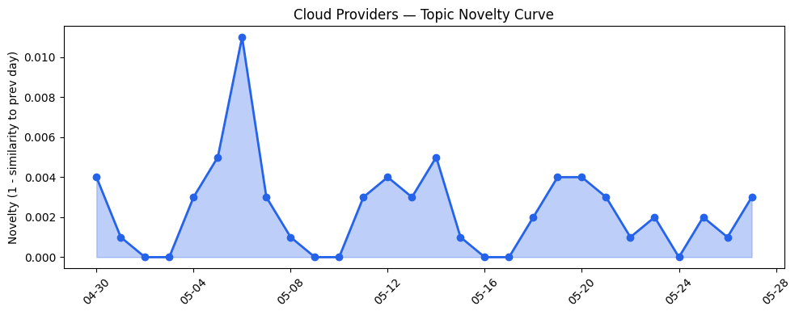
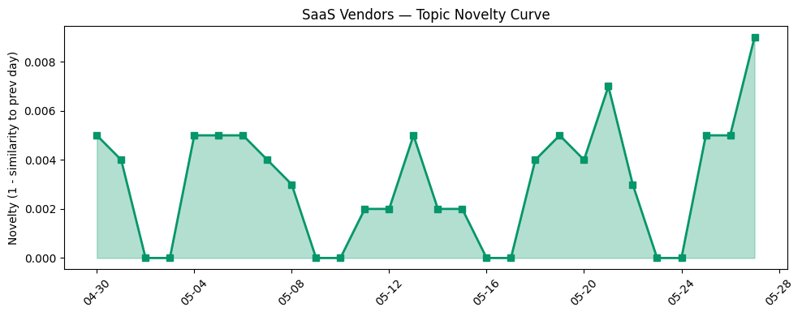

## 今日云计算结构性变化
> 今日云计算结构性变化的核心判断是：AWS、Salesforce、Google Cloud和Adobe等公司在AI和SaaS领域取得了显著进展，推动了行业的创新和发展。
今日最值得注意的云计算/SaaS结构性变化是，AWS和Google Cloud推出了新的云原生服务，包括Amazon Bedrock和Cloud Run，这些服务将进一步推动云计算的发展和应用。同时，Salesforce和Adobe推出了新的行业解决方案，利用AI和SaaS技术改善其搜索功能和客户体验。
- 📈 **持续趋势**：技术层话题已连续8天增强
- 🆕 **新兴方向**：AI Threat Defense、Cloud Networking、Cloud Run等话题为30天内首次出现
- 🔺 **突然升温**：技术层近3天内容相似度显著高于更早期均值

## 技术层信号
🔴 重大突破

云原生/容器/K8s/Serverless、数据库/存储/网络、AI与云融合等技术层面都有显著进展。AWS和Google Cloud推出了新的云原生服务，包括Amazon Bedrock和Cloud Run，这些服务将进一步推动云计算的发展和应用。同时，Google Cloud还推出了Google AI Threat Defense，用于帮助客户抵御AI威胁。
[Amazon Bedrock introduces new advanced prompt optimization and migration tool](https://aws.amazon.com/blogs/aws/amazon-bedrock-introduces-new-advanced-prompt-optimization-and-migration-tool/)
[A Guide to AI Cold Starts on Cloud Run](https://cloud.google.com/blog/topics/developers-practitioners/a-guide-to-ai-cold-starts-on-cloud-run/)
[Introducing Google AI Threat Defense to help you outpace the adversary](https://cloud.google.com/blog/products/identity-security/introducing-google-ai-threat-defense/)

## 产业资本信号
🔴 强信号

基础设施变化、应用层变化、资本流向等方面都有显著信号。AWS和Google Cloud推出了新的定价和区域扩张策略，进一步推动了云计算的发展和应用。同时，Salesforce和Adobe推出了新的行业解决方案，利用AI和SaaS技术改善其搜索功能和客户体验。
[AWS Weekly Roundup: AWS Local Zones in Istanbul, open-source ExtendDB, Kiro Web, and more (May 25, 2026)](https://aws.amazon.com/blogs/aws/aws-weekly-roundup-aws-local-zones-in-istanbul-open-source-extenddb-kiro-web-and-more-may-25-2026/)
[AWS Weekly Roundup: AWS Transform at 1 year, Claude Platform on AWS, EC2 M3 Ultra Mac instances, and more (May 18, 2026)](https://aws.amazon.com/blogs/aws/aws-weekly-roundup-aws-transform-at-1-year-claude-platform-on-aws-ec2-m3-ultra-mac-instances-and-more-may-18-2026/)

## 潜在拐点判断
今日信号 + 历史趋势表明，云计算和SaaS领域可能存在潜在拐点。AWS和Google Cloud推出的新服务和解决方案可能会进一步推动云计算的发展和应用，而Salesforce和Adobe的新行业解决方案可能会改善其搜索功能和客户体验。

## 明日观察点
1. 观察AWS和Google Cloud的新服务和解决方案是否会继续推动云计算的发展和应用。
2. 观察Salesforce和Adobe的新行业解决方案是否会改善其搜索功能和客户体验。
3. 观察AI和SaaS技术在云计算和产业资本信号中的应用和发展。

## 长期趋势坐标
今日信号放到月/季尺度，云计算和SaaS领域的发展和应用可能会继续推动行业的创新和发展。AWS和Google Cloud的新服务和解决方案可能会进一步推动云计算的发展和应用，而Salesforce和Adobe的新行业解决方案可能会改善其搜索功能和客户体验。

## 数据洞察
### 云厂商话题演化
今日云厂商话题演化的novelty score为0.018，mean similarity为0.982，表明云厂商话题向量在最近28天内呈现稳定趋势。
### SaaS厂商话题演化
今日SaaS厂商话题演化的novelty score为0.029，mean similarity为0.971，表明SaaS厂商话题向量在最近28天内呈现稳定趋势。
### 趋势图

## 参考来源
- [Amazon Bedrock introduces new advanced prompt optimization and migration tool](https://aws.amazon.com/blogs/aws/amazon-bedrock-introduces-new-advanced-prompt-optimization-and-migration-tool/)
- [A Guide to AI Cold Starts on Cloud Run](https://cloud.google.com/blog/topics/developers-practitioners/a-guide-to-ai-cold-starts-on-cloud-run/)
- [Introducing Google AI Threat Defense to help you outpace the adversary](https://cloud.google.com/blog/products/identity-security/introducing-google-ai-threat-defense/)
- [AWS Weekly Roundup: AWS Local Zones in Istanbul, open-source ExtendDB, Kiro Web, and more (May 25, 2026)](https://aws.amazon.com/blogs/aws/aws-weekly-roundup-aws-local-zones-in-istanbul-open-source-extenddb-kiro-web-and-more-may-25-2026/)
- [AWS Weekly Roundup: AWS Transform at 1 year, Claude Platform on AWS, EC2 M3 Ultra Mac instances, and more (May 18, 2026)](https://aws.amazon.com/blogs/aws/aws-weekly-roundup-aws-transform-at-1-year-claude-platform-on-aws-ec2-m3-ultra-mac-instances-and-more-may-18-2026/)