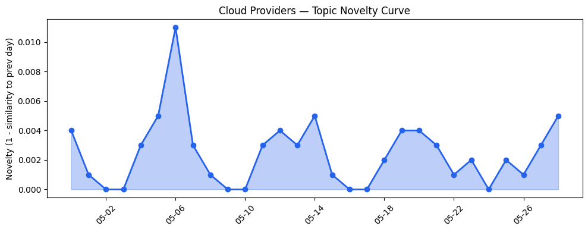
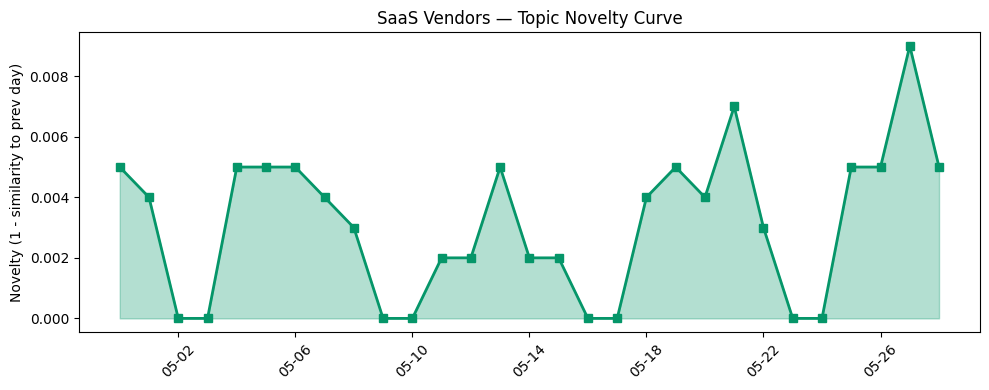

## 今日云计算结构性变化
> 今日云计算结构性变化的核心判断是：AWS、Salesforce、Google Cloud、Azure和火山引擎等云厂商推出新技术和服务，行业资讯显示AI和云计算领域融合加深，安全和监管问题凸显。
今天最值得注意的云计算/SaaS结构性变化是云厂商和SaaS厂商在技术和应用层面的持续创新和升级，尤其是在AI和云计算领域的融合加深。这种变化意味着云计算和SaaS产业正在经历一场深刻的变革，企业需要紧跟这一趋势以保持竞争力。
- 📈 **持续趋势**：基础设施、应用层和风险信号的话题向量在最近8天内呈现持续增强趋势。
- 🆕 **新兴方向**：tokenization、并购、监管和融资等关键词近期出现频率增高。
- 🔺 **突然升温**：基础设施近3天内容相似度显著高于更早期均值。
- 🔑 **新关键词**：tokenization、并购、监管和融资。
- 📉 **消退关键词**：Anthropic、Claude Opus 4.7、实时数据、数据产品和网络安全等关键词近期关注度降低。

## 技术层信号
🔴 重大突破

云原生和Serverless技术的发展是近期技术层信号中最值得注意的变化。AWS推出AWS Resilience Hub和Amazon OpenSearch Serverless，Google Cloud发布关于AI在SRE中的应用和Dataflow的更新，这些变化意味着云厂商正在加速推进云原生和Serverless技术的发展和应用。同时，基础设施的更新，如AWS Graviton-based RG instances和AWS MCP Server等，也表明云厂商在不断提升基础设施的性能和能力。
例如，[Introducing the next generation of AWS Resilience Hub for generative AI-based SRE resilience journey](https://aws.amazon.com/blogs/aws/introducing-the-next-generation-of-aws-resilience-hub-for-generative-ai-based-sre-resilience-journey/) 和 [Introducing the next generation of Amazon OpenSearch Serverless for building your agentic AI applications](https://aws.amazon.com/blogs/aws/introducing-the-next-generation-of-amazon-opensearch-serverless-for-building-your-agentic-ai-applications/) 等文章都体现了这一趋势。

## 产业资本信号
🔴 强信号

近期，Anthropic raises $65 billion，H1 secures $40M from CVS等融资事件，以及Asana acquires no-code agent-builder StackAI等并购事件，表明云计算和SaaS领域的资本流动性仍然较高。这些信号意味着投资者仍然看好云计算和SaaS的发展前景，企业需要抓住这一机会加速自己的发展。
例如，[Anthropic raises $65 billion, nears $1T valuation ahead of IPO](https://techcrunch.com/2026/05/28/anthropic-raises-65-billion-nears-1t-valuation-ahead-of-ipo/) 和 [Snowflake buys Natoma to help freeze out rogue agents](https://www.theregister.com/ai-ml/2026/05/28/snowflake-buys-natoma-to-help-freeze-out-rogue-agents/5248062) 等文章都体现了这一趋势。

## 潜在拐点判断
基于今日信号和历史趋势，判断是否存在潜在拐点。今日的信号表明，云计算和SaaS领域的技术和应用层面正在经历一场深刻的变革，企业需要紧跟这一趋势以保持竞争力。同时，资本流动性较高，企业需要抓住这一机会加速自己的发展。因此，今日的信号和历史趋势都表明，云计算和SaaS领域可能正在经历一个潜在的拐点。

## 明日观察点
1. 观察AWS和Google Cloud在云原生和Serverless技术方面的进一步发展和应用。
2. 关注Anthropic和H1等公司的进一步发展和融资动向。
3. 密切关注云计算和SaaS领域的监管和安全问题的发展。

## 长期趋势坐标
将今日信号放到月/季尺度，今日的信号和历史趋势都表明，云计算和SaaS领域可能正在经历一个潜在的拐点。云原生和Serverless技术的发展，资本流动性较高，监管和安全问题的凸显等，都意味着云计算和SaaS领域正在经历一场深刻的变革。

## 数据洞察
### 云厂商话题演化
今日云厂商话题演化的变化主要体现在AWS和Google Cloud在云原生和Serverless技术方面的进一步发展和应用。例如，[Introducing the next generation of AWS Resilience Hub for generative AI-based SRE resilience journey](https://aws.amazon.com/blogs/aws/introducing-the-next-generation-of-aws-resilience-hub-for-generative-ai-based-sre-resilience-journey/) 和 [Introducing the next generation of Amazon OpenSearch Serverless for building your agentic AI applications](https://aws.amazon.com/blogs/aws/introducing-the-next-generation-of-amazon-opensearch-serverless-for-building-your-agentic-ai-applications/) 等文章都体现了这一趋势。
### SaaS 厂商话题演化
今日SaaS厂商话题演化的变化主要体现在Salesforce和HubSpot等公司在应用层面的持续创新和升级。例如，[B2C Commerce May Release: Merchandising, Product Management, and Payment Efficiency](https://www.salesforce.com/blog/b2c-commerce-may-26-release/) 和 [The role of citations in AEO: Why citations matter more than backlinks for AI visibility](https://blog.hubspot.com/marketing/citations-in-aeo) 等文章都体现了这一趋势。
### 趋势图

## 参考来源
- [Introducing the next generation of AWS Resilience Hub for generative AI-based SRE resilience journey](https://aws.amazon.com/blogs/aws/introducing-the-next-generation-of-aws-resilience-hub-for-generative-ai-based-sre-resilience-journey/) — AWS Blog
- [Introducing the next generation of Amazon OpenSearch Serverless for building your agentic AI applications](https://aws.amazon.com/blogs/aws/introducing-the-next-generation-of-amazon-opensearch-serverless-for-building-your-agentic-ai-applications/) — AWS Blog
- [B2C Commerce May Release: Merchandising, Product Management, and Payment Efficiency](https://www.salesforce.com/blog/b2c-commerce-may-26-release/) — Salesforce Blog
- [The role of citations in AEO: Why citations matter more than backlinks for AI visibility](https://blog.hubspot.com/marketing/citations-in-aeo) — HubSpot Blog
- [Anthropic raises $65 billion, nears $1T valuation ahead of IPO](https://techcrunch.com/2026/05/28/anthropic-raises-65-billion-nears-1t-valuation-ahead-of-ipo/) — TechCrunch
- [Snowflake buys Natoma to help freeze out rogue agents](https://www.theregister.com/ai-ml/2026/05/28/snowflake-buys-natoma-to-help-freeze-out-rogue-agents/5248062) — The Register