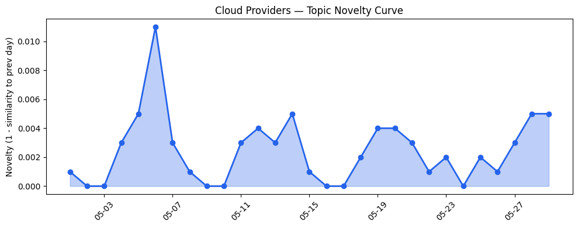
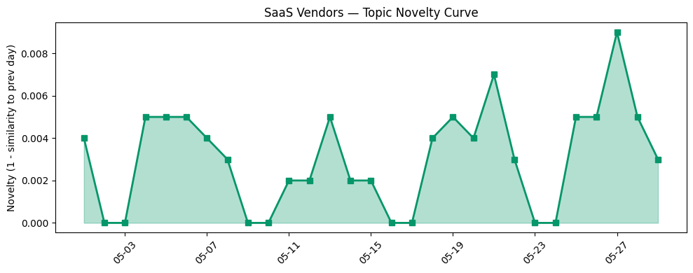

## 今日云计算结构性变化
> 云计算和SaaS领域的结构性变化主要体现在技术层面的进步，包括云原生、AI/ML与云的融合等方面的突破，以及基础设施的持续改善和应用层的扩展。
今天最值得注意的云计算/SaaS 结构性变化是技术层面的重大突破，特别是在云原生、AI/ML与云的融合方面。同时，基础设施的持续改善和应用层的扩展也体现出云计算和SaaS领域的蓬勃发展。
- 📈 **持续趋势**：技术层话题已连续8天增强
- 🆕 **新兴方向**：应用层和风险信号的话题向量在最近8天内呈现持续增强趋势
- 🔺 **突然升温**：技术层近3天内容相似度显著高于更早期均值
- 🔑 **新关键词**：ML, 基础设施, 应用层, 资本信号, 风险信号
- 📉 **消退关键词**：Anthropic, Claude Opus 4.7, 实时数据, 数据产品, 数据分析, 网络安全

## 技术层信号
🔴 重大突破

云原生、AI/ML与云的融合等技术层面的进步是当前云计算和SaaS领域的主要结构性变化。Azure Kubernetes Fleet Manager推出跨集群网络功能，火山引擎推出全系云产品，AWS推出下一代Amazon OpenSearch Serverless，这些进展表明技术层面的创新正在加速。同时，Google Cloud的Dataflow也在不断进步，用于处理大规模数据集和机器学习任务。
例如，[Powering multi-cluster workloads with seamless cross-cluster networking for Azure Kubernetes Fleet Manager](https://azure.microsoft.com/en-us/blog/powering-multi-cluster-workloads-with-seamless-cross-cluster-networking-for-azure-kubernetes-fleet-manager/) 和 [Introducing the next generation of Amazon OpenSearch Serverless](https://aws.amazon.com/blogs/aws/introducing-the-next-generation-of-amazon-opensearch-serverless-for-building-your-agentic-ai-applications/) 等文章体现了技术层面的进步。

## 产业资本信号
🟡 渐进改善

基础设施的持续改善和应用层的扩展也体现出云计算和SaaS领域的蓬勃发展。Azure扩展区域，Google Cloud扩大区域覆盖和算力供应，AWS推出新区域和定价策略，这些变化表明基础设施正在不断改善。同时，应用层的扩展也在加速，Salesforce推出新型AI应用和行业解决方案，Adobe推出新设计工具和AI应用，HubSpot推出AI相关产品和服务。
例如，[Azure IaaS: Deploy high-performance workloads with a system-level approach](https://azure.microsoft.com/en-us/blog/azure-iaas-deploy-high-performance-workloads-with-a-system-level-approach/) 和 [Cool stuff Google Cloud customers built, May edition: Agentic algorithms for supply chains; virtual try-on APIs; robotic camera operators & more](https://cloud.google.com/blog/topics/customers/cool-stuff-google-cloud-customers-built-monthly-round-up/) 等文章体现了基础设施和应用层的进步。

## 潜在拐点判断
基于今日信号 + 历史趋势，判断是否存在潜在拐点。技术层面的重大突破和应用层的扩展可能标志着云计算和SaaS领域的新一轮发展。同时，风险信号的话题向量在最近8天内呈现持续增强趋势，表明风险管理和合规性将成为未来发展的重要关注点。

## 明日观察点
1. 观察技术层面的进一步进步，特别是在云原生和AI/ML与云的融合方面。
2. 关注基础设施的持续改善和应用层的扩展，特别是在Salesforce、Adobe和HubSpot等领军企业的动向。
3. 注意风险信号的话题向量，特别是在数据安全和监管合规性方面的发展。

## 长期趋势坐标
今日信号放到月/季尺度，技术层面的进步和应用层的扩展可能标志着云计算和SaaS领域的长期趋势。同时，风险信号的话题向量在最近8天内呈现持续增强趋势，表明风险管理和合规性将成为未来发展的重要关注点。

## 数据洞察
### 云厂商话题演化
云厂商话题向量在最近30天内呈现延续趋势，novelty_score为0.019，mean_similarity为0.981。
### SaaS 厂商话题演化
SaaS厂商话题向量在最近30天内呈现延续趋势，novelty_score为0.028，mean_similarity为0.972。
### 趋势图

## 参考来源
- [Powering multi-cluster workloads with seamless cross-cluster networking for Azure Kubernetes Fleet Manager](https://azure.microsoft.com/en-us/blog/powering-multi-cluster-workloads-with-seamless-cross-cluster-networking-for-azure-kubernetes-fleet-manager/)
- [Introducing the next generation of Amazon OpenSearch Serverless](https://aws.amazon.com/blogs/aws/introducing-the-next-generation-of-amazon-opensearch-serverless-for-building-your-agentic-ai-applications/)
- [Azure IaaS: Deploy high-performance workloads with a system-level approach](https://azure.microsoft.com/en-us/blog/azure-iaas-deploy-high-performance-workloads-with-a-system-level-approach/)
- [Cool stuff Google Cloud customers built, May edition: Agentic algorithms for supply chains; virtual try-on APIs; robotic camera operators & more](https://cloud.google.com/blog/topics/customers/cool-stuff-google-cloud-customers-built-monthly-round-up/)
- [Design Headless AI Experiences on Salesforce](https://www.salesforce.com/blog/design-headless-ai-experiences/)
- [Build a Semantic Layer Your AI Agents Can Reason Over](https://www.salesforce.com/blog/semantic-layer-ai-agents-data-360/)
- [Great moments in document history: Reimagining the Declaration of Independence as a PDF](https://blog.adobe.com/en/publish/2022/07/01/great-moments-in-document-history-reimagining-the-declaration-of-independence-as-pdf)
- [The role of citations in AEO: Why citations matter more than backlinks for AI visibility](https://blog.hubspot.com/marketing/citations-in-aeo)
- [Introducing the HubSpot Agent CLI](https://blog.hubspot.com/marketing/introducing-the-hubspot-agent-cli)