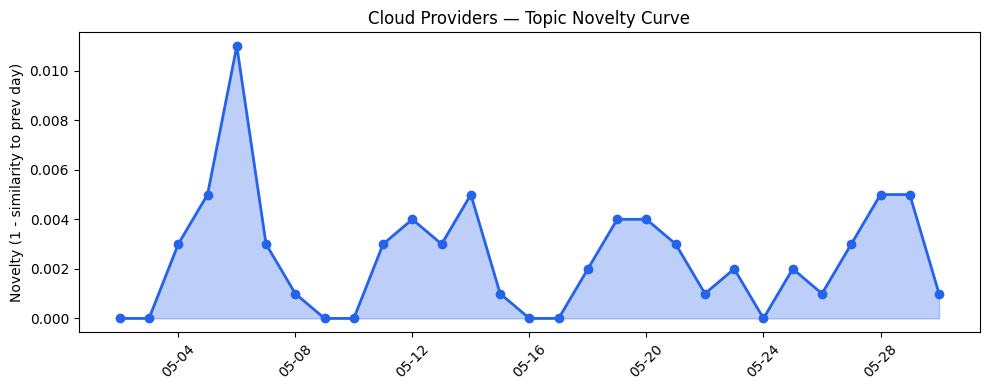
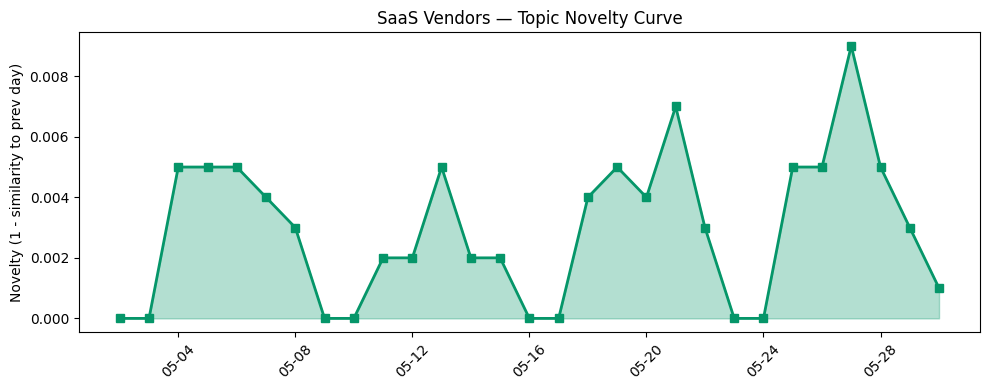

## 今日云计算结构性变化
> 今日云计算行业结构性变化的核心判断是：AWS、Salesforce、Google Cloud、Adobe、火山引擎和Cloudflare等公司的技术发展和基础设施升级为云计算行业带来新的变化。
今天最值得注意的云计算/SaaS结构性变化是技术层和基础设施的重大突破，包括AWS推出下一代AWS Resilience Hub和Amazon OpenSearch Serverless，Google Cloud推出AI-ready安全程序和Dataflow的AI聚焦创新，火山引擎发布ByteHouse，解决ClickHouse的技术难点等。
以下是今日结构性变化的关键信号：
- 📈 **持续趋势**：资本信号的话题向量在最近8天内呈现持续增强趋势。
- 🆕 **新兴方向**：风险信号出现全新话题。
- 🔺 **突然升温**：技术层近3天内容相似度显著高于更早期均值。

## 技术层信号
🔴 重大突破

云原生技术、容器、K8s和Serverless领域的进展为云计算行业带来新的变化。AWS推出下一代AWS Resilience Hub和Amazon OpenSearch Serverless，Google Cloud推出AI-ready安全程序和Dataflow的AI聚焦创新，火山引擎发布ByteHouse，解决ClickHouse的技术难点等。这些发展表明云计算行业正在朝着更高的可用性、安全性和智能化方向发展。
例如，AWS的下一代AWS Resilience Hub可以帮助企业更好地应对故障和中断，提高系统的可用性和可靠性。Google Cloud的AI-ready安全程序可以帮助企业更好地应对安全威胁，提高系统的安全性和合规性。

## 产业资本信号
🔴 强信号

云计算行业的资本信号正在持续增强，投资者对AI和云计算领域的投资热情持续高涨。SoftBank计划投资高达75亿欧元建设法国数据中心，AWS引入新的计算实例，包括EC2 M3 Ultra Mac实例，Cloudflare的容器化和ClickHouse集群优化等。
这些发展表明云计算行业正在朝着更高的基础设施和服务能力方向发展，企业正在采用更多的云计算和AI技术来推动数字化转型。

## 潜在拐点判断
今日观察到技术层和基础设施的重大突破，资本信号的持续增强，风险信号的新兴方向等，这些信号可能表明云计算行业正在经历一个潜在的拐点。
这个拐点可能是云计算行业从传统的基础设施和服务模式转向更高的智能化和可用性方向的转变，企业将更多地采用云计算和AI技术来推动数字化转型和创新。

## 明日观察点
1. 关注AWS和Google Cloud的技术发展和基础设施升级。
2. 观察云计算行业的资本信号和投资热情。
3. 密切关注风险信号的新兴方向和潜在影响。

## 长期趋势坐标
今日信号放到月/季尺度来看，云计算行业的技术发展和基础设施升级将继续推动行业的增长和创新，资本信号的持续增强将促进企业采用更多的云计算和AI技术，风险信号的新兴方向将需要企业的关注和应对。

## 数据洞察
### 云厂商话题演化
今日云厂商话题演化的novelty score为0.017，mean similarity为0.983，表明云厂商话题在近期内没有显著的变化。
### SaaS 厂商话题演化
今日SaaS厂商话题演化的novelty score为0.027，mean similarity为0.973，表明SaaS厂商话题在近期内没有显著的变化。
### 趋势图

## 参考来源
- [Introducing the next generation of AWS Resilience Hub for generative AI-based SRE resilience journey](https://aws.amazon.com/blogs/aws/introducing-the-next-generation-of-aws-resilience-hub-for-generative-ai-based-sre-resilience-journey/)
- [Cloud CISO Perspectives: How to build an AI-ready security program for the public sector](https://cloud.google.com/blog/products/identity-security/cloud-ciso-perspectives-how-to-build-an-ai-ready-security-program-for-the-public-sector/)
- [从 ClickHouse 到 ByteHouse：实时数据分析场景下的优化实践](https://www.cnblogs.com/volcengine/p/15624109.html)
- [SoftBank says it will invest up to €75 billion to build French data centers](https://techcrunch.com/2026/05/30/softbank-says-it-will-invest-up-to-e75-billion-to-build-french-data-centers/)
- [Browser Run: now running on Cloudflare Containers, it’s faster and more scalable](https://blog.cloudflare.com/browser-run-containers/)
- [Design Headless AI Experiences on Salesforce](https://www.salesforce.com/blog/design-headless-ai-experiences/)
- [Fresh new foundries and fonts from the Americas, and Hidden Treasures revisited](https://blog.adobe.com/en/publish/2022/06/30/fresh-new-foundries-fonts-from-americas-hidden-treasures-revisited)
- [Snap alums unveil Ghost Angels fund](https://techcrunch.com/2026/05/30/snap-alums-unveil-ghost-angels-fund/)
- [Wikipedia editors plot strike and banner sabotage after Wikimedia layoffs](https://www.theregister.com/software/2026/05/30/wikipedia-editors-plot-strike-and-banner-sabotage-after-wikimedia-layoffs/5248491)