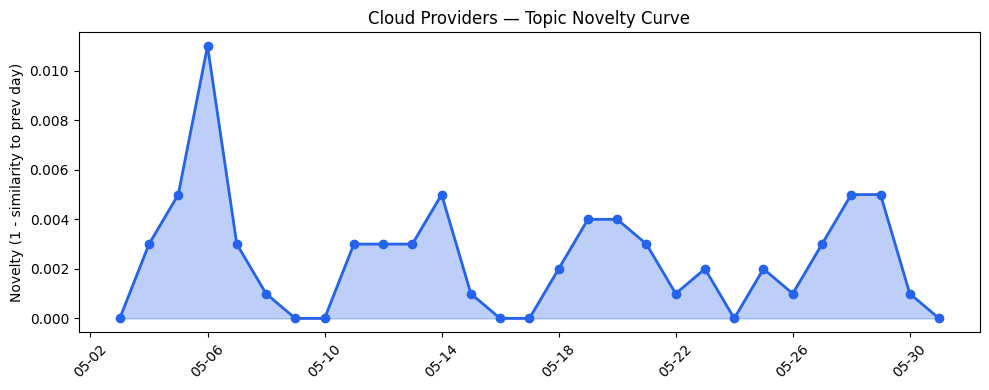
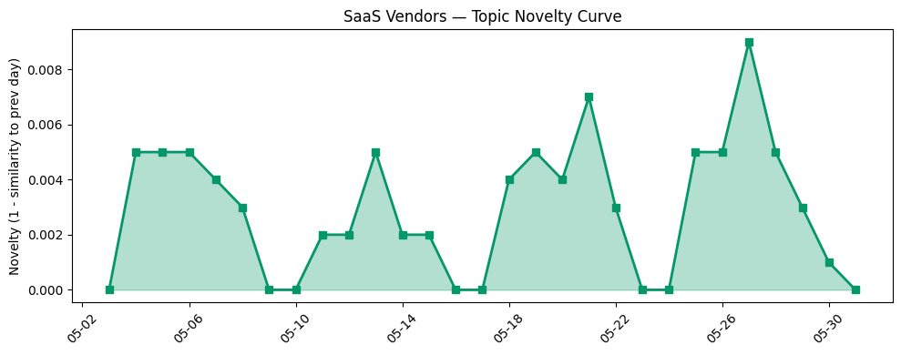

## 今日云计算结构性变化
> 云计算和SaaS领域正在经历快速的技术进步、安全挑战和结构性变化，云厂商和SaaS厂商在技术创新、安全保障和应用层面进行着持续的努力。
今天最值得注意的云计算/SaaS结构性变化是云原生技术的更新、基础设施的改善以及应用层面的创新。这些变化表明云计算和SaaS领域正在经历快速的技术进步和结构性变化。
- 📈 **持续趋势**：技术层话题已连续8天增强
- 🆕 **新兴方向**：风险信号出现全新话题
- 🔺 **突然升温**：应用层的话题向量在最近8天内呈现持续增强趋势

## 技术层信号
🔴 重大突破

云原生技术的更新是技术层信号中最值得注意的变化。AWS、Google Cloud和Azure的云原生技术更新支持云原生和Serverless架构，这将改善数据分析和机器学习体验。例如，AWS的Resilience Hub更新支持生成式AI-based SRE resilience journey，Google Cloud的AlloyDB Hot Standby提供了更快的故障转移和一致的性能，Azure的Claude Opus 4.8提供了更好的数据分析和机器学习体验。
这些技术层面的更新表明云厂商正在持续地改善其技术能力，以满足客户的需求。

## 产业资本信号
🔴 强信号

产业资本信号中最值得注意的变化是基础设施的更新和资本流向的变化。SoftBank计划投资75亿欧元建设法国数据中心，这将改善数据中心的基础设施和安全性。同时，Black founders获得最高季度资金支持，达到2022年以来最高水平，这表明资本流向正在发生变化。
这些产业资本信号表明云计算和SaaS领域的基础设施和资本流向正在发生变化，这将影响云厂商和SaaS厂商的发展。

## 潜在拐点判断
基于今日信号和历史趋势，判断是否存在潜在拐点。应用层的话题向量在最近8天内呈现持续增强趋势，表明该方向正在持续升温。同时，风险信号出现全新话题，这可能是一个新兴方向的早期信号。
这些潜在拐点判断表明云计算和SaaS领域可能正在经历结构性变化，这将影响云厂商和SaaS厂商的发展。

## 明日观察点
1. 观察云原生技术的更新是否会继续改善数据分析和机器学习体验。
2. 观察基础设施的更新是否会改善数据中心的安全性和性能。
3. 观察资本流向的变化是否会影响云厂商和SaaS厂商的发展。

## 长期趋势坐标
今日信号放到月/季尺度，应用层的话题向量在最近8天内呈现持续增强趋势，表明该方向正在持续升温。同时，风险信号出现全新话题，这可能是一个新兴方向的早期信号。
这些长期趋势坐标表明云计算和SaaS领域可能正在经历结构性变化，这将影响云厂商和SaaS厂商的发展。

## 数据洞察
### 云厂商话题演化
云厂商的话题向量在最近8天内呈现持续增强趋势，表明该方向正在持续升温。
### SaaS厂商话题演化
SaaS厂商的话题向量在最近8天内呈现持续增强趋势，表明该方向正在持续升温。
### 趋势图

## 参考来源
- [Introducing the next generation of AWS Resilience Hub for generative AI-based SRE resilience journey](https://aws.amazon.com/blogs/aws/introducing-the-next-generation-of-aws-resilience-hub-for-generative-ai-based-sre-resilience-journey/)
- [AlloyDB Hot Standby: Faster failovers, consistent performance](https://cloud.google.com/blog/products/databases/alloydb-hot-standby-faster-failovers-and-consistent-performance/)
- [Claude Opus 4.8 is now available in Microsoft Foundry](https://techcommunity.microsoft.com/blog/azure-ai-foundry-blog/claude-opus-4-8-is-now-available-in-microsoft-foundry/4523367)
- [SoftBank says it will invest up to €75 billion to build French data centers](https://techcrunch.com/2026/05/30/softbank-says-it-will-invest-up-to-e75-billion-to-build-french-data-centers/)
- [Model Cards for AI Model Transparency](https://www.salesforce.com/blog/model-cards-for-ai-model-transparency/)
- [The role of citations in AEO: Why citations matter more than backlinks for AI visibility](https://blog.hubspot.com/marketing/citations-in-aeo)
- [Black founders raise highest amount of quarterly funding since 2022, but there’s a catch](https://techcrunch.com/2026/05/31/black-founders-raise-highest-amount-of-quarterly-funding-since-2022-but-theres-a-catch/)
- [Snap alums unveil Ghost Angels fund](https://techcrunch.com/2026/05/30/snap-alums-unveil-ghost-angels-fund/)
- [Erin Brockovich takes aim at data center secrecy](https://techcrunch.com/2026/05/31/erin-brockovich-takes-aim-at-data-center-secrecy/)
- [Lone attacker published 14 malicious npm packages mimicking popular OpenSearch, Elasticsearch libraries](https://www.theregister.com/security/2026/05/29/14-malicious-npm-packages-impersonated-opensearch-elasticsearch-libraries/5248792)