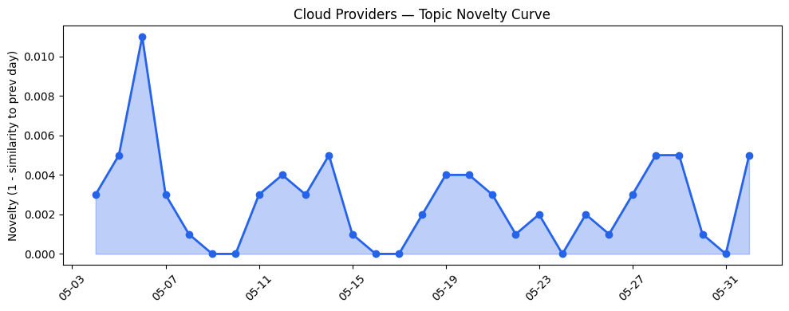
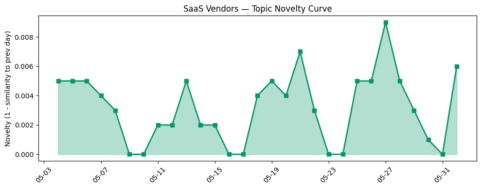

## 今日云计算结构性变化
> 今日云计算和SaaS行业结构性变化的核心判断是：AWS、Salesforce、Google Cloud、Microsoft Azure和火山引擎等公司在AI、云计算和数据分析领域取得重大进展，行业资讯显示AI和数据安全成为热点。
云计算和SaaS行业的结构性变化主要体现在技术层、基础设施、应用层、资本流向和风险管理等方面。其中，技术层的突破尤为显著，AWS推出Amazon OpenSearch Serverless，支持agentic AI和动态工作负载，Google Cloud推出GKE standby buffer，改善节点启动时间。
今日最值得注意的信号包括：
- 📈 **持续趋势**：资本信号和风险信号的话题向量在最近8天内呈现持续增强趋势。
- 🆕 **新兴方向**：Nvidia成为新的热点关键词。
- 🔺 **突然升温**：数据安全成为热点话题。
- 🔑 **新关键词**：Nvidia、数据安全。
- 📉 **消退关键词**：实时数据、数据产品、网络安全。

## 技术层信号
🔴 重大突破

云原生和容器化技术的进展是技术层信号中的一个重要方面。AWS推出Amazon OpenSearch Serverless，支持agentic AI和动态工作负载，这标志着云原生技术在AI应用中的进一步深化。同时，Google Cloud推出GKE standby buffer，改善节点启动时间，这将提高云原生应用的性能和可靠性。
此外，数据分析和AI的融合也成为一个热点。AWS推出AWS Transform，支持企业数字化转型，Microsoft Azure和火山引擎在云基础设施和AI应用方面的推进，也体现了这一趋势。
相关证据包括：
- [Get started with OpenAI GPT-5.5, GPT-5.4 models, and Codex on Amazon Bedrock](https://aws.amazon.com/blogs/aws/get-started-with-openai-gpt-5-5-gpt-5-4-models-and-codex-on-amazon-bedrock/)
- [Introducing the next generation of Amazon OpenSearch Serverless for building your agentic AI applications](https://aws.amazon.com/blogs/aws/introducing-the-next-generation-of-amazon-opensearch-serverless-for-building-your-agentic-ai-applications/)

## 产业资本信号
🔴 强信号

产业资本信号中，资本流向和并购成为热点。Alphabet计划筹集800亿美元用于AI建设，Anthropic获得1.4亿美元融资，准备上市，这些信号表明资本市场对AI和云计算的投资热情不减。
同时，Nvidia推出AI agent PCs，从Microsoft、Dell和HP，也体现了产业资本对AI和云计算的布局。
相关证据包括：
- [Alphabet plans to raise $80 billion to pay for AI buildout](https://techcrunch.com/2026/06/01/alphabet-plans-to-raise-80-billion-to-pay-for-ai-buildout/)
- [Nvidia chases $200B CPU market with AI agent PCs from Microsoft, Dell, and HP](https://techcrunch.com/2026/06/01/nvidia-chases-200b-cpu-market-with-ai-agent-pcs-from-microsoft-dell-and-hp/)

## 潜在拐点判断
今日的信号和趋势报告表明，云计算和SaaS行业可能正在经历一个潜在的拐点。技术层的突破，尤其是AI和云计算的融合，可能会带来新的应用和商业模式。
同时，资本信号的强烈也表明，产业资本对AI和云计算的投资热情不减，这可能会推动行业的进一步发展。

## 明日观察点
1. 观察AWS和Google Cloud在云原生和容器化技术方面的进一步推进。
2. 关注Nvidia在AI agent PCs方面的发展和市场反应。
3. 密切关注Anthropic的IPO进展和其对行业的影响。

## 长期趋势坐标
从月度尺度来看，云计算和SaaS行业的结构性变化主要体现在技术层和资本流向方面。AI和云计算的融合将继续推动行业的发展，资本市场对AI和云计算的投资热情也将持续。
相关的趋势图和数据洞察报告将继续提供行业发展的参考。

## 数据洞察
### 云厂商话题演化
云厂商的话题向量在最近30天内呈现相对稳定的趋势，今日的novelty score为0.018，mean similarity为0.982，表明云厂商的话题向量相对稳定。
### SaaS 厂商话题演化
SaaS厂商的话题向量在最近30天内也呈现相对稳定的趋势，今日的novelty score为0.027，mean similarity为0.973，表明SaaS厂商的话题向量相对稳定。
### 趋势图

## 参考来源
- [Get started with OpenAI GPT-5.5, GPT-5.4 models, and Codex on Amazon Bedrock](https://aws.amazon.com/blogs/aws/get-started-with-openai-gpt-5-5-gpt-5-4-models-and-codex-on-amazon-bedrock/) — AWS Blog
- [Introducing the next generation of Amazon OpenSearch Serverless for building your agentic AI applications](https://aws.amazon.com/blogs/aws/introducing-the-next-generation-of-amazon-opensearch-serverless-for-building-your-agentic-ai-applications/) — AWS Blog
- [Alphabet plans to raise $80 billion to pay for AI buildout](https://techcrunch.com/2026/06/01/alphabet-plans-to-raise-80-billion-to-pay-for-ai-buildout/) — TechCrunch
- [Nvidia chases $200B CPU market with AI agent PCs from Microsoft, Dell, and HP](https://techcrunch.com/2026/06/01/nvidia-chases-200b-cpu-market-with-ai-agent-pcs-from-microsoft-dell-and-hp/) — TechCrunch