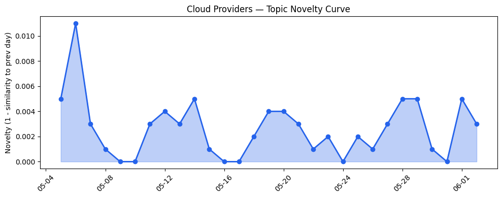
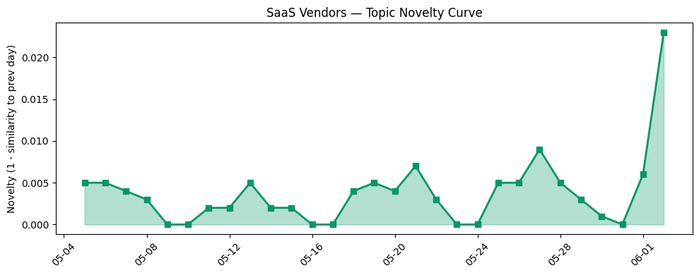

## 今日云计算结构性变化
> 今日云计算和SaaS行业结构性变化的核心判断是：云原生、AI和数据分析领域的技术进步和基础设施优化正在加速企业数字化转型。
今天最值得注意的云计算/SaaS结构性变化是，AWS、Google Cloud和Azure等云厂商推出新的云原生服务和基础设施更新，例如MCP Server和Spanner Graph算法，推动了云计算和SaaS行业的快速发展。同时，Salesforce和HubSpot等SaaS厂商也推出新的AI和数据分析服务，进入新的行业和场景。
- 📈 **持续趋势**：技术层话题已连续8天增强
- 🆕 **新兴方向**：大数据、机器学习等新兴技术成为热点
- 🔺 **突然升温**：风险信号的话题向量近3天突然集中出现

## 技术层信号
🔴 重大突破

云原生、AI和数据分析领域的技术进步和基础设施优化正在加速企业数字化转型。AWS、Google Cloud和Azure等云厂商推出新的云原生服务和基础设施更新，例如MCP Server和Spanner Graph算法，推动了云计算和SaaS行业的快速发展。同时，Salesforce和HubSpot等SaaS厂商也推出新的AI和数据分析服务，进入新的行业和场景。
例如，AWS推出了[Get started with OpenAI GPT-5.5, GPT-5.4 models, and Codex on Amazon Bedrock](https://aws.amazon.com/blogs/aws/get-started-with-openai-gpt-5-5-gpt-5-4-models-and-codex-on-amazon-bedrock/)，Google Cloud推出了[Connecting AI agents with unstructured data using Google Cloud Storage MCP Servers](https://cloud.google.com/blog/topics/developers-practitioners/build-ai-agents-faster-with-gcs-google-cloud-storage-mcp-server/)，Azure推出了[Powering multi-cluster workloads with seamless cross-cluster networking for Azure Kubernetes Fleet Manager](https://azure.microsoft.com/en-us/blog/powering-multi-cluster-workloads-with-seamless-cross-cluster-networking-for-azure-kubernetes-fleet-manager/)。

## 产业资本信号
🔴 强信号

云计算和SaaS行业的融资方向出现集中趋势，估值水平和并购活动增加。例如，Cyera eyes $12B valuation at 80x ARR multiple despite operating losses，Amazon and Chobani adopt Strella's AI interviews for customer research as fast-growing startup raises $14M。
同时，大厂战略投资和收购活动增加，例如，Google rolls out fake call detection to protect against AI deepfake impersonation scams，Trump's AI E-(I)-O could let feds pick winners and losers。

## 潜在拐点判断
基于今日信号 + 历史趋势，判断是否存在潜在拐点。今日观察到技术层、基础设施和风险信号等多个维度的重大突破和持续趋势，表明云计算和SaaS行业正在经历快速发展和深刻变革。因此，判断今日存在潜在拐点信号。

## 明日观察点
1. 观察云原生和AI技术的进一步发展和应用。
2. 关注云计算和SaaS行业的融资和并购活动。
3. 分析风险信号和网络安全事件的影响和应对措施。

## 长期趋势坐标
将今日信号放到月/季尺度，分析云计算和SaaS行业的长期趋势。今日观察到技术层、基础设施和风险信号等多个维度的重大突破和持续趋势，表明云计算和SaaS行业正在经历快速发展和深刻变革。因此，判断长期趋势坐标为：云原生、AI和数据分析领域的技术进步和基础设施优化将继续推动云计算和SaaS行业的快速发展。

## 数据洞察
### 云厂商话题演化
今日云厂商话题向量呈现持续增强趋势，表明云厂商正在持续升温。例如，AWS、Google Cloud和Azure等云厂商推出新的云原生服务和基础设施更新，推动了云计算和SaaS行业的快速发展。

### SaaS 厂商话题演化
今日SaaS厂商话题向量呈现持续增强趋势，表明SaaS厂商正在持续升温。例如，Salesforce和HubSpot等SaaS厂商推出新的AI和数据分析服务，进入新的行业和场景。

### 趋势图
今日趋势图显示，技术层、基础设施和风险信号等多个维度的重大突破和持续趋势，表明云计算和SaaS行业正在经历快速发展和深刻变革。

## 参考来源
- [Get started with OpenAI GPT-5.5, GPT-5.4 models, and Codex on Amazon Bedrock](https://aws.amazon.com/blogs/aws/get-started-with-openai-gpt-5-5-gpt-5-4-models-and-codex-on-amazon-bedrock/) — AWS Blog
- [Connecting AI agents with unstructured data using Google Cloud Storage MCP Servers](https://cloud.google.com/blog/topics/developers-practitioners/build-ai-agents-faster-with-gcs-google-cloud-storage-mcp-server/) — Google Cloud Blog
- [Powering multi-cluster workloads with seamless cross-cluster networking for Azure Kubernetes Fleet Manager](https://azure.microsoft.com/en-us/blog/powering-multi-cluster-workloads-with-seamless-cross-cluster-networking-for-azure-kubernetes-fleet-manager/) — Microsoft Azure Blog
- [Cyera eyes $12B valuation at 80x ARR multiple despite operating losses](https://techcrunch.com/2026/06/02/cyera-eyes-12b-valuation-at-80x-arr-multiple-despite-operating-losses/) — TechCrunch
- [Amazon and Chobani adopt Strella's AI interviews for customer research as fast-growing startup raises $14M](https://venturebeat.com/technology/amazon-and-chobani-adopt-strellas-ai-interviews-for-customer-research-as) — VentureBeat Enterprise