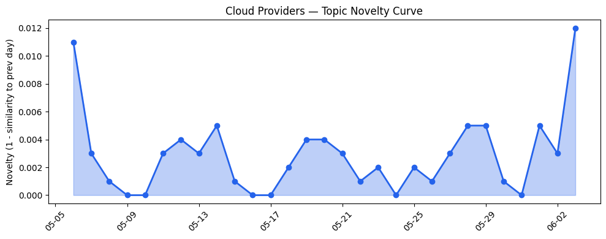
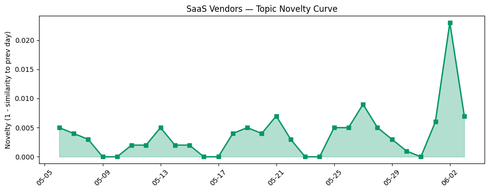

## 今日云计算结构性变化
> 今日云计算领域出现多项技术进展，包括AI与云的融合、性能优化、开源版权声明等，表明云厂商在技术层面不断推动创新。
今天最值得注意的云计算/SaaS结构性变化是AI与云的融合加速，包括AWS、Google Cloud、Microsoft Azure等云厂商推出多项新功能，支持构建智能AI应用。这种变化意味着云计算产业正在向更高级别的智能化转型，这将对整个产业产生深远影响。
- 📈 **持续趋势**：技术层话题已连续8天增强
- 🆕 **新兴方向**：风险信号出现全新话题
- 🔺 **突然升温**：AI与云融合相关话题近3天突然集中出现
- 🔑 **新关键词**：SEO、混合云、营销
- 📉 **消退关键词**：实时数据、数据产品

## 技术层信号
🔴 重大突破

云原生和Serverless技术的进展是今日技术层信号的重要组成部分。AWS和Google Cloud推出多项新功能，支持构建智能AI应用，包括Amazon Cognito多区域复制和Google Cloud的Serverless Managed Service for Apache Spark。这些进展表明云厂商在技术层面不断推动创新，提高了云原生和Serverless应用的性能和可靠性。
Microsoft Azure也推出新一代Azure Cobalt 200 VMs，性能提高50%，这将进一步提高云计算的性能和效率。火山引擎推出四款数据产品，完善了敏捷数智引擎矩阵，这也表明了云厂商在数据分析和AI应用方面的投入。
Cloudflare推出Browser Run，运行在Cloudflare Containers上，进一步提高了云计算的性能和可扩展性。

## 产业资本信号
🔴 强信号

今日产业资本信号显示，Alphabet的85亿美元融资为AI相关领域带来了新的机遇，Lovable与Google Cloud签署多年协议，扩大其在Google Cloud上的使用，这些信号表明云计算和AI领域的投资和合作正在加速。
Carvana与Bezos-backed Slate Auto合作，计划新车销售，这也表明了云计算和AI在汽车销售领域的应用潜力。这些信号意味着云计算和AI领域的资本流动正在增加，这将推动整个产业的发展。

## 潜在拐点判断
今日信号和历史趋势表明，云计算产业可能正在经历一个潜在的拐点。AI与云的融合加速、技术层面的进展和产业资本信号的强化，都意味着云计算产业正在向更高级别的智能化转型。
这种转型可能会带来新的商业机会和挑战，云厂商和企业需要紧跟这一趋势，投资于AI和云计算技术，才能保持竞争优势。

## 明日观察点
1. 观察AI与云融合相关话题的发展，是否会继续升温。
2. 关注云厂商的技术进展，是否会推出新的功能和产品。
3. 密切关注产业资本信号，是否会有新的投资和合作出现。

## 长期趋势坐标
今日信号和历史趋势表明，云计算产业正在向更高级别的智能化转型，这一趋势可能会在未来几个月内持续。
我们需要继续观察AI与云融合相关话题的发展，云厂商的技术进展和产业资本信号的变化，才能更好地理解这一趋势的发展方向。

## 数据洞察
### 云厂商话题演化
今日云厂商话题演化显示，AWS、Google Cloud和Microsoft Azure等云厂商的技术进展和AI与云融合相关话题的发展是今日云厂商话题演化的重要组成部分。
### SaaS厂商话题演化
今日SaaS厂商话题演化显示，Salesforce和Microsoft Azure等SaaS厂商的新功能和产品推出是今日SaaS厂商话题演化的重要组成部分。
### 趋势图

## 参考来源
- [Improve your application resilience with Amazon Cognito multi-Region replication](https://aws.amazon.com/blogs/aws/improve-your-application-resilience-with-amazon-cognito-multi-region-replication/)
- [What’s new in serverless Managed Service for Apache Spark](https://cloud.google.com/blog/products/data-analytics/serverless-managed-service-for-apache-spark-runtime-3-0-features/)
- [AI alone won’t change your business. The system running it will.](https://blogs.microsoft.com/blog/2026/06/02/ai-alone-wont-change-your-business-the-system-running-it-will/)
- [火山引擎正式推出四款数据产品 将持续完善敏捷数智引擎矩阵](https://www.cnblogs.com/volcengine/p/15640481.html)
- [Browser Run: now running on Cloudflare Containers, it’s faster and more scalable](https://blog.cloudflare.com/browser-run-containers/)
- [Alphabet’s record-breaking $85B raise for Google’s AI business is a helluva good signal](https://techcrunch.com/2026/06/03/alphabets-record-breaking-85b-raise-for-googles-ai-business-is-a-helluva-good-signal/)
- [Lovable signs multi-year deal with Google Cloud to up usage 5x, source says](https://techcrunch.com/2026/06/03/lovable-signs-multi-year-deal-with-google-cloud-to-up-usage-5x-source-says/)
- [Instagram is alerting users who were targeted by hackers during AI chatbot attacks](https://techcrunch.com/2026/06/03/instagram-is-alerting-users-who-were-targeted-by-hackers-during-ai-chatbot-attacks/)
- [Ultrahuman says hackers accessed customers’ wellness data via internal tool](https://techcrunch.com/2026/06/03/ultrahuman-says-hackers-accessed-customers-wellness-data-via-internal-tool/)