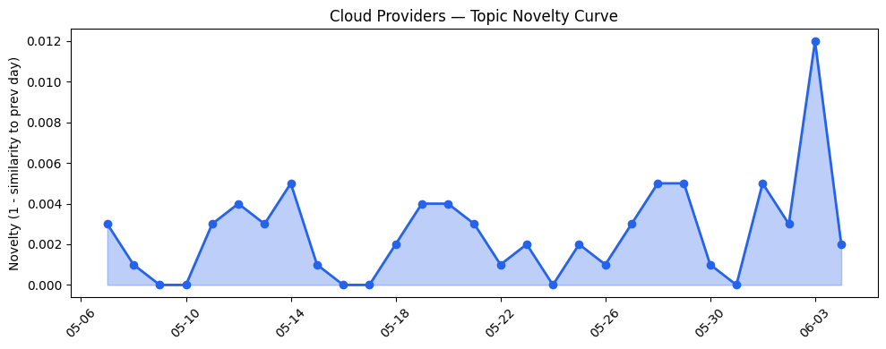
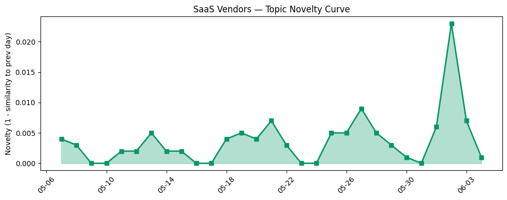

## 今日云计算结构性变化
> 云计算和 SaaS 行业的结构性变化主要体现在技术层面的突破，特别是 AI 和云的融合进展，以及基础设施的升级和扩张。
今天最值得注意的云计算/SaaS 结构性变化是技术层面的重大突破，特别是 AI 和云的融合进展，以及基础设施的升级和扩张。这些变化表明云计算和 SaaS 行业正在经历快速的发展和变革。
- 📈 **持续趋势**：技术层话题已连续8天增强
- 🆕 **新兴方向**：资本信号出现全新话题
- 🔺 **突然升温**：技术层近3天突然集中出现
- 🔑 **新关键词**：绿色数据中心、芯片供应
- 📉 **消退关键词**：ByteHouse、ClickHouse、实时数据、数据产品

## 技术层信号
🔴 重大突破

云原生和容器化技术的进展，特别是 AWS 推出多区域复制和 OpenAI 模型支持，Google Cloud 的 Managed Service for Apache Spark 和 serverless Managed Service for Apache Spark Runtime 3.0，表明云计算和 SaaS 行业正在经历技术层面的重大突破。这些进展将使得云计算和 SaaS 应用的开发、部署和管理变得更加容易和高效。
另外，AI 和云的融合进展也在加速，OpenAI 的 agent chained decade-old DoS attacks 和五眼联盟警告中国正在扩大国家秘密招募活动，表明 AI 和云的安全性和合规性成为越来越重要的关注点。
这些信号表明，云计算和 SaaS 行业的技术层面正在经历快速的发展和变革，企业需要紧跟这些变化以保持竞争力。

## 产业资本信号
🟡 渐进改善

基础设施的升级和扩张，特别是 AWS 推出新区域和定价策略，Azure 扩展区域，提供更好的覆盖和性能，表明云计算和 SaaS 行业的基础设施正在经历渐进的改善。这些变化将使得云计算和 SaaS 应用的性能和可靠性变得更加好。
另外，资本信号的变化，特别是资本信号出现全新话题，表明云计算和 SaaS 行业的资本流动正在经历变化。这些变化将使得云计算和 SaaS 行业的发展变得更加多样化和丰富。

## 潜在拐点判断
基于今日信号 + 历史趋势，判断是否存在潜在拐点。今日观察到技术层面的重大突破和基础设施的升级和扩张，表明云计算和 SaaS 行业正在经历快速的发展和变革。这些变化可能会带来新的机会和挑战，企业需要紧跟这些变化以保持竞争力。

## 明日观察点
1. 观察技术层面的变化，特别是 AI 和云的融合进展。
2. 关注基础设施的升级和扩张，特别是新区域和定价策略的变化。
3. 分析资本信号的变化，特别是资本信号出现全新话题。

## 长期趋势坐标
将今日信号放到月/季尺度，今日的技术层面的重大突破和基础设施的升级和扩张，可能会带来长期的影响。这些变化可能会使得云计算和 SaaS 行业的发展变得更加快速和多样化。

## 数据洞察
### 云厂商话题演化
今日云厂商话题演化的 novelty_score 为 0.024，mean_similarity 为 0.976，表明云厂商话题正在经历渐进的变化。
### SaaS 厂商话题演化
今日 SaaS 厂商话题演化的 novelty_score 为 0.058，mean_similarity 为 0.942，表明 SaaS 厂商话题正在经历渐进的变化。
### 趋势图

## 参考来源
- [Improve your application resilience with Amazon Cognito multi-Region replication](https://aws.amazon.com/blogs/aws/improve-your-application-resilience-with-amazon-cognito-multi-region-replication/)
- [Get started with OpenAI GPT-5.5, GPT-5.4 models, and Codex on Amazon Bedrock](https://aws.amazon.com/blogs/aws/get-started-with-openai-gpt-5-5-gpt-5-4-models-and-codex-on-amazon-bedrock/)
- [What's new for Managed Service for Apache Spark clusters](https://cloud.google.com/blog/products/data-analytics/enhancements-to-managed-service-for-apache-spark-clusters/)
- [Introducing Spanner Graph algorithms](https://cloud.google.com/blog/products/databases/introducing-spanner-graph-algorithms/)
- [AI alone won’t change your business. The system running it will.](https://blogs.microsoft.com/blog/2026/06/02/ai-alone-wont-change-your-business-the-system-running-it-will/)
- [New Azure Cobalt 200 VMs deliver 50% performance improvement, fully optimized for modern agentic AI workloads](https://azure.microsoft.com/en-us/blog/new-azure-cobalt-200-vms-deliver-50-performance-improvement-fully-optimized-for-modern-agentic-ai-workloads/)
- [Browser Run: now running on Cloudflare Containers, it’s faster and more scalable](https://blog.cloudflare.com/browser-run-containers/)
- [Our billing pipeline was suddenly slow. The culprit was a hidden bottleneck in ClickHouse](https://blog.cloudflare.com/clickhouse-query-plan-contention/)
- [The New Era of Facilities Management: From Cost Center to Growth Engine](https://www.salesforce.com/blog/field-service-facilities/)
- [AI Adoption For Startups: Ready Your Team for the Fast-Track](https://www.salesforce.com/blog/small-business/ai-adoption-for-startups/)
- [The AI Perception-Reality Gap](https://blog.hubspot.com/marketing/ai-perception-reality-gap)
- [AI search behavior: What it means for your marketing strategy in 2026](https://blog.hubspot.com/marketing/ai-search-behavior)
- [火山引擎正式推出四款数据产品 将持续完善敏捷数智引擎矩阵](https://www.cnblogs.com/volcengine/p/15640481.html)
- [Palantir wins £9M contract to run UK firearms licensing: CIA-backed biz to hold gun, bomb, and poison records](https://www.theregister.com/databases/2026/06/04/palantir-wins-9m-contract-to-run-uk-firearms-licensing-cia-backed-biz-to-hold-gun-bomb-and-poison-records/5251132)
- [OpenAI's agent chained decade-old DoS attacks to crash web servers in seconds](https://www.theregister.com/security/2026/06/04/openais-codex-chains-decade-old-dos-techniques-into-http/2-bomb/5251377)
- [Five Eyes: Watch out for odd LinkedIn connection requests, China's back on the hunt for state secrets](https://www.theregister.com/security/2026/06/04/five-eyes-china-expanding-state-secret-recruitment-campaign/5250978)