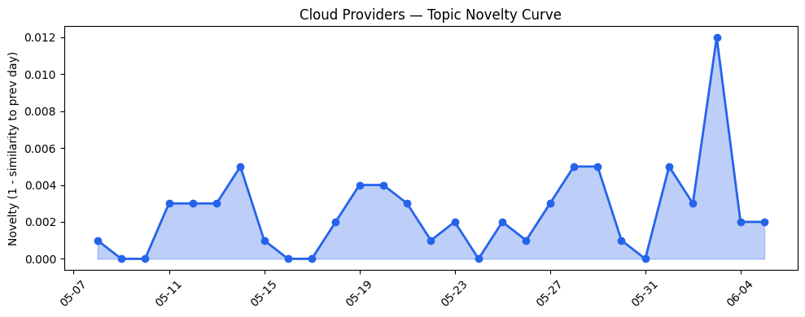
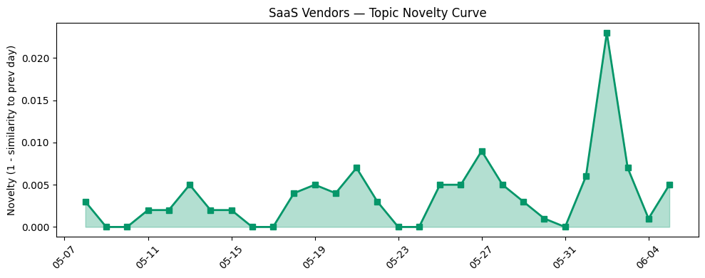

## 今日云计算结构性变化
> 今日云计算和SaaS领域的主要变化包括AWS、Google Cloud、Azure和Salesforce的技术和基础设施更新，以及Cloudflare的AI和数据平台发展。
今天最值得注意的云计算/SaaS结构性变化是技术层和基础设施的重大更新，包括AWS、Google Cloud和Azure的云原生技术和基础设施更新，这些变化表明云计算领域的竞争和创新正在加剧。同时，资本信号方面，Supabase估值翻倍至10B美元，Google和SpaceX达成合作协议，这些信号表明投资者对AI和云计算初创公司的兴趣增加。
- 📈 **持续趋势**：技术层话题已连续8天增强
- 🆕 **新兴方向**：资本信号出现全新话题
- 🔺 **突然升温**：数据安全和监管方面的风险信号突然增强
- 🔑 **新关键词**：Apache Spark, GKE, Graph 算法
- 📉 **消退关键词**：ByteHouse, ClickHouse, K8s, 实时数据, 容器, 数据产品

## 技术层信号
🔴 重大突破

云原生技术和基础设施更新是今日技术层信号的主要组成部分，包括AWS、Google Cloud和Azure的云原生技术更新和基础设施更新。例如，AWS推出了新的EC2实例和区域扩张，Google Cloud更新了其云原生技术，Azure推出了新的Cobalt 200 VMs。这些更新表明云计算领域的竞争和创新正在加剧。
同时，AI和数据分析方面的技术信号也很强烈，包括Cloudflare的AI和数据平台发展，Salesforce和HubSpot推出的新的AI驱动的客户服务解决方案。这些信号表明AI和数据分析正在成为云计算和SaaS领域的核心技术。
此外，数据安全和监管方面的风险信号突然增强，包括监管机构对AI和数据安全的关注度增加，供应链风险和地缘政治风险加剧。这些信号表明云计算和SaaS领域的风险和挑战正在增加。

## 产业资本信号
🔴 强信号

今日产业资本信号很强烈，包括Supabase估值翻倍至10B美元，Google和SpaceX达成合作协议。这些信号表明投资者对AI和云计算初创公司的兴趣增加，云计算和SaaS领域的竞争和创新正在加剧。
同时，基础设施和应用层方面的信号也很强烈，包括AWS、Google Cloud和Azure的基础设施更新，Salesforce和HubSpot推出的新的AI驱动的客户服务解决方案。这些信号表明云计算和SaaS领域的基础设施和应用层正在快速发展。
此外，数据安全和监管方面的风险信号突然增强，包括监管机构对AI和数据安全的关注度增加，供应链风险和地缘政治风险加剧。这些信号表明云计算和SaaS领域的风险和挑战正在增加。

## 潜在拐点判断
今日信号和历史趋势表明，云计算和SaaS领域可能正在经历一个潜在的拐点。技术层和基础设施的重大更新，资本信号的强烈信号，数据安全和监管方面的风险信号突然增强，所有这些信号都表明云计算和SaaS领域的竞争和创新正在加剧，风险和挑战也正在增加。
如果这一趋势持续下去，可能会导致云计算和SaaS领域的格局发生重大变化，包括新的领导者和挑战者的出现，旧有的领导者和挑战者的衰落。

## 明日观察点
1. 观察技术层信号是否继续增强，特别是AI和数据分析方面的信号。
2. 关注资本信号是否继续强烈，特别是投资者对AI和云计算初创公司的兴趣是否继续增加。
3. 密切关注数据安全和监管方面的风险信号，特别是监管机构对AI和数据安全的关注度是否继续增加。

## 长期趋势坐标
今日信号和历史趋势表明，云计算和SaaS领域的长期趋势坐标可能正在发生变化。技术层和基础设施的重大更新，资本信号的强烈信号，数据安全和监管方面的风险信号突然增强，所有这些信号都表明云计算和SaaS领域的竞争和创新正在加剧，风险和挑战也正在增加。
在月/季尺度上，云计算和SaaS领域可能会继续经历快速的发展和变化，新的领导者和挑战者可能会出现，旧有的领导者和挑战者可能会衰落。

## 数据洞察
### 云厂商话题演化
今日云厂商话题演化信号较强，包括AWS、Google Cloud和Azure的云原生技术更新和基础设施更新。这些信号表明云计算领域的竞争和创新正在加剧。
### SaaS 厂商话题演化
今日SaaS厂商话题演化信号较弱，包括Salesforce和HubSpot推出的新的AI驱动的客户服务解决方案。这些信号表明SaaS领域的竞争和创新正在加剧，但不如云计算领域那么激烈。
### 趋势图

## 参考来源
- [Try the new console experience in Amazon Bedrock](https://aws.amazon.com/blogs/aws/try-the-new-console-experience-in-amazon-bedrock-optimized-for-anthropic-and-openai-compatible-apis/) — AWS Blog
- [What's new with Google Cloud](https://cloud.google.com/blog/topics/inside-google-cloud/whats-new-google-cloud/) — Google Cloud Blog
- [AI alone won’t change your business. The system running it will.](https://blogs.microsoft.com/blog/2026/06/02/ai-alone-wont-change-your-business-the-system-running-it-will/) — Microsoft Azure Blog
- [火山引擎正式推出四款数据产品](https://www.cnblogs.com/volcengine/p/15640481.html) — 火山引擎博客
- [Announcing Claude Managed Agents on Cloudflare](https://blog.cloudflare.com/claude-managed-agents/) — Cloudflare Blog
- [Google will pay SpaceX $920M per month for compute](https://techcrunch.com/2026/06/05/google-will-pay-spacex-920m-per-month-for-compute/) — TechCrunch
- [AWS Weekly Roundup: AWS Local Zones in Istanbul](https://aws.amazon.com/blogs/aws/aws-weekly-roundup-aws-local-zones-in-istanbul-open-source-extenddb-kiro-web-and-more-may-25-2026/) — AWS Blog
- [New Azure Cobalt 200 VMs deliver 50% performance improvement](https://azure.microsoft.com/en-us/blog/new-azure-cobalt-200-vms-deliver-50-performance-improvement-fully-optimized-for-modern-agentic-ai-workloads/) — Microsoft Azure Blog
- [Help Agent: Built Into Your Flow of Work](https://www.salesforce.com/blog/help-agent-built-into-your-flow-of-work/) — Salesforce Blog
- [On-page content formats answer engines actually favor [new research]](https://blog.hubspot.com/marketing/content-format-types-that-earn-citations) — HubSpot Blog
- [How we built Cloudflare's data platform and an AI agent on top of it](https://blog.cloudflare.com/our-unified-data-platform/) — Cloudflare Blog
- [Supabase doubles valuation to $10B in 8 months](https://techcrunch.com/2026/06/05/supabase-doubles-valuation-to-10b-in-8-months/) — TechCrunch
- [Former cyber executive turned whistleblower accuses IBM of covering up several data breaches](https://techcrunch.com/2026/06/05/former-cyber-executive-turned-whistleblower-accuses-ibm-of-covering-up-several-data-breaches/) — TechCrunch
- [Google and FBI warn of ransomware group that sends fake IT workers to hack victims in person](https://techcrunch.com/2026/06/05/google-and-fbi-warn-of-ransomware-group-that-sends-fake-it-workers-to-hack-victims-in-person/) — TechCrunch
- [Tokenization takes the lead in the fight for data security](https://venturebeat.com/technology/tokenization-takes-the-lead-in-the-fight-for-data-security) — VentureBeat Enterprise