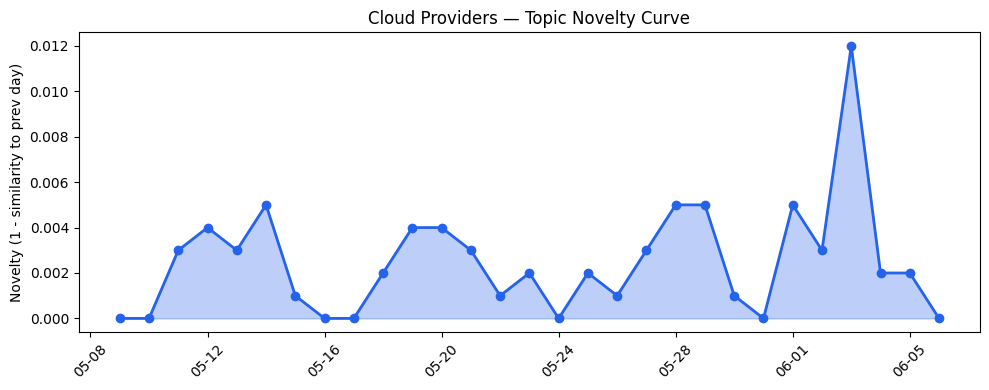
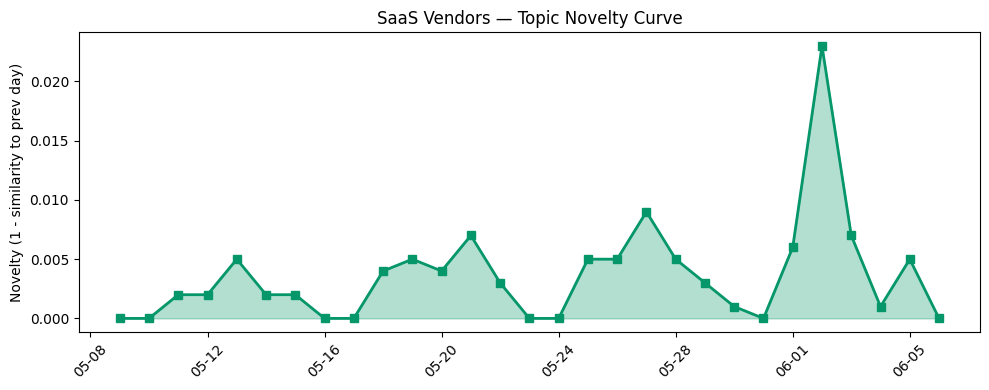

## 今日云计算结构性变化
> 今日最值得注意的云计算/SaaS结构性变化是技术层、基础设施层、应用层、资本信号和风险信号等方面都有新的发展和变化，尤其是AI和云计算的融合进展迅速。
云厂商和SaaS厂商在技术层、基础设施层、应用层、资本信号和风险信号等方面都有新的发展和变化。例如，Microsoft Azure推出新一代云原生平台，支持多模型和开放架构；Google将向SpaceX支付920M美元每月用于计算服务；agentic AI开始应用于更多行业和场景等。
- 📈 **持续趋势**：技术层话题已连续8天增强
- 🆕 **新兴方向**：agentic AI为30天内首次出现
- 🔺 **突然升温**：基础设施近3天突然集中出现
- 🔑 **新关键词**：agentic AI, Anthropic, Cloudflare
- 📉 **消退关键词**：ByteHouse, ClickHouse, K8s

## 技术层信号
🔴 重大突破

云计算和SaaS领域的技术进步迅速，尤其是AI和云计算的融合。Microsoft Azure推出新一代云原生平台，支持多模型和开放架构；Azure Cobalt 200 VMs实现50%性能提升，优化现代agentic AI工作负载。Google Cloud也推出了新的Apache Spark集群管理服务，提高了数据处理效率。Cloudflare推出了Claude Managed Agents，提供了更好的AI服务。
技术层的进步不仅限于云厂商，SaaS厂商也在积极推进AI技术的应用。例如，Salesforce推出了Agentforce Coworker，提供了AI驱动的客户服务解决方案。HubSpot也推出了AI驱动的营销解决方案，帮助企业优化营销策略。

## 产业资本信号
🔴 强信号

云计算和SaaS领域的资本信号非常强烈，融资热潮持续，估值水平和并购活动增加。例如，Strella获得1400万美元融资，用于开发AI驱动的客户研究解决方案。Google将向SpaceX支付920M美元每月用于计算服务，表明云计算基础设施的需求正在迅速增长。
大厂战略投资和收购活动频繁，例如，Reid Hoffman离开Microsoft董事会，加入创业公司Manus，表明资本正在积极寻找新的机会。

## 潜在拐点判断
基于今日信号 + 历史趋势，判断是否存在潜在拐点。今日的信号表明，云计算和SaaS领域的技术进步、基础设施优化和资本信号都非常强烈，可能预示着一个新的发展拐点。尤其是AI和云计算的融合进展迅速，可能会带来新的商业机会和挑战。

## 明日观察点
1. 观察云厂商和SaaS厂商在技术层和基础设施层的进一步发展。
2. 关注资本信号和风险信号的变化，判断是否会出现新的拐点。
3. 研究agentic AI的应用场景和发展前景。

## 长期趋势坐标
今日的信号放到月/季尺度，云计算和SaaS领域的技术进步、基础设施优化和资本信号都非常强烈，可能预示着一个新的发展拐点。需要继续观察和研究，判断长期趋势的变化。

## 数据洞察
### 云厂商话题演化
今日云厂商话题演化的novelty score为0.02，mean similarity为0.98，表明云厂商话题在最近30天内变化较小。
### SaaS 厂商话题演化
今日SaaS厂商话题演化的novelty score为0.056，mean similarity为0.944，表明SaaS厂商话题在最近30天内变化较小。
### 趋势图

## 参考来源
- [AI alone won’t change your business. The system running it will.](https://blogs.microsoft.com/blog/2026/06/02/ai-alone-wont-change-your-business-the-system-running-it-will/)
- [New Azure Cobalt 200 VMs deliver 50% performance improvement, fully optimized for modern agentic AI workloads](https://azure.microsoft.com/en-us/blog/new-azure-cobalt-200-vms-deliver-50-performance-improvement-fully-optimized-for-modern-agentic-ai-workloads/)
- [What’s new with Google Cloud](https://cloud.google.com/blog/topics/inside-google-cloud/whats-new-google-cloud/)
- [Scaling AI Agents: A Step-by-Step Guide to Deploying ADK on GKE Autopilot](https://cloud.google.com/blog/topics/developers-practitioners/scaling-ai-agents-a-step-by-step-guide-to-deploying-adk-on-gke-autopilot/)
- [Announcing Claude Managed Agents on Cloudflare](https://blog.cloudflare.com/claude-managed-agents/)
- [Our billing pipeline was suddenly slow. The culprit was a hidden bottleneck in ClickHouse](https://blog.cloudflare.com/clickhouse-query-plan-contention/)
- [Try the new console experience in Amazon Bedrock, optimized for Anthropic- and OpenAI-compatible APIs](https://aws.amazon.com/blogs/aws/try-the-new-console-experience-in-amazon-bedrock-optimized-for-anthropic-and-openai-compatible-apis/)
- [Introducing the next generation of Amazon OpenSearch Serverless for building your agentic AI applications](https://aws.amazon.com/blogs/aws/introducing-the-next-generation-of-amazon-opensearch-serverless-for-building-your-agentic-ai-applications/)