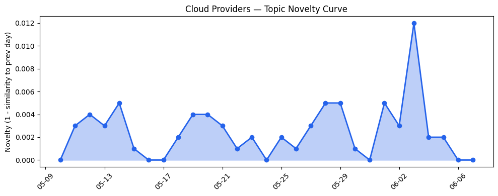
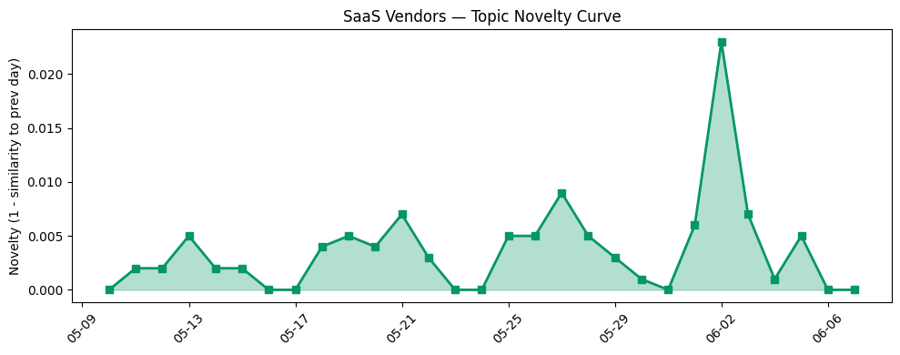

## 今日云计算结构性变化
> 今日云计算和SaaS领域出现多项技术和基础设施更新，包括AWS、Salesforce、Google Cloud、HubSpot、Microsoft Azure和火山引擎的新产品发布，同时安全事件和监管动向也值得关注。
今天最值得注意的云计算/SaaS结构性变化是AWS、Google Cloud、Microsoft Azure和火山引擎的新产品发布，这些发布可能会影响云计算市场的技术进展和基础设施建设。此外，Salesforce和HubSpot的AI驱动创新也值得关注，可能会推动企业的数字化转型和上云进程。
- 📈 **持续趋势**：技术层话题已连续8天增强
- 🆕 **新兴方向**：风险信号近3天话题突然增强
- 🔺 **突然升温**：技术层近3天内容相似度显著高于更早期均值
- 🔑 **新关键词**：Amazon Bedrock、Amazon Cognito、Claude Managed Agents等
- 📉 **消退关键词**：Adobe、ByteHouse、K8s等

## 技术层信号
🔴 重大突破

云原生和容器化技术的进展是技术层信号中的一个重要方面，AWS推出Amazon Bedrock支持Anthropic和OpenAI API，Google Cloud推出了新的Managed Service for Apache Spark和serverless Managed Service for Apache Spark，Microsoft Azure发布新VMs，优化了AI工作负载的性能。这些进展可能会推动云计算技术的进步和应用的扩展。
此外，安全事件和监管动向也是技术层信号中的一个重要方面，OpenAI推出Lockdown Mode以保护敏感数据，数据中心可能面临监管挑战，例如New York的数据中心许可暂停。这些事件和动向可能会影响云计算的安全性和合规性。
技术层信号的变化可能会影响云计算产业的技术进展和应用的扩展，企业需要关注这些变化，以便更好地应对技术进步和安全挑战。

## 产业资本信号
⚪ 无显著变化

今日无显著的融资方向变化，今日无显著的估值和并购变化，今日无显著的大厂战略动向。产业资本信号的变化可能会影响云计算产业的发展和竞争格局，企业需要关注这些变化，以便更好地应对市场的变化。

## 潜在拐点判断
今日观察到多个潜在拐点信号，包括技术层信号的重大突破和风险信号的突然升温，这些信号可能会影响云计算产业的发展和竞争格局。企业需要关注这些信号，以便更好地应对技术进步和安全挑战。

## 明日观察点
1. 关注AWS、Google Cloud、Microsoft Azure和火山引擎的新产品发布和技术进展。
2. 关注Salesforce和HubSpot的AI驱动创新和应用扩展。
3. 关注安全事件和监管动向的变化和影响。

## 长期趋势坐标
今日的信号和变化可能会影响云计算产业的长期趋势和发展方向，企业需要关注这些变化，以便更好地应对市场的变化和技术进步。

## 数据洞察
### 云厂商话题演化
云厂商的话题向量在最近30天内呈现延续趋势，novelty_score为0.019，mean_similarity为0.981。
### SaaS 厂商话题演化
SaaS厂商的话题向量在最近30天内呈现延续趋势，novelty_score为0.054，mean_similarity为0.946。
### 趋势图

## 参考来源
- [Try the new console experience in Amazon Bedrock](https://aws.amazon.com/blogs/aws/try-the-new-console-experience-in-amazon-bedrock-optimized-for-anthropic-and-openai-compatible-apis/)
- [What’s new with Google Cloud](https://cloud.google.com/blog/topics/inside-google-cloud/whats-new-google-cloud/)
- [New Azure Cobalt 200 VMs deliver 50% performance improvement, fully optimized for modern agentic AI workloads](https://azure.microsoft.com/en-us/blog/new-azure-cobalt-200-vms-deliver-50-performance-improvement-fully-optimized-for-modern-agentic-ai-workloads/)
- [火山引擎正式推出四款数据产品 将持续完善敏捷数智引擎矩阵](https://www.cnblogs.com/volcengine/p/15640481.html)
- [Announcing Claude Managed Agents on Cloudflare](https://blog.cloudflare.com/claude-managed-agents/)
- [Meet Agentforce Coworker: your AI teammate everywhere](https://www.salesforce.com/blog/agentforce-coworker-salesforce-ai-teammate/)
- [The AI Perception-Reality Gap](https://blog.hubspot.com/marketing/ai-perception-reality-gap)
- [Microsoft Build 2026: Building agentic apps with Microsoft Fabric and Microsoft Databases](https://azure.microsoft.com/en-us/blog/microsoft-build-2026-building-agentic-apps-with-microsoft-fabric-and-microsoft-databases/)
- [布局云计算，火山引擎的技术发展之路](https://www.cnblogs.com/volcengine/p/15632953.html)
- [Start spreading the news: Datacenters may face one-year ban in NY](https://www.theregister.com/legal/2026/06/05/new-york-advances-one-year-datacenter-permit-moratorium/5251911)
- [Oxford Uni student data pwned yet again - this time via career platform breach](https://www.theregister.com/security/2026/06/06/oxford-university-data-pwned-again-by-career-platform-breach/5251754)
- [OpenAI unveils Lockdown Mode to protect sensitive data from prompt injection attacks](https://techcrunch.com/2026/06/06/openai-unveils-lockdown-mode-to-protect-sensitive-data-from-prompt-injection-attacks/)