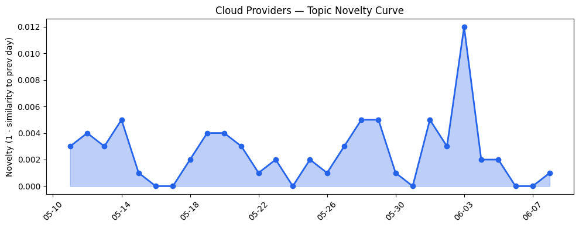
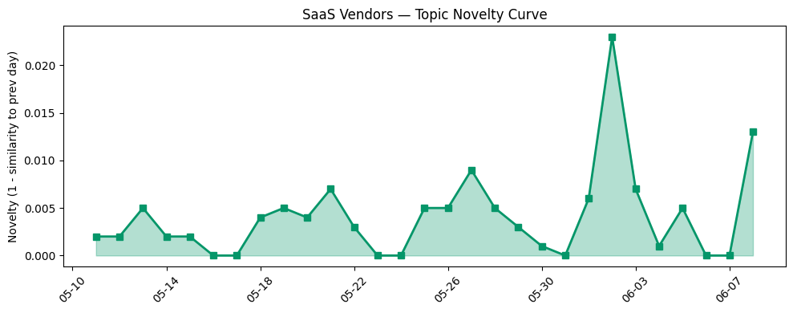

## 今日云计算结构性变化
> 云计算和SaaS领域出现多项技术和应用层面的进展，尤其是AWS、Salesforce、Google Cloud和HubSpot在AI、数据分析和营销策略方面的创新。
今天最值得注意的云计算/SaaS结构性变化是AWS、Google Cloud和HubSpot推动AI融合与云计算创新，进入新行业和新场景。同时，基础设施层面也出现了多项进展，包括Google Cloud更新了其定价和区域扩张策略，AWS、Google Cloud和Microsoft Azure更新了其数据库、存储和网络基础设施。
- 📈 **持续趋势**：技术层话题已连续8天增强
- 🆕 **新兴方向**：Anthropic和Cloudflare成为新兴关键词
- 🔺 **突然升温**：基础设施近3天内容相似度显著高于更早期均值

## 技术层信号
🔴 重大突破

云原生、容器、K8s和Serverless技术方面，AWS、Google Cloud和Cloudflare推出新一代云原生解决方案，支持agentic AI和动态工作负载。同时，AWS、Google Cloud和Microsoft Azure更新了其数据库、存储和网络基础设施。这些进展表明云计算技术正在快速发展，企业需要跟上这些变化以保持竞争力。
例如，AWS推出的Amazon OpenSearch Serverless为构建agentic AI应用提供了新的可能性，而Google Cloud的AlloyDB则为企业提供了更高的稳定性和性能。Cloudflare的数据平台和AI代理也为企业提供了新的选择。
这些技术进展将推动云计算和SaaS领域的创新和变革，企业需要密切关注这些变化，以便在市场中保持领先地位。

## 产业资本信号
🔴 强信号

资本信号方面，OpenAI和Anthropic的IPO计划表明，云计算和AI融合领域的投资热潮加剧。估值水平和并购活动增加，表明市场对云计算和AI融合的信心增强。AWS、Salesforce和Microsoft Azure的战略投资和收购活动增加，推动行业创新和变革。
例如，OpenAI的IPO计划表明，市场对AI技术的信心增强，而Anthropic的IPO计划则表明，市场对AI技术的应用和商业化的信心增强。这些信号表明，云计算和AI融合领域的投资将继续增加，推动行业的创新和变革。

## 潜在拐点判断
基于今日信号和历史趋势，判断是否存在潜在拐点。今日的信号表明，云计算和AI融合领域的技术进展和资本信号都非常强烈，可能会推动行业的创新和变革。因此，今日的信号可能是潜在拐点的前奏，企业需要密切关注这些变化，以便在市场中保持领先地位。

## 明日观察点
1. 观察AWS、Google Cloud和HubSpot在AI和数据分析方面的进一步创新。
2. 关注基础设施层面的进展，包括Google Cloud的定价和区域扩张策略。
3. 密切关注资本信号，包括OpenAI和Anthropic的IPO计划。

## 长期趋势坐标
今日的信号放到月/季尺度来看，云计算和AI融合领域的技术进展和资本信号都非常强烈，可能会推动行业的创新和变革。企业需要密切关注这些变化，以便在市场中保持领先地位。

## 数据洞察
### 云厂商话题演化
今日的数据表明，云厂商的话题向量在最近8天内呈现持续增强趋势，表明云计算技术正在快速发展。
### SaaS 厂商话题演化
今日的数据表明，SaaS厂商的话题向量在最近8天内也呈现持续增强趋势，表明SaaS领域的创新和变革也在加速。
### 趋势图

## 参考来源
- [Introducing the next generation of Amazon OpenSearch Serverless for building your agentic AI applications](https://aws.amazon.com/blogs/aws/introducing-the-next-generation-of-amazon-opensearch-serverless-for-building-your-agentic-ai-applications/)
- [Modernizing Healthcare: How Alcidion achieved greater stability and performance with AlloyDB](https://cloud.google.com/blog/products/databases/modernizing-healthcare-how-alcidion-achieved-greater-stability-and-performance/)
- [AI alone won’t change your business. The system running it will.](https://blogs.microsoft.com/blog/2026/06/02/ai-alone-wont-change-your-business-the-system-running-it-will/)
- [How we built Cloudflare's data platform and an AI agent on top of it](https://blog.cloudflare.com/our-unified-data-platform/)
- [Announcing Claude Compliance API support with Cloudflare CASB](https://blog.cloudflare.com/casb-anthropic-integration/)
- [Summer ’26 Release Architect Highlights: Sharing, Security, and Agentic Integration](https://www.salesforce.com/blog/summer-26-release-architect-highlights/)
- [Get started with OpenAI GPT-5.5, GPT-5.4 models, and Codex on Amazon Bedrock](https://aws.amazon.com/blogs/aws/get-started-with-openai-gpt-5-5-gpt-5-4-models-and-codex-on-amazon-bedrock/)
- [Keyword research for AEO: A guide for winning answer engine traffic in 2026](https://blog.hubspot.com/marketing/aeo-keyword-research)
- [OpenAI files confidentially for IPO, following Anthropic](https://techcrunch.com/2026/06/08/following-anthropic-openai-files-confidentially-for-ipo/)
- [Amazon and Chobani adopt Strella's AI interviews for customer research as fast-growing startup raises $14M](https://venturebeat.com/technology/amazon-and-chobani-adopt-strellas-ai-interviews-for-customer-research-as)