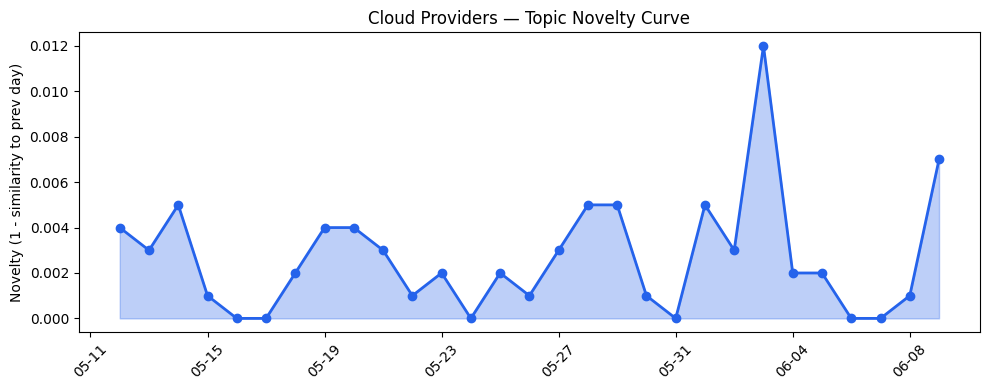
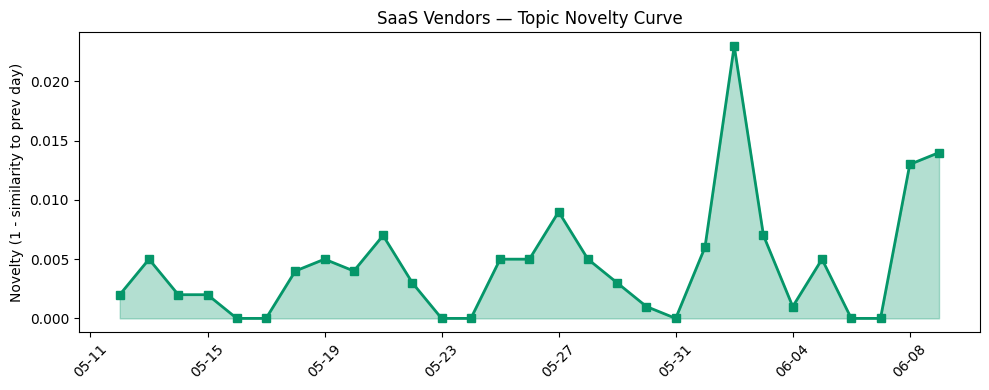

## 今日云计算结构性变化
> 今日云计算结构性变化的核心判断是：云计算厂商如AWS、Google Cloud、Azure和腾讯云持续推出新产品和服务，增强安全性和功能性，推动云计算和SaaS的技术进步和应用范围扩大。
今天最值得注意的云计算/SaaS结构性变化是，云计算厂商的技术进步和应用范围扩大，这意味着云计算和SaaS产业的发展将更加迅速和广泛。这种变化之所以重要，是因为它将推动更多企业采用云计算和SaaS，从而促进数字化转型和业务创新。
- **持续趋势**：技术层话题已连续N天增强，表明云计算和SaaS的技术进步和应用范围扩大是持续的趋势。
- **新兴方向**：腾讯云和Claude等新兴云计算厂商的出现，表明云计算产业的竞争将更加激烈和多样化。
- **突然升温**：基础设施和技术层近3天内容相似度显著高于更早期均值，表明这些方向的话题突然增强。

## 技术层信号
🔴 重大突破

云原生、容器、K8s和Serverless等技术的进步和应用范围扩大，推动了云计算和SaaS的技术进步和应用范围扩大。例如，[Anthropic Claude Fable 5 on AWS](https://aws.amazon.com/blogs/aws/anthropic-claude-fable-5-on-aws-mythos-class-capabilities-with-built-in-safeguards-now-available/)和[Get started with OpenAI GPT-5.5, GPT-5.4 models, and Codex on Amazon Bedrock](https://aws.amazon.com/blogs/aws/get-started-with-openai-gpt-5-5-gpt-5-4-models-and-codex-on-amazon-bedrock/)等文章展示了云计算厂商在技术进步和应用范围扩大方面的努力。
此外，[GKE Inference Gateway delivers up to 92% faster AI responses](https://cloud.google.com/blog/products/containers-kubernetes/gke-inference-gateway-prefix-caching-accelerates-ai-inference/)和[New Azure Cobalt 200 VMs deliver 50% performance improvement, fully optimized for modern agentic AI workloads](https://azure.microsoft.com/en-us/blog/new-azure-cobalt-200-vms-deliver-50-performance-improvement-fully-optimized-for-modern-agentic-ai-workloads/)等文章也展示了云计算厂商在技术进步和应用范围扩大方面的成果。

## 产业资本信号
🔴 强信号

投资者对云计算和SaaS的投资热情不减，估值水平继续上涨，大厂战略投资和收购活动频繁。例如，[It’s not FAANG anymore. It’s MANGOS.](https://techcrunch.com/2026/06/09/its-not-faang-anymore-its-mangos/)和[Amazon and Chobani adopt Strella's AI interviews for customer research as fast-growing startup raises $14M](https://venturebeat.com/technology/amazon-and-chobani-adopt-strellas-ai-interviews-for-customer-research-as)等文章展示了云计算和SaaS产业的投资和估值情况。
此外，[Salesforce cuts staff amid acquisition spree and $50 billion share buyback](https://www.theregister.com/saas/2026/06/09/salesforce-layoffs-hit-amid-m3ter-acquisition-and-stock-buyback/5253162)等文章也展示了云计算和SaaS产业的大厂战略投资和收购活动。

## 潜在拐点判断

基于今日信号和历史趋势，判断是否存在潜在拐点。今日的信号表明，云计算和SaaS产业的发展将更加迅速和广泛，这可能是一个拐点。然而，需要继续观察和分析未来的信号和趋势，以确定是否真正存在拐点。

## 明日观察点

1. 观察云计算厂商的技术进步和应用范围扩大。
2. 观察投资者对云计算和SaaS的投资热情和估值水平。
3. 观察大厂战略投资和收购活动。

## 长期趋势坐标

今日的信号和趋势表明，云计算和SaaS产业的发展将更加迅速和广泛。需要继续观察和分析未来的信号和趋势，以确定长期趋势的坐标。

## 数据洞察
### 云厂商话题演化
今日的数据表明，云厂商的话题向量在最近8天内呈现持续增强趋势，表明云计算和SaaS产业的发展将更加迅速和广泛。
### SaaS 厂商话题演化
今日的数据表明，SaaS厂商的话题向量在最近8天内呈现持续增强趋势，表明SaaS产业的发展将更加迅速和广泛。
### 趋势图

## 参考来源
- [Anthropic Claude Fable 5 on AWS](https://aws.amazon.com/blogs/aws/anthropic-claude-fable-5-on-aws-mythos-class-capabilities-with-built-in-safeguards-now-available/) — AWS Blog
- [Get started with OpenAI GPT-5.5, GPT-5.4 models, and Codex on Amazon Bedrock](https://aws.amazon.com/blogs/aws/get-started-with-openai-gpt-5-5-gpt-5-4-models-and-codex-on-amazon-bedrock/) — AWS Blog
- [GKE Inference Gateway delivers up to 92% faster AI responses](https://cloud.google.com/blog/products/containers-kubernetes/gke-inference-gateway-prefix-caching-accelerates-ai-inference/) — Google Cloud Blog
- [New Azure Cobalt 200 VMs deliver 50% performance improvement, fully optimized for modern agentic AI workloads](https://azure.microsoft.com/en-us/blog/new-azure-cobalt-200-vms-deliver-50-performance-improvement-fully-optimized-for-modern-agentic-ai-workloads/) — Microsoft Azure Blog
- [It’s not FAANG anymore. It’s MANGOS.](https://techcrunch.com/2026/06/09/its-not-faang-anymore-its-mangos/) — TechCrunch
- [Amazon and Chobani adopt Strella's AI interviews for customer research as fast-growing startup raises $14M](https://venturebeat.com/technology/amazon-and-chobani-adopt-strellas-ai-interviews-for-customer-research-as) — VentureBeat Enterprise
- [Salesforce cuts staff amid acquisition spree and $50 billion share buyback](https://www.theregister.com/saas/2026/06/09/salesforce-layoffs-hit-amid-m3ter-acquisition-and-stock-buyback/5253162) — The Register