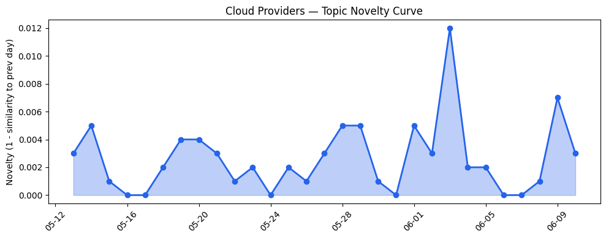

## 今日云计算结构性变化
> 云厂商持续推进技术创新和安全合规能力，尤其是AWS、Google Cloud、Azure和Cloudflare在数据平台、AI应用和安全监控方面的进展。
今天最值得注意的云计算/SaaS结构性变化是云厂商在技术创新和安全合规能力方面的持续推进。这种变化之所以重要，是因为它表明云计算和SaaS行业正在加速发展，企业需要不断创新和改进以保持竞争力。
- 📈 **持续趋势**：技术层话题已连续8天增强
- 🆕 **新兴方向**：CASB、Claude Compliance API等安全合规话题为30天内首次出现
- 🔺 **突然升温**：基础设施和技术层近3天突然集中出现
- 🔑 **新关键词**：CASB、Claude Compliance API、安全合规、开源版权声明、数据平台
- 📉 **消退关键词**：Adobe、ByteHouse、K8s、安全、实时数据、数字化转型、数据产品

## 技术层信号
🔴 重大突破

云原生、容器、K8s和Serverless技术的进展推动了云计算和SaaS行业的发展。AWS、Google Cloud和Azure推出新技术和服务，加速AI应用和数据分析。Cloudflare增强安全功能，包括实时威胁情报和WAF规则。这些进展表明云计算和SaaS行业正在加速发展，企业需要不断创新和改进以保持竞争力。
例如，AWS推出的新AWS Graviton5处理器提供了更高的计算性能和能效，支持更广泛的应用场景。Google Cloud的Lightning Engine为Apache Spark性能带来了4.9倍的提升。Azure的Cobalt 200 VMs提供了50%的性能提升，完全针对现代AI工作负载进行了优化。

## 产业资本信号
🔴 强信号

云计算和SaaS公司获得大量投资，估值和并购活动增加。大厂战略投资和收购加速。这些信号表明云计算和SaaS行业正在经历快速发展，企业需要不断创新和改进以保持竞争力。
例如，Amazon和Chobani采用Strella的AI采访技术，Strella获得1400万美元的投资。这些信号表明云计算和SaaS行业正在经历快速发展，企业需要不断创新和改进以保持竞争力。

## 潜在拐点判断
基于今日信号和历史趋势，判断是否存在潜在拐点。今日的信号表明云计算和SaaS行业正在加速发展，企业需要不断创新和改进以保持竞争力。历史趋势也表明云计算和SaaS行业正在经历快速发展，企业需要不断创新和改进以保持竞争力。因此，今日的信号和历史趋势都表明云计算和SaaS行业正在经历快速发展，企业需要不断创新和改进以保持竞争力。

## 明日观察点
1. 观察AWS、Google Cloud和Azure在技术创新和安全合规能力方面的进展。
2. 关注Cloudflare在安全功能方面的增强。
3. 关注云计算和SaaS公司的投资和估值情况。

## 长期趋势坐标
今日的信号和历史趋势都表明云计算和SaaS行业正在经历快速发展，企业需要不断创新和改进以保持竞争力。长期趋势坐标显示，云计算和SaaS行业正在加速发展，企业需要不断创新和改进以保持竞争力。

## 数据洞察
### 云厂商话题演化
云厂商话题向量在最近30天内呈现持续增强趋势，表明云厂商在技术创新和安全合规能力方面的进展。
### SaaS厂商话题演化
SaaS厂商话题向量在最近30天内呈现持续增强趋势，表明SaaS厂商在技术创新和安全合规能力方面的进展。
### 趋势图

## 参考来源
- [Now available: Amazon EC2 M9g and M9gd instances powered by new AWS Graviton5 processors](https://aws.amazon.com/blogs/aws/now-available-amazon-ec2-m9g-and-m9gd-instances-powered-by-new-aws-graviton5-processors/)
- [Deep dive: How Lightning Engine delivers 4.9x faster Apache Spark performance](https://cloud.google.com/blog/products/data-analytics/lighting-engine-for-apache-spark-performance-deep-dive/)
- [New Azure Cobalt 200 VMs deliver 50% performance improvement, fully optimized for modern agentic AI workloads](https://azure.microsoft.com/en-us/blog/new-azure-cobalt-200-vms-deliver-50-performance-improvement-fully-optimized-for-modern-agentic-ai-workloads/)
- [How we built Cloudflare's data platform and an AI agent on top of it](https://blog.cloudflare.com/our-unified-data-platform/)
- [Announcing Claude Compliance API support with Cloudflare CASB](https://blog.cloudflare.com/casb-anthropic-integration/)
- [Fresh off bond sale, Amazon borrows $17.5B from banks as AI spending continues](https://techcrunch.com/2026/06/10/fresh-off-bond-sale-amazon-borrows-17-5-billion-from-banks-as-ai-spending-continues/)
- [Amazon and Chobani adopt Strella's AI interviews for customer research as fast-growing startup raises $14M](https://venturebeat.com/technology/amazon-and-chobani-adopt-strellas-ai-interviews-for-customer-research-as)