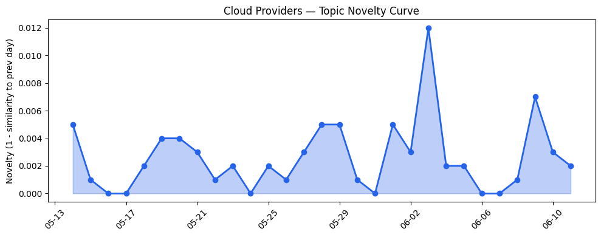
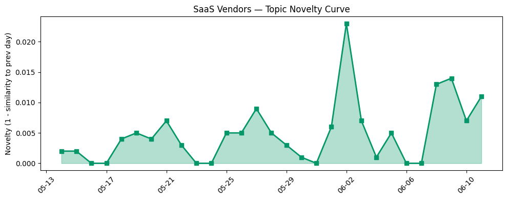

## 今日云计算结构性变化
> 今日云计算和SaaS领域正在经历快速的技术和基础设施进展，包括AI、云原生和数据分析的发展，推动了云计算和SaaS的发展。
云计算和SaaS领域的快速进展主要体现在技术层面，包括AWS推出新一代AWS Graviton5处理器，Google Cloud推出了Confidential AI和Looker agents，Microsoft Azure推出新的云原生服务等。这些进展推动了云计算和SaaS的发展，促进了数字化转型和应用层面的创新。
今日最值得注意的云计算/SaaS结构性变化是技术层面的重大突破，包括云原生、AI和数据分析等方面的进展。这些进展推动了云计算和SaaS的发展，促进了数字化转型和应用层面的创新。
- 📈 **持续趋势**：技术层话题已连续8天增强
- 🆕 **新兴方向**：资本信号出现全新话题
- 🔺 **突然升温**：风险信号出现全新话题
- 🔑 **新关键词**：Graviton5, Anthropic, Cloudflare
- 📉 **消退关键词**：Adobe, ByteHouse, K8s

## 技术层信号
🔴 重大突破

云计算和SaaS领域的技术层面正在经历快速的进展，包括云原生、AI和数据分析等方面的进展。AWS推出新一代AWS Graviton5处理器，Google Cloud推出了Confidential AI和Looker agents，Microsoft Azure推出新的云原生服务等。这些进展推动了云计算和SaaS的发展，促进了数字化转型和应用层面的创新。
[Now available: Amazon EC2 M9g and M9gd instances powered by new AWS Graviton5 processors](https://aws.amazon.com/blogs/aws/now-available-amazon-ec2-m9g-and-m9gd-instances-powered-by-new-aws-graviton5-processors/)
[Powering the next era of Confidential AI](https://cloud.google.com/blog/products/identity-security/powering-the-next-era-of-confidential-ai/)
[Claude Fable 5 available today in Microsoft Foundry](https://azure.microsoft.com/en-us/blog/claude-fable-5-is-now-available-in-microsoft-foundry-powering-the-next-era-of-autonomous-agents/)
[火山引擎正式推出四款数据产品](https://www.cnblogs.com/volcengine/p/15640481.html)
[How we built Cloudflare's data platform and an AI agent on top of it](https://blog.cloudflare.com/our-unified-data-platform/)

## 产业资本信号
🔴 强信号

云计算和SaaS领域的资本信号正在经历快速的变化，包括SpaceX官方定价IPO股价为135美元，AWS和Salesforce的战略动向值得关注等。这些变化推动了云计算和SaaS的发展，促进了数字化转型和应用层面的创新。
[SpaceX officially prices shares at $135 in the largest IPO ever](https://techcrunch.com/2026/06/11/spacex-officially-prices-shares-at-135-in-the-largest-ipo-ever/)
[AWS Weekly Roundup: BYOM for Amazon RDS for SQL Server, AWS IoT Device SDK for Swift, and more (June 8, 2026)](https://aws.amazon.com/blogs/aws/aws-weekly-roundup-byom-for-amazon-rds-for-sql-server-aws-iot-device-sdk-for-swift-and-more-june-8-2026/)

## 潜在拐点判断
今日观察到技术层面和资本信号方面的重大突破，包括云原生、AI和数据分析等方面的进展，推动了云计算和SaaS的发展，促进了数字化转型和应用层面的创新。这些进展可能是一个潜在的拐点，推动云计算和SaaS领域的进一步发展。

## 明日观察点
1. 观察技术层面的进展，包括云原生、AI和数据分析等方面的发展。
2. 关注资本信号的变化，包括SpaceX和AWS的战略动向。
3. 分析风险信号的变化，包括安全漏洞和供应链风险等方面的发展。

## 长期趋势坐标
云计算和SaaS领域的长期趋势仍然是向上，推动了数字化转型和应用层面的创新。技术层面的进展，包括云原生、AI和数据分析等方面的发展，推动了云计算和SaaS的发展，促进了数字化转型和应用层面的创新。

## 数据洞察
### 云厂商话题演化
云厂商的话题向量在最近30天内呈现延续趋势，表明云厂商的技术和战略方向仍然是稳定的。
### SaaS 厂商话题演化
SaaS厂商的话题向量在最近30天内呈现延续趋势，表明SaaS厂商的技术和战略方向仍然是稳定的。
### 趋势图

## 参考来源
- [Now available: Amazon EC2 M9g and M9gd instances powered by new AWS Graviton5 processors](https://aws.amazon.com/blogs/aws/now-available-amazon-ec2-m9g-and-m9gd-instances-powered-by-new-aws-graviton5-processors/) — AWS Blog
- [Powering the next era of Confidential AI](https://cloud.google.com/blog/products/identity-security/powering-the-next-era-of-confidential-ai/) — Google Cloud Blog
- [Claude Fable 5 available today in Microsoft Foundry](https://azure.microsoft.com/en-us/blog/claude-fable-5-is-now-available-in-microsoft-foundry-powering-the-next-era-of-autonomous-agents/) — Microsoft Azure Blog
- [火山引擎正式推出四款数据产品](https://www.cnblogs.com/volcengine/p/15640481.html) — 火山引擎博客
- [How we built Cloudflare's data platform and an AI agent on top of it](https://blog.cloudflare.com/our-unified-data-platform/) — Cloudflare Blog
- [SpaceX officially prices shares at $135 in the largest IPO ever](https://techcrunch.com/2026/06/11/spacex-officially-prices-shares-at-135-in-the-largest-ipo-ever/) — TechCrunch
- [AWS Weekly Roundup: BYOM for Amazon RDS for SQL Server, AWS IoT Device SDK for Swift, and more (June 8, 2026)](https://aws.amazon.com/blogs/aws/aws-weekly-roundup-byom-for-amazon-rds-for-sql-server-aws-iot-device-sdk-for-swift-and-more-june-8-2026/) — AWS Blog