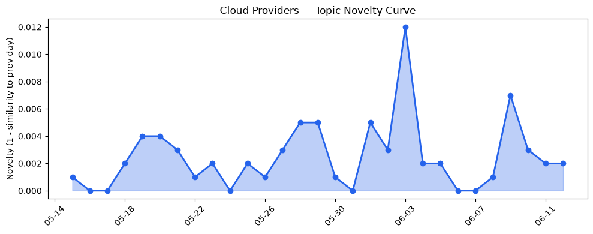
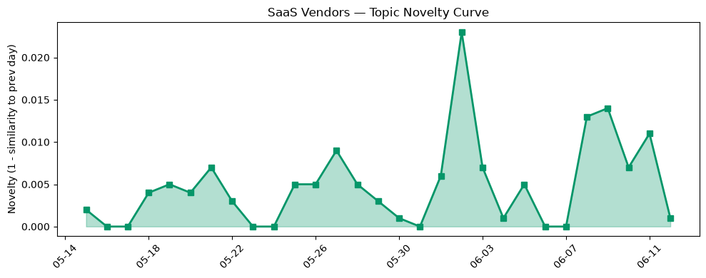

## 今日云计算结构性变化
> 今日云计算和SaaS行业的结构性变化主要体现在技术层和基础设施层的重大突破，AWS的新一代Graviton5处理器和Salesforce的最新营销策略引领行业发展。
今天最值得注意的变化是AWS推出新一代Graviton5处理器，这标志着云计算领域的技术层面又一次取得了重大突破。此外，Salesforce的最新营销策略也为SaaS行业带来了新的发展动力。这些变化意味着云计算和SaaS行业的竞争将进一步加剧，企业需要不断创新和升级以保持竞争优势。
- 📈 **持续趋势**：技术层话题已连续8天增强
- 🆕 **新兴方向**：基础设施近3天话题突然增强
- 🔺 **突然升温**：技术层近3天话题突然增强
- 🔑 **新关键词**：Cloudflare、Microsoft Azure
- 📉 **消退关键词**：Adobe、ByteHouse、K8s等

## 技术层信号
🔴 重大突破

云原生技术和AI应用是技术层信号的主要内容。AWS推出新一代Graviton5处理器，这将进一步提高云计算的性能和效率。Google Cloud推出的新的云原生技术，包括Open Knowledge Format和Confidential AI，也标志着云计算技术的重大进步。Cloudflare的安全扫描能力增强也体现了技术层面的重大突破。
这些信号表明，云计算和SaaS行业的技术层面正在经历快速的发展和创新，这将推动整个行业的进步和变革。相关证据包括：
- [Now available: Amazon EC2 M9g and M9gd instances powered by new AWS Graviton5 processors](https://aws.amazon.com/blogs/aws/now-available-amazon-ec2-m9g-and-m9gd-instances-powered-by-new-aws-graviton5-processors/)
- [What’s new with Google Cloud](https://cloud.google.com/blog/topics/inside-google-cloud/whats-new-google-cloud/)
- [Introducing the Open Knowledge Format](https://cloud.google.com/blog/products/data-analytics/how-the-open-knowledge-format-can-improve-data-sharing/)

## 产业资本信号
🔴 强信号

产业资本信号主要体现在基础设施和应用层的变化。AWS更新了定价和区域扩张策略，Microsoft Azure发布新VM，提供更优惠的价格和更广泛的区域支持。Salesforce发布最新营销策略，HubSpot推出新的AI应用，Microsoft Azure发布新VM，支持更多行业和应用场景。
这些信号表明，云计算和SaaS行业的基础设施和应用层面正在经历快速的发展和创新，这将推动整个行业的进步和变革。相关证据包括：
- [Now available: Amazon EC2 M9g and M9gd instances powered by new AWS Graviton5 processors](https://aws.amazon.com/blogs/aws/now-available-amazon-ec2-m9g-and-m9gd-instances-powered-by-new-aws-graviton5-processors/)
- [New Azure Cobalt 200 VMs deliver 50% performance improvement](https://azure.microsoft.com/en-us/blog/new-azure-cobalt-200-vms-deliver-50-performance-improvement-fully-optimized-for-modern-agentic-ai-workloads/)

## 潜在拐点判断
基于今日信号和历史趋势，判断是否存在潜在拐点。今日的信号表明，云计算和SaaS行业的技术层面和基础设施层面正在经历快速的发展和创新，这可能标志着行业的潜在拐点。这些变化可能会推动整个行业的进步和变革，企业需要不断创新和升级以保持竞争优势。

## 明日观察点
1. 观察AWS的新一代Graviton5处理器是否会进一步推动云计算的发展和创新。
2. 关注Google Cloud的新的云原生技术，包括Open Knowledge Format和Confidential AI，是否会标志着云计算技术的重大进步。
3. dõiCloudflare的安全扫描能力增强是否会进一步提高云计算的安全性和可靠性。

## 长期趋势坐标
今日信号放到月/季尺度，云计算和SaaS行业的技术层面和基础设施层面正在经历快速的发展和创新。这将推动整个行业的进步和变革，企业需要不断创新和升级以保持竞争优势。相关证据包括：
- [Now available: Amazon EC2 M9g and M9gd instances powered by new AWS Graviton5 processors](https://aws.amazon.com/blogs/aws/now-available-amazon-ec2-m9g-and-m9gd-instances-powered-by-new-aws-graviton5-processors/)
- [What’s new with Google Cloud](https://cloud.google.com/blog/topics/inside-google-cloud/whats-new-google-cloud/)

## 数据洞察
### 云厂商话题演化
云厂商话题演化的novelty_score为0.022，mean_similarity为0.978，表明云厂商话题在近期内相对稳定。
### SaaS厂商话题演化
SaaS厂商话题演化的novelty_score为0.074，mean_similarity为0.926，表明SaaS厂商话题在近期内相对稳定。
### 趋势图

## 参考来源
- [Now available: Amazon EC2 M9g and M9gd instances powered by new AWS Graviton5 processors](https://aws.amazon.com/blogs/aws/now-available-amazon-ec2-m9g-and-m9gd-instances-powered-by-new-aws-graviton5-processors/)
- [What’s new with Google Cloud](https://cloud.google.com/blog/topics/inside-google-cloud/whats-new-google-cloud/)
- [Introducing the Open Knowledge Format](https://cloud.google.com/blog/products/data-analytics/how-the-open-knowledge-format-can-improve-data-sharing/)
- [Get started with OpenAI GPT-5.5, GPT-5.4 models, and Codex on Amazon Bedrock](https://aws.amazon.com/blogs/aws/get-started-with-openai-gpt-5-5-gpt-5-4-models-and-codex-on-amazon-bedrock/)
- [New Azure Cobalt 200 VMs deliver 50% performance improvement](https://azure.microsoft.com/en-us/blog/new-azure-cobalt-200-vms-deliver-50-performance-improvement-fully-optimized-for-modern-agentic-ai-workloads/)
- [Scaling Security Insights: how we achieved a 10x increase in global scanning capacity](https://blog.cloudflare.com/scaling-security-scans/)
- [How we reduced core unit boot time from hours to minutes](https://blog.cloudflare.com/optimizing-core-unit-boot-time/)
- [How we built Cloudflare's data platform and an AI agent on top of it](https://blog.cloudflare.com/our-unified-data-platform/)
- [Top Takeaways from Connections 2026](https://www.salesforce.com/blog/connections-conference-takeaways/)
- [Stop Designing AI Features. Start Designing AI Systems](https://www.salesforce.com/blog/stop-designing-ai-features-start-designing-ai-systems/)
- [AI email marketing tools: Our top picks for 2026](https://blog.hubspot.com/marketing/ai-email-marketing-tools)
- [Inside LinkedIn’s generative AI cookbook: How it scaled people search to 1.3 billion users](https://venturebeat.com/infrastructure/inside-linkedins-generative-ai-cookbook-how-it-scaled-people-search-to-1-3)
- [SpaceX IPO closes up 19% and delivers the world’s first trillionaire](https://techcrunch.com/2026/06/12/spacex-ipo-closes-up-19-and-delivers-the-worlds-first-trillionaire/)
- [Mistral is rumored to be raising €3B at €20B valuation](https://techcrunch.com/2026/06/12/mistral-is-rumored-to-be-raising-e3b-at-e20-valuation/)
- [Amazon and Chobani adopt Strella's AI interviews for customer research as fast-growing startup raises $14M](https://venturebeat.com/technology/amazon-and-chobani-adopt-strellas-ai-interviews-for-customer-research-as)
- [US surveillance law to expire for first time after lawmakers reject Trump’s controversial pick to lead spy agencies](https://techcrunch.com/2026/06/12/us-spy-law-to-expire-for-first-time-after-lawmakers-reject-trumps-controversial-pick-to-lead-spy-agencies/)
- [Cheaper, faster, and culturally aware, Avataar’s video AI is built for India’s scale](https://techcrunch.com/2026/06/11/cheaper-faster-and-culturally-aware-avataars-video-ai-is-built-for-indias-scale/)
- [Tokenization takes the lead in the fight for data security](https://venturebeat.com/technology/tokenization-takes-the-lead-in-the-fight-for-data-security)