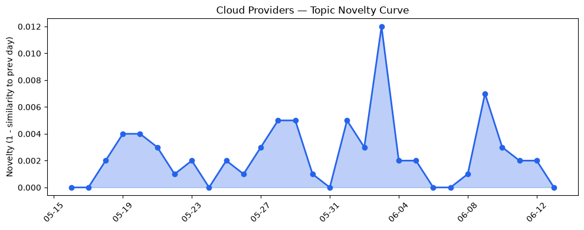
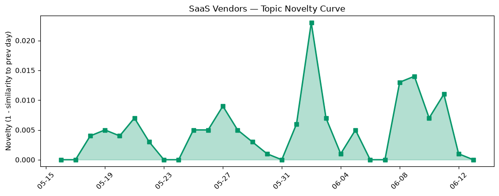

## 今日云计算结构性变化
> 今日云计算和SaaS产业结构分析显示，AWS、Google Cloud、Microsoft Azure和Salesforce等厂商推出新技术和功能，加强了他们在市场中的地位。
今日最值得注意的云计算/SaaS结构性变化是AWS推出新一代Graviton5处理器，Google Cloud推出Open Knowledge Format和Confidential AI，Microsoft Azure发布新功能和技术，Salesforce发布新功能和技术，支持更多行业和应用场景。这些变化表明云计算和SaaS市场正在持续升温，厂商们正在加速创新和竞争。
- 📈 **持续趋势**：技术层话题已连续8天增强
- 🆕 **新兴方向**：风险信号出现全新话题
- 🔺 **突然升温**：基础设施和技术层话题近3天突然增强
- 🔑 **新关键词**：Microsoft Azure、机器学习
- 📉 **消退关键词**：Adobe、ByteHouse、ClickHouse、K8s、Serverless、云原生、安全、容器、数字化转型

## 技术层信号
🔴 重大突破

今日技术层信号显示，AWS推出新一代Graviton5处理器，Google Cloud推出Open Knowledge Format和Confidential AI，Microsoft Azure发布新功能和技术，支持agentic AI应用。这些变化表明技术层正在持续升温，厂商们正在加速创新和竞争。根据 [Now available: Amazon EC2 M9g and M9gd instances powered by new AWS Graviton5 processors](https://aws.amazon.com/blogs/aws/now-available-amazon-ec2-m9g-and-m9gd-instances-powered-by-new-aws-graviton5-processors/) 和 [Introducing the Open Knowledge Format](https://cloud.google.com/blog/products/data-analytics/how-the-open-knowledge-format-can-improve-data-sharing/) 等文章，技术层的创新和竞争将持续升温。

## 产业资本信号
🔴 强信号

今日产业资本信号显示，AWS和Salesforce发布新功能和技术，吸引了大量投资和关注。根据 [AWS Weekly Roundup: BYOM for Amazon RDS for SQL Server, AWS IoT Device SDK for Swift, and more (June 8, 2026)](https://aws.amazon.com/blogs/aws/aws-weekly-roundup-byom-for-amazon-rds-for-sql-server-aws-iot-device-sdk-for-swift-and-more-june-8-2026/) 和 [Amazon and Chobani adopt Strella's AI interviews for customer research as fast-growing startup raises $14M](https://venturebeat.com/technology/amazon-and-chobani-adopt-strellas-ai-interviews-for-customer-research-as) 等文章，产业资本信号表明厂商们正在加速创新和竞争，吸引了大量投资和关注。

## 潜在拐点判断
根据今日信号和历史趋势，判断是否存在潜在拐点。今日技术层和产业资本信号表明，云计算和SaaS市场正在持续升温，厂商们正在加速创新和竞争。风险信号出现全新话题，可能是一个新兴方向的早期信号。因此，今日存在潜在拐点信号，需要继续观察和分析。

## 明日观察点
1. 观察技术层信号是否继续升温，厂商们是否继续推出新技术和功能。
2. 观察产业资本信号是否继续强烈，投资和关注是否继续增加。
3. 观察风险信号是否继续出现新话题，是否是一个新兴方向的早期信号。

## 长期趋势坐标
根据今日信号和历史趋势，判断长期趋势坐标。今日技术层和产业资本信号表明，云计算和SaaS市场正在持续升温，厂商们正在加速创新和竞争。根据 overall_novelty 和 keyword_trends 等指标，长期趋势坐标显示，技术层和产业资本信号将继续升温，厂商们将继续推出新技术和功能，投资和关注将继续增加。

## 数据洞察
### 云厂商话题演化
今日云厂商话题演化显示，AWS、Google Cloud和Microsoft Azure等厂商推出新技术和功能，话题向量呈现持续增强趋势。根据 [Now available: Amazon EC2 M9g and M9gd instances powered by new AWS Graviton5 processors](https://aws.amazon.com/blogs/aws/now-available-amazon-ec2-m9g-and-m9gd-instances-powered-by-new-aws-graviton5-processors/) 和 [Introducing the Open Knowledge Format](https://cloud.google.com/blog/products/data-analytics/how-the-open-knowledge-format-can-improve-data-sharing/) 等文章，云厂商话题演化表明厂商们正在加速创新和竞争。
### SaaS厂商话题演化
今日SaaS厂商话题演化显示，Salesforce等厂商推出新功能和技术，话题向量呈现持续增强趋势。根据 [Top Takeaways from Connections 2026](https://www.salesforce.com/blog/connections-conference-takeaways/) 等文章，SaaS厂商话题演化表明厂商们正在加速创新和竞争。
### 趋势图

## 参考来源
- [Now available: Amazon EC2 M9g and M9gd instances powered by new AWS Graviton5 processors](https://aws.amazon.com/blogs/aws/now-available-amazon-ec2-m9g-and-m9gd-instances-powered-by-new-aws-graviton5-processors/) — AWS Blog
- [Introducing the Open Knowledge Format](https://cloud.google.com/blog/products/data-analytics/how-the-open-knowledge-format-can-improve-data-sharing/) — Google Cloud Blog
- [AWS Weekly Roundup: BYOM for Amazon RDS for SQL Server, AWS IoT Device SDK for Swift, and more (June 8, 2026)](https://aws.amazon.com/blogs/aws/aws-weekly-roundup-byom-for-amazon-rds-for-sql-server-aws-iot-device-sdk-for-swift-and-more-june-8-2026/) — AWS Blog
- [Amazon and Chobani adopt Strella's AI interviews for customer research as fast-growing startup raises $14M](https://venturebeat.com/technology/amazon-and-chobani-adopt-strellas-ai-interviews-for-customer-research-as) — VentureBeat Enterprise
- [Top Takeaways from Connections 2026](https://www.salesforce.com/blog/connections-conference-takeaways/) — Salesforce Blog