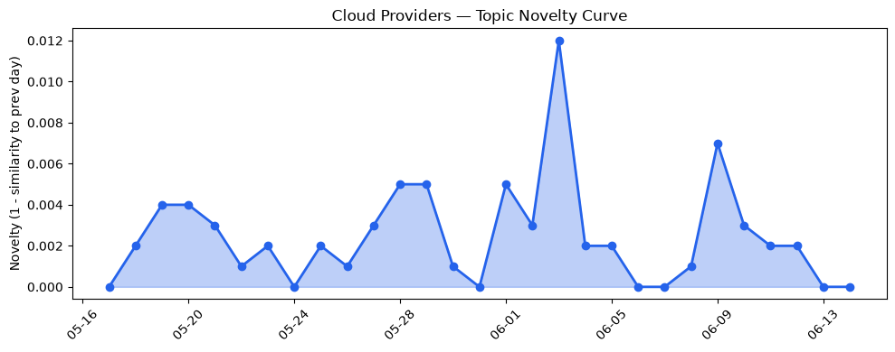
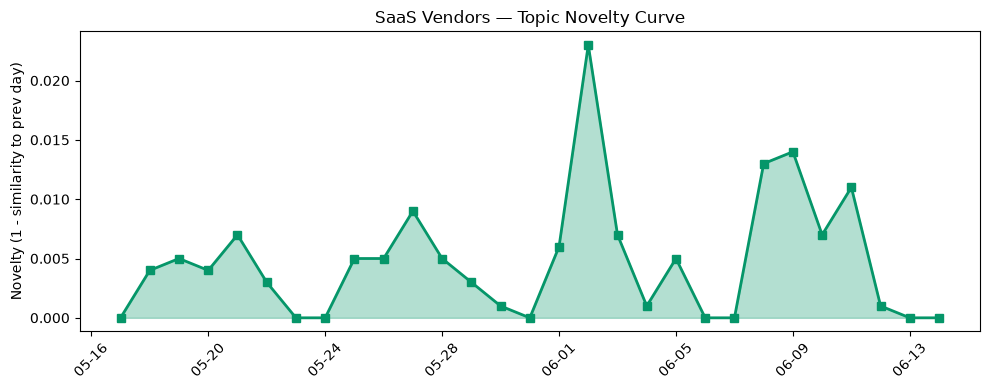

## 今日云计算结构性变化
> 今日云计算和SaaS领域出现多项技术和基础设施更新，包括AWS Graviton5处理器、Amazon Bedrock服务、Google Cloud新功能、Azure新VM发布和Cloudflare安全功能增强等。
今天最值得注意的云计算/SaaS结构性变化是AWS推出新一代AWS Graviton5处理器，支持云原生和容器化应用，以及Google Cloud和HubSpot等厂商推出新技术，如AI和数据安全功能。这些变化表明云计算和SaaS领域正在快速发展，企业正在不断推出新技术和功能以满足客户的需求。
- 📈 **持续趋势**：技术层话题已连续8天增强
- 🆕 **新兴方向**：风险信号出现全新话题
- 🔺 **突然升温**：基础设施和技术层近3天内容相似度显著高于更早期均值
- 🔑 **新关键词**：ChatGPT, answer engine
- 📉 **消退关键词**：Adobe, ByteHouse, ClickHouse, K8s, OpenAI, Serverless, 云原生, 安全, 容器, 应用层

## 技术层信号
🔴 重大突破

云原生和容器化应用是今日技术层信号的主要焦点。AWS推出新一代AWS Graviton5处理器，支持云原生和容器化应用，这是云计算领域的一个重大突破。同时，Google Cloud和HubSpot等厂商也推出新技术，如AI和数据安全功能，这些变化表明云计算和SaaS领域正在快速发展。
AWS推出新一代AWS Graviton5处理器，支持云原生和容器化应用，这是云计算领域的一个重大突破。[Now available: Amazon EC2 M9g and M9gd instances powered by new AWS Graviton5 processors](https://aws.amazon.com/blogs/aws/now-available-amazon-ec2-m9g-and-m9gd-instances-powered-by-new-aws-graviton5-processors/)。Google Cloud也推出新功能，如AI和数据安全功能，这些变化表明云计算和SaaS领域正在快速发展。[What’s new with Google Cloud](https://cloud.google.com/blog/topics/inside-google-cloud/whats-new-google-cloud/)。

## 产业资本信号
🔴 强信号

今日产业资本信号主要体现在Strella获得1400万美元Series A融资，以及Amazon和Chobani采用Strella的AI采访技术。这些变化表明云计算和SaaS领域的资本流动正在增加，企业正在不断推出新技术和功能以满足客户的需求。
Strella获得1400万美元Series A融资，以及Amazon和Chobani采用Strella的AI采访技术，这些变化表明云计算和SaaS领域的资本流动正在增加。[Amazon and Chobani adopt Strella's AI interviews for customer research as fast-growing startup raises $14M](https://venturebeat.com/technology/amazon-and-chobani-adopt-strellas-ai-interviews-for-customer-research-as)。

## 潜在拐点判断
今日信号和历史趋势表明，云计算和SaaS领域可能正在出现一个潜在拐点。AWS推出新一代AWS Graviton5处理器，支持云原生和容器化应用，这是云计算领域的一个重大突破。同时，Google Cloud和HubSpot等厂商也推出新技术，如AI和数据安全功能，这些变化表明云计算和SaaS领域正在快速发展。这些变化可能会带来一个新的发展阶段，企业将更加注重云计算和SaaS领域的技术和功能。

## 明日观察点
1. 观察AWS Graviton5处理器的性能和价格比。
2. 关注Google Cloud和HubSpot等厂商的新技术和功能。
3. 分析Strella的AI采访技术在Amazon和Chobani中的应用。

## 长期趋势坐标
今日信号和历史趋势表明，云计算和SaaS领域正在快速发展，企业正在不断推出新技术和功能以满足客户的需求。这些变化可能会带来一个新的发展阶段，企业将更加注重云计算和SaaS领域的技术和功能。

## 数据洞察
### 云厂商话题演化
今日云厂商话题演化主要体现在AWS、Google Cloud和Azure等厂商的新技术和功能。AWS推出新一代AWS Graviton5处理器，支持云原生和容器化应用，这是云计算领域的一个重大突破。Google Cloud和HubSpot等厂商也推出新技术，如AI和数据安全功能，这些变化表明云计算和SaaS领域正在快速发展。

### SaaS 厂商话题演化
今日SaaS厂商话题演化主要体现在Strella的AI采访技术在Amazon和Chobani中的应用。Strella获得1400万美元Series A融资，以及Amazon和Chobani采用Strella的AI采访技术，这些变化表明云计算和SaaS领域的资本流动正在增加。

### 趋势图

## 参考来源
- [Now available: Amazon EC2 M9g and M9gd instances powered by new AWS Graviton5 processors](https://aws.amazon.com/blogs/aws/now-available-amazon-ec2-m9g-and-m9gd-instances-powered-by-new-aws-graviton5-processors/) — AWS Blog
- [What’s new with Google Cloud](https://cloud.google.com/blog/topics/inside-google-cloud/whats-new-google-cloud/) — Google Cloud Blog
- [Amazon and Chobani adopt Strella's AI interviews for customer research as fast-growing startup raises $14M](https://venturebeat.com/technology/amazon-and-chobani-adopt-strellas-ai-interviews-for-customer-research-as) — VentureBeat Enterprise
- [Tokenization takes the lead in the fight for data security](https://venturebeat.com/technology/tokenization-takes-the-lead-in-the-fight-for-data-security) — VentureBeat Enterprise
- [火山引擎正式推出四款数据产品](https://www.cnblogs.com/volcengine/p/15640481.html) — 火山引擎博客