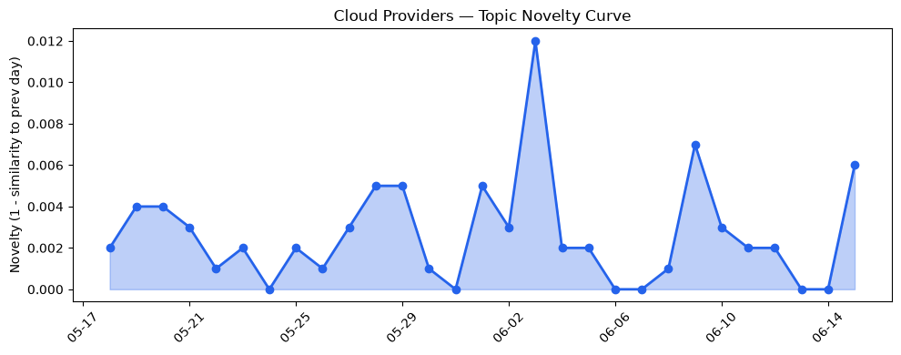
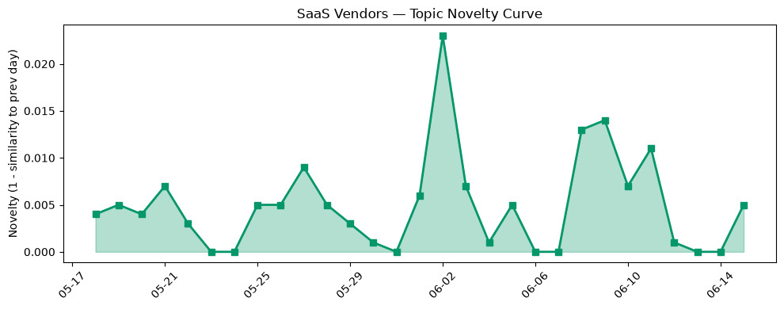

## 今日云计算结构性变化
> 今日云计算与SaaS产业结构变化主要体现在技术层面的进步，特别是AI和云计算的融合，以及基础设施的升级和扩展，同时面临着安全挑战和监管变化。
今天最值得注意的云计算/SaaS结构性变化是技术层面的重大突破，特别是在AI和云计算的融合方面，以及基础设施的升级和扩展。这些变化表明云计算和SaaS产业正在快速发展，企业正在积极采用新技术和新基础设施来提高效率和竞争力。
- 📈 **持续趋势**：技术层话题已连续8天增强
- 🆕 **新兴方向**：资本信号和风险信号出现全新话题
- 🔺 **突然升温**：基础设施和技术层话题近3天突然集中出现
- 🔑 **新关键词**：Claude Fable 5
- 📉 **消退关键词**：Adobe, ByteHouse, ClickHouse, K8s, OpenAI, Serverless, 云原生, 容器, 应用层, 资本信号

## 技术层信号
🔴 重大突破

云原生技术、AI和云计算的融合是今日技术层信号的主要焦点。AWS、Google Cloud和Microsoft Azure推出了新的云原生技术和AI能力，例如AWS WAF添加了AI流量货币化能力，Google Cloud推出了新的数据代理技术和图技术，Microsoft Azure推出了新的Azure Cobalt 200 VMs。这些技术进步将提高云计算的效率和安全性。
同时，基础设施的升级和扩展也是一个重要的信号。AWS推出了新的Amazon EC2 M9g和M9gd实例，支持Anthropic Claude Fable 5和OpenAI GPT-5.5模型，Microsoft Azure推出了新的Azure Cobalt 200 VMs，Cloudflare推出了私有应用路由。这些基础设施的升级和扩展将提高云计算的性能和可靠性。

## 产业资本信号
🔴 强信号

今日产业资本信号主要体现在Salesforce收购AI客户服务平台Fin，投资金额为3.6亿美元，Sarvam成为印度最新的AI独角兽公司，获得2.34亿美元的融资。这些资本信号表明AI和云计算的融合正在成为一个热点领域，企业正在积极采用新技术和新基础设施来提高效率和竞争力。
同时，基础设施的升级和扩展也是一个重要的信号。Microsoft Azure推出了新Azure Cobalt 200 VMs，Cloudflare推出了私有应用路由。这些基础设施的升级和扩展将提高云计算的性能和可靠性。

## 潜在拐点判断
今日信号表明云计算和SaaS产业正在快速发展，企业正在积极采用新技术和新基础设施来提高效率和竞争力。技术层面的重大突破，特别是在AI和云计算的融合方面，以及基础设施的升级和扩展，可能会带来新的发展机会和挑战。然而，安全挑战和监管变化也可能会对产业产生影响。

## 明日观察点
1. 观察技术层面的信号，特别是在AI和云计算的融合方面，以及基础设施的升级和扩展。
2. 关注产业资本信号，特别是在AI和云计算的融合方面，以及基础设施的升级和扩展。
3. 关注安全挑战和监管变化对产业的影响。

## 长期趋势坐标
今日信号表明云计算和SaaS产业正在快速发展，企业正在积极采用新技术和新基础设施来提高效率和竞争力。技术层面的重大突破，特别是在AI和云计算的融合方面，以及基础设施的升级和扩展，可能会带来新的发展机会和挑战。然而，安全挑战和监管变化也可能会对产业产生影响。

## 数据洞察
### 云厂商话题演化
今日云厂商话题演化主要体现在技术层面的进步，特别是在AI和云计算的融合方面，以及基础设施的升级和扩展。
### SaaS 厂商话题演化
今日SaaS厂商话题演化主要体现在Salesforce收购AI客户服务平台Fin，投资金额为3.6亿美元。
### 趋势图

## 参考来源
- [AWS WAF adds AI traffic monetization capability to help content owners charge AI bots for content access](https://aws.amazon.com/blogs/aws/aws-waf-adds-ai-traffic-monetization-capability-to-help-content-owners-charge-ai-bots-for-content-access/)
- [Now available: Amazon EC2 M9g and M9gd instances powered by new AWS Graviton5 processors](https://aws.amazon.com/blogs/aws/now-available-amazon-ec2-m9g-and-m9gd-instances-powered-by-new-aws-graviton5-processors/)
- [What’s new in data agents: Supercharging your AI workflows](https://cloud.google.com/blog/products/data-analytics/new-data-agents-across-the-agentic-data-cloud/)
- [Architecting a trusted agentic platform with graph technologies: A Yahoo case study](https://cloud.google.com/blog/products/databases/graph-technologies-underpin-yahoo-system-of-action/)
- [3 things leaders need to know from Microsoft Build 2026](https://azure.microsoft.com/en-us/blog/3-things-leaders-need-to-know-from-microsoft-build-2026/)
- [Claude Fable 5 is now available in Microsoft Foundry](https://azure.microsoft.com/en-us/blog/claude-fable-5-is-now-available-in-microsoft-foundry-powering-the-next-era-of-autonomous-agents/)
- [Enforcing the First AS in BGP AS_PATHs](https://blog.cloudflare.com/enforce-first-as-bgp/)
- [How we reduced core unit boot time from hours to minutes](https://blog.cloudflare.com/optimizing-core-unit-boot-time/)
- [Salesforce acquires AI customer service platform Fin for $3.6B](https://techcrunch.com/2026/06/15/salesforce-acquires-ai-customer-service-platform-fin-for-3-6b/)
- [Sarvam becomes India’s newest AI unicorn with $234 million funding round led by HCLTech](https://techcrunch.com/2026/06/15/sarvam-becomes-indias-newest-ai-unicorn-with-234-million-funding-round-led-by-hcltech/)
- [The US government’s Anthropic models ban was never about an AI jailbreak](https://techcrunch.com/2026/06/15/the-us-governments-anthropic-models-ban-was-never-about-an-ai-jailbreak/)
- [UK unveils sweeping social media ban for users under 16](https://techcrunch.com/2026/06/15/uk-unveils-sweeping-social-media-ban-for-users-under-16/)