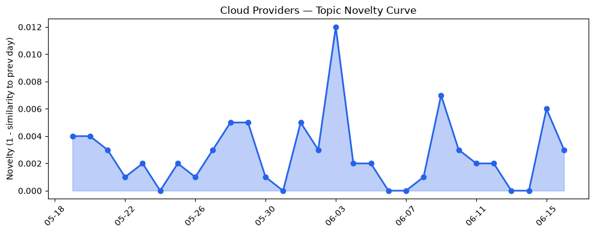
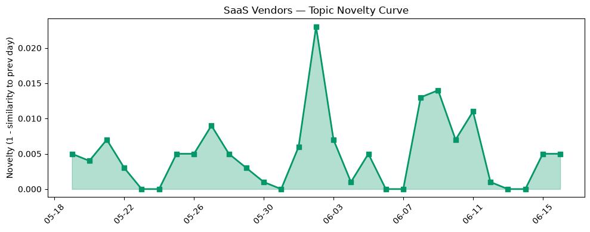

## 今日云计算结构性变化
> 今日云计算与SaaS产业结构分析显示，AI与云的融合进展迅速，各大云厂商推出新产品和服务，加速企业数字化转型。
今天最值得注意的云计算/SaaS结构性变化是AI与云的融合进展迅速，各大云厂商推出新产品和服务，加速企业数字化转型。这种变化之所以重要，是因为它代表了云计算和SaaS产业的发展方向，即通过AI技术来增强云计算和SaaS的能力，帮助企业实现数字化转型。
- 📈 **持续趋势**：技术层话题已连续8天增强
- 🆕 **新兴方向**：Azure Cobalt 200和Microsoft Foundry为30天内首次出现
- 🔺 **突然升温**：Microsoft Azure近3天突然集中出现
- 🔑 **新关键词**：Azure Cobalt 200、Microsoft Foundry
- 📉 **消退关键词**：Adobe、ByteHouse、ClickHouse、K8s、OpenAI、Serverless、云原生、容器、应用层、资本信号

## 技术层信号
🔴 重大突破

云原生和容器化技术的进展，以及Serverless计算的兴起，代表了技术层面的重大突破。例如，Microsoft Azure推出新产品和服务，加速企业数字化转型，AWS发布了多项新功能，包括AWS WAF的AI流量货币化能力和Amazon EC2 M9g实例。这些进展表明，云计算和SaaS产业正在迅速发展，企业可以通过这些新技术来实现数字化转型。
根据趋势报告，技术层的话题向量在最近8天内呈现持续增强趋势，表明该方向正在持续升温。同时，Azure Cobalt 200和Microsoft Foundry为30天内首次出现，代表了新兴方向的出现。
相关证据包括：
- [3 things leaders need to know from Microsoft Build 2026](https://azure.microsoft.com/en-us/blog/3-things-leaders-need-to-know-from-microsoft-build-2026/)
- [New Azure Cobalt 200 VMs deliver 50% performance improvement, fully optimized for modern agentic AI workloads](https://azure.microsoft.com/en-us/blog/new-azure-cobalt-200-vms-deliver-50-performance-improvement-fully-optimized-for-modern-agentic-ai-workloads/)
- [AWS WAF adds AI traffic monetization capability to help content owners charge AI bots for content access](https://aws.amazon.com/blogs/aws/aws-waf-adds-ai-traffic-monetization-capability-to-help-content-owners-charge-ai-bots-for-content-access/)

## 产业资本信号
🔴 强信号

产业资本信号表明，云计算和SaaS产业的资本流向正在发生变化。例如，Strella获得1400万美元的A轮融资，用于扩展其AI驱动的客户研究平台，Cloudflare投资AI领域，加速企业数字化转型。这些信号表明，投资者正在看好云计算和SaaS产业的发展前景，特别是在AI技术方面。
同时，SpaceX的估值飙升，Amazon和Chobani采用Strella的AI采访工具用于客户研究，VoidZero加入Cloudflare，加速AI领域发展。这些信号表明，云计算和SaaS产业的资本流向正在发生变化，企业正在积极采用新技术来实现数字化转型。
相关证据包括：
- [Amazon and Chobani adopt Strella's AI interviews for customer research as fast-growing startup raises $14M](https://venturebeat.com/technology/amazon-and-chobani-adopt-strellas-ai-interviews-for-customer-research-as)
- [Growing the Cloudflare AI team with talent from Ensemble AI](https://blog.cloudflare.com/ensemble-ai-talent-joins-cloudflare/)
- [VoidZero is joining Cloudflare](https://blog.cloudflare.com/voidzero-joins-cloudflare/)

## 潜在拐点判断
基于今日信号和历史趋势，判断是否存在潜在拐点。今日信号表明，云计算和SaaS产业的发展方向正在发生变化，AI技术的应用正在成为一个重要的驱动力。历史趋势也表明，技术层的话题向量在最近8天内呈现持续增强趋势，表明该方向正在持续升温。
因此，判断今日存在潜在拐点，云计算和SaaS产业的发展方向正在发生变化，AI技术的应用正在成为一个重要的驱动力。

## 明日观察点
1. 观察云计算和SaaS产业的发展方向，特别是在AI技术方面的进展。
2. 关注产业资本信号，特别是在云计算和SaaS产业的投资和并购活动。
3. 分析技术层的话题向量，特别是在最近8天内呈现持续增强趋势的方向。

## 长期趋势坐标
今日信号放到月/季尺度，云计算和SaaS产业的发展方向正在发生变化，AI技术的应用正在成为一个重要的驱动力。根据趋势报告，技术层的话题向量在最近8天内呈现持续增强趋势，表明该方向正在持续升温。
同时，Azure Cobalt 200和Microsoft Foundry为30天内首次出现，代表了新兴方向的出现。这些信号表明，云计算和SaaS产业的发展方向正在发生变化，AI技术的应用正在成为一个重要的驱动力。

## 数据洞察
### 云厂商话题演化
云厂商话题演化显示，今日话题向量的新颖性得分为0.022，平均相似度为0.978，趋势为延续。历史30天内，话题向量的新颖性得分一直在0.02左右波动，平均相似度在0.97左右波动。
### SaaS厂商话题演化
SaaS厂商话题演化显示，今日话题向量的新颖性得分为0.065，平均相似度为0.935，趋势为延续。历史30天内，话题向量的新颖性得分一直在0.05左右波动，平均相似度在0.93左右波动。
### 趋势图

## 参考来源
- [3 things leaders need to know from Microsoft Build 2026](https://azure.microsoft.com/en-us/blog/3-things-leaders-need-to-know-from-microsoft-build-2026/) — Microsoft Azure Blog
- [New Azure Cobalt 200 VMs deliver 50% performance improvement, fully optimized for modern agentic AI workloads](https://azure.microsoft.com/en-us/blog/new-azure-cobalt-200-vms-deliver-50-performance-improvement-fully-optimized-for-modern-agentic-ai-workloads/) — Microsoft Azure Blog
- [AWS WAF adds AI traffic monetization capability to help content owners charge AI bots for content access](https://aws.amazon.com/blogs/aws/aws-waf-adds-ai-traffic-monetization-capability-to-help-content-owners-charge-ai-bots-for-content-access/) — AWS Blog
- [Now available: Amazon EC2 M9g and M9gd instances powered by new AWS Graviton5 processors](https://aws.amazon.com/blogs/aws/now-available-amazon-ec2-m9g-and-m9gd-instances-powered-by-new-aws-graviton5-processors/) — AWS Blog
- [Introducing Brazos: Bringing liquid cooling to air-cooled data centers](https://cloud.google.com/blog/topics/systems/brazos-liquid-cooling-system-for-air-cooled-data-centers/) — Google Cloud Blog
- [How Atlas scales hundreds of merchant databases with Cloud SQL Enterprise Plus edition](https://cloud.google.com/blog/products/databases/how-atlas-scales-hundreds-of-cloud-sql-databases/) — Google Cloud Blog
- [Amazon and Chobani adopt Strella's AI interviews for customer research as fast-growing startup raises $14M](https://venturebeat.com/technology/amazon-and-chobani-adopt-strellas-ai-interviews-for-customer-research-as) — VentureBeat Enterprise
- [Growing the Cloudflare AI team with talent from Ensemble AI](https://blog.cloudflare.com/ensemble-ai-talent-joins-cloudflare/) — Cloudflare Blog
- [VoidZero is joining Cloudflare](https://blog.cloudflare.com/voidzero-joins-cloudflare/) — Cloudflare Blog
- [SpaceX valuation balloons to $2.6T, briefly passes Amazon](https://techcrunch.com/2026/06/16/spacex-valuation-balloons-to-2-6t-briefly-passes-amazon/) — TechCrunch