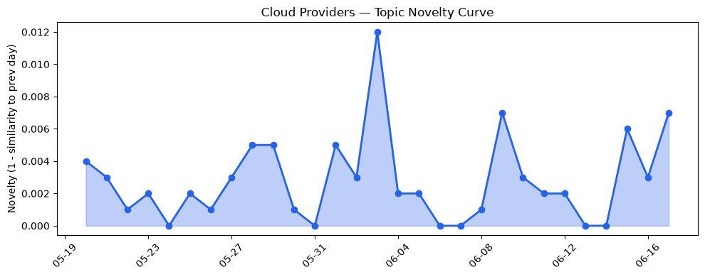
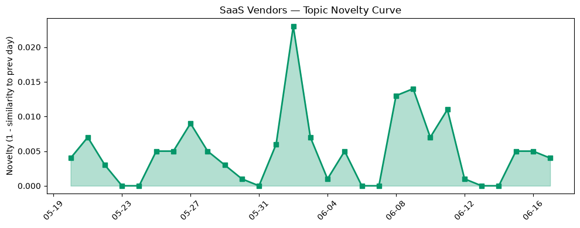

## 今日云计算结构性变化
> 今日云计算和SaaS产业结构性变化的核心判断是：云厂商和SaaS厂商正在加速推进AI和云原生技术的融合，推动数字化转型和企业上云的进程。
云计算和SaaS的结构性变化主要体现在技术层、基础设施、应用层和资本流向等方面。技术层方面，云原生技术的推进和基础设施的更新是主要的变化点。基础设施方面，云厂商的定价和区域扩张以及算力供应的增加是主要的变化点。应用层方面，企业上云和数字化转型的推进是主要的变化点。资本流向方面，云计算和SaaS的融资方向和估值水平是主要的变化点。

## 技术层信号
🔴 重大突破

云原生技术的推进，如Microsoft Azure的新VMs和Cloudflare的Agents SDK，是技术层信号的主要体现。同时，基础设施的更新，如火山引擎的新数据产品和Cloudflare的Security Insights系统，也是技术层信号的重要组成部分。这些变化表明，云厂商正在加速推进云原生技术和基础设施的更新，推动数字化转型和企业上云的进程。
例如，AWS的新VMs和Cloudflare的Agents SDK是云原生技术的重要体现，能够帮助企业更好地利用云计算资源。同时，火山引擎的新数据产品和Cloudflare的Security Insights系统也是基础设施的重要更新，能够帮助企业更好地管理和保护自己的数据。

## 产业资本信号
🔴 强信号

云计算和SaaS的融资方向和估值水平是产业资本信号的主要体现。例如，Uncle Sam对Alphabet spinoff的投资和AWS的连续agentic DevOps是产业资本信号的重要体现。这些变化表明，云计算和SaaS的融资方向和估值水平正在不断变化，推动数字化转型和企业上云的进程。
例如，Uncle Sam对Alphabet spinoff的投资是产业资本信号的重要体现，能够帮助Alphabet spinoff更好地发展自己的业务。同时，AWS的连续agentic DevOps也是产业资本信号的重要体现，能够帮助AWS更好地提供自己的服务。

## 潜在拐点判断
今日信号和历史趋势表明，云计算和SaaS产业结构性变化可能存在潜在拐点。技术层信号的重大突破和产业资本信号的强信号表明，云厂商和SaaS厂商正在加速推进AI和云原生技术的融合，推动数字化转型和企业上云的进程。这些变化可能会带来新的发展机遇和挑战，企业需要及时应对和调整自己的战略。

## 明日观察点
1. 观察云厂商和SaaS厂商的技术层信号和产业资本信号的变化。
2. 观察企业上云和数字化转型的推进情况。
3. 观察云计算和SaaS的融资方向和估值水平的变化。

## 长期趋势坐标
今日信号和历史趋势表明，云计算和SaaS产业结构性变化的长期趋势坐标是：云厂商和SaaS厂商正在加速推进AI和云原生技术的融合，推动数字化转型和企业上云的进程。这些变化可能会带来新的发展机遇和挑战，企业需要及时应对和调整自己的战略。

## 数据洞察
### 云厂商话题演化
今日云厂商话题演化的数据洞察报告显示，云厂商话题的新颖性评分为0.025，均值相似度为0.975，趋势为延续。这些数据表明，云厂商话题在最近30天内保持了相对稳定的趋势。
### SaaS厂商话题演化
今日SaaS厂商话题演化的数据洞察报告显示，SaaS厂商话题的新颖性评分为0.061，均值相似度为0.939，趋势为延续。这些数据表明，SaaS厂商话题在最近30天内保持了相对稳定的趋势。
### 趋势图

## 参考来源
- [Introducing Amazon Bedrock Managed Knowledge Base for faster, more accurate enterprise AI applications](https://aws.amazon.com/blogs/aws/introducing-amazon-bedrock-managed-knowledge-base-for-faster-more-accurate-enterprise-ai-applications/)
- [Now available: Amazon EC2 M9g and M9gd instances powered by new AWS Graviton5 processors](https://aws.amazon.com/blogs/aws/now-available-amazon-ec2-m9g-and-m9gd-instances-powered-by-new-aws-graviton5-processors/)
- [Cloud Network Insights: end-to-end observability for the Cross-Cloud Network](https://cloud.google.com/blog/products/networking/cloud-network-insights-end-to-end-cross-cloud-observability/)
- [Introducing Brazos: Bringing liquid cooling to air-cooled data centers](https://cloud.google.com/blog/topics/systems/brazos-liquid-cooling-system-for-air-cooled-data-centers/)
- [3 things leaders need to know from Microsoft Build 2026](https://azure.microsoft.com/en-us/blog/3-things-leaders-need-to-know-from-microsoft-build-2026/)
- [Bringing more agent harnesses and frameworks to Cloudflare, starting with Flue](https://blog.cloudflare.com/agents-platform-flue-sdk/)
- [New Azure Cobalt 200 VMs deliver 50% performance improvement, fully optimized for modern agentic AI workloads](https://azure.microsoft.com/en-us/blog/new-azure-cobalt-200-vms-deliver-50-performance-improvement-fully-optimized-for-modern-agentic-ai-workloads/)
- [Route public traffic to private applications with Cloudflare](https://blog.cloudflare.com/private-origins-dns-routing/)
- [Turning Cloudflare’s threat indicators into real-time WAF rules](https://blog.cloudflare.com/realtime-threat-intel-waf-rules/)
- [Your AI bill is out of control. Cloudflare can fix it now.](https://blog.cloudflare.com/ai-gateway-spend-limits/)
- [Securing the Agentic Enterprise: Why Trust is the Engine of Headless 360](https://www.salesforce.com/blog/headless-360-security/)
- [Field Service: A Revenue Engine for Asset-Intensive Industries](https://www.salesforce.com/blog/field-service-asset-revenue/)
- [How to get indexed by ChatGPT [2026]](https://blog.hubspot.com/marketing/how-to-get-indexed-by-chatgpt)
- [Microsoft’s Copilot can now build apps and automate your job — here’s how it works](https://venturebeat.com/technology/microsofts-copilot-can-now-build-apps-and-automate-your-job-heres-how-it)
- [Announcing Microsoft Discovery general availability and Microsoft Discovery app preview](https://azure.microsoft.com/en-us/blog/announcing-microsoft-discovery-general-availability-and-microsoft-discovery-app-preview/)
- [Introducing the Cloudflare One stack: agent-powered deployment](https://blog.cloudflare.com/cloudflare-one-stack/)
- [World model maker Odyssey nabs $1.45B valuation backed by Amazon and other big names](https://techcrunch.com/2026/06/17/world-model-maker-odyssey-nabs-1-45b-valuation-backed-by-amazon-and-other-big-names/)
- [Amazon and Chobani adopt Strella's AI interviews for customer research as fast-growing startup raises $14M](https://venturebeat.com/technology/amazon-and-chobani-adopt-strellas-ai-interviews-for-customer-research-as)
- [Uncle Sam bets $500M that Alphabet spinoff's AI can dig up new semiconductor materials](https://www.theregister.com/systems/2026/06/17/uncle-sam-bets-500m-that-alphabet-spinoffs-ai-can-dig-up-new-semiconductor-materials/5257854)
- [Growing the Cloudflare AI team with talent from Ensemble AI](https://blog.cloudflare.com/ensemble-ai-talent-joins-cloudflare/)
- [FTC lawsuit reveals how subscription scam networks evade app store enforcement](https://techcrunch.com/2026/06/17/ftc-lawsuit-reveals-how-subscription-scam-networks-evade-app-store-enforcement/)
- [Cybercriminals allegedly hacked tens of thousands of Fortinet firewalls used by major companies all over the world](https://techcrunch.com/2026/06/17/cybercriminals-allegedly-hacked-tens-of-thousands-of-fortinet-firewalls-used-by-major-companies-all-over-the-world/)
- [Digital sovereignty needs an operating model](https://www.theregister.com/security/2026/06/17/digital-sovereignty-needs-an-operating-model/5254631)
- [Only half of US datacenter capacity planned for 2026 is actually under construction](https://www.theregister.com/on-prem/2026/06/17/only-half-of-us-datacenter-capacity-planned-for-2026-is-actually-under-construction/5257781)