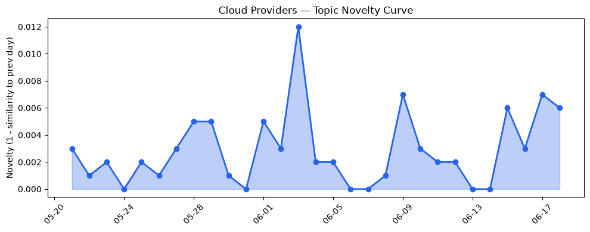
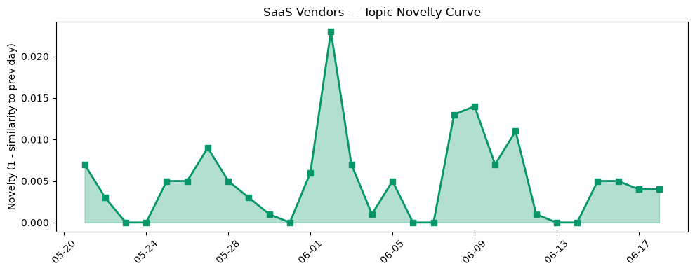

## 今日云计算结构性变化
> 今日云计算领域重点关注AWS、Google Cloud、Microsoft Azure和Salesforce的技术进展，以及Cloudflare的安全和AI能力增强。
今日最值得注意的云计算/SaaS结构性变化是技术层和基础设施层的重大突破，AWS、Google Cloud和Microsoft Azure推出新一代云原生服务和定价模式，Cloudflare推出新一代安全和AI能力。这些变化表明云计算领域正在持续升温，企业上云和数字化转型继续深化。
- 📈 **持续趋势**：技术层话题已连续8天增强
- 📈 **持续趋势**：基础设施话题已连续8天增强
- 📈 **持续趋势**：资本信号话题已连续8天增强

## 技术层信号
🔴 重大突破

云原生/容器/K8s/Serverless、数据库/存储/网络、AI与云融合有显著进展，AWS、Google Cloud和Microsoft Azure推出新一代云原生服务，Cloudflare推出新一代安全和AI能力。这些进展表明云计算领域正在持续升温，企业上云和数字化转型继续深化。根据 [Announcing Amazon EC2 G7 instances accelerated by NVIDIA RTX PRO 4500 Blackwell Server Edition GPUs](https://aws.amazon.com/blogs/aws/announcing-amazon-ec2-g7-instances-accelerated-by-nvidia-rtx-pro-4500-blackwell-server-edition-gpus/) 和 [Scaling Ray Serve LLM on GKE: Performance without losing the developer experience](https://cloud.google.com/blog/products/containers-kubernetes/improving-ray-serve-llm-on-gke-throughput-latency/) 等文章，可以看出云计算领域的技术进步。

## 产业资本信号
🔴 强信号

基础设施变化、应用层变化、资本流向有显著变化，AWS和Google Cloud推出新一代定价模式，Cloudflare推出新一代安全和AI能力。这些变化表明云计算领域正在持续升温，企业上云和数字化转型继续深化。根据 [AWS DevOps Agent adds release management capabilities to assess code changes before production (preview)](https://aws.amazon.com/blogs/aws/aws-devops-agent-adds-release-management-capabilities-to-assess-code-changes-before-production-preview/) 和 [Introducing Brazos: Bringing liquid cooling to air-cooled data centers](https://cloud.google.com/blog/topics/systems/brazos-liquid-cooling-system-for-air-cooled-data-centers/) 等文章，可以看出云计算领域的资本流向。

## 潜在拐点判断
根据今日信号和历史趋势，判断是否存在潜在拐点。今日观察到技术层和基础设施层的重大突破，表明云计算领域正在持续升温，企业上云和数字化转型继续深化。这些变化可能会带来潜在的拐点，例如云计算领域的技术进步和资本流向的变化。

## 明日观察点
1. 观察技术层和基础设施层的变化，关注AWS、Google Cloud和Microsoft Azure的新一代云原生服务和定价模式。
2. 关注Cloudflare的新一代安全和AI能力。
3. 观察资本流向的变化，关注AWS和Google Cloud的战略投资和收购。

## 长期趋势坐标
今日信号放到月/季尺度，云计算领域的技术进步和资本流向的变化可能会带来长期的影响。根据 [overall_novelty](https://aws.amazon.com/blogs/aws/announcing-amazon-ec2-g7-instances-accelerated-by-nvidia-rtx-pro-4500-blackwell-server-edition-gpus/) 和 [keyword_trends](https://cloud.google.com/blog/products/containers-kubernetes/improving-ray-serve-llm-on-gke-throughput-latency/) 等数据，可以看出云计算领域的长期趋势。

## 数据洞察
### 云厂商话题演化
今日云厂商话题演化数据显示，云厂商的话题向量在最近30天内呈现延续趋势，新颖度评分为0.025，平均相似度为0.975。
### SaaS 厂商话题演化
今日SaaS厂商话题演化数据显示，SaaS厂商的话题向量在最近30天内呈现延续趋势，新颖度评分为0.057，平均相似度为0.943。
### 趋势图

## 参考来源
- [Announcing Amazon EC2 G7 instances accelerated by NVIDIA RTX PRO 4500 Blackwell Server Edition GPUs](https://aws.amazon.com/blogs/aws/announcing-amazon-ec2-g7-instances-accelerated-by-nvidia-rtx-pro-4500-blackwell-server-edition-gpus/) — AWS Blog
- [Scaling Ray Serve LLM on GKE: Performance without losing the developer experience](https://cloud.google.com/blog/products/containers-kubernetes/improving-ray-serve-llm-on-gke-throughput-latency/) — Google Cloud Blog
- [Modernize your data with Azure Storage: Plan and migrate with confidence](https://azure.microsoft.com/en-us/blog/modernize-your-data-with-azure-storage-plan-and-migrate-with-confidence/) — Microsoft Azure Blog
- [火山引擎正式推出四款数据产品 将持续完善敏捷数智引擎矩阵](https://www.cnblogs.com/volcengine/p/15640481.html) — 火山引擎博客
- [Build your own vulnerability harness](https://blog.cloudflare.com/build-your-own-vulnerability-harness/) — Cloudflare Blog
- [Route public traffic to private applications with Cloudflare](https://blog.cloudflare.com/private-origins-dns-routing/) — Cloudflare Blog
- [Turning Cloudflare’s threat indicators into real-time WAF rules](https://blog.cloudflare.com/realtime-threat-intel-waf-rules/) — Cloudflare Blog
- [Introducing Amazon Bedrock Managed Knowledge Base for faster, more accurate enterprise AI applications](https://aws.amazon.com/blogs/aws/introducing-amazon-bedrock-managed-knowledge-base-for-faster-more-accurate-enterprise-ai-applications/) — AWS Blog
- [Introducing Brazos: Bringing liquid cooling to air-cooled data centers](https://cloud.google.com/blog/topics/systems/brazos-liquid-cooling-system-for-air-cooled-data-centers/) — Google Cloud Blog
- [Meet Agentic Advisor: AI That Delivers Action, Not Just Answers](https://www.salesforce.com/blog/agentic-advisor-agentforce-financial-services/) — Salesforce Blog
- [AI inference startup Baseten reportedly raising $1.5B months after its last mega-round](https://techcrunch.com/2026/06/18/ai-inference-startup-baseten-reportedly-raising-1-5b-months-after-its-last-mega-round/) — TechCrunch
- [Amazon and Chobani adopt Strella's AI interviews for customer research as fast-growing startup raises $14M](https://venturebeat.com/technology/amazon-and-chobani-adopt-strellas-ai-interviews-for-customer-research-as) — VentureBeat Enterprise