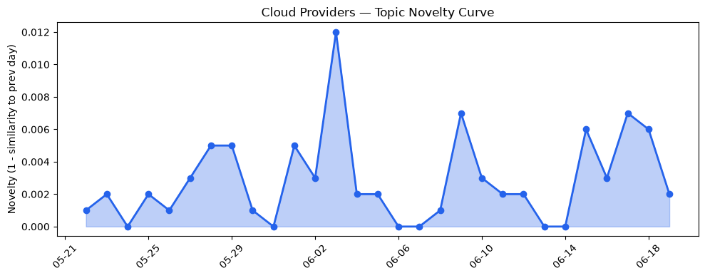
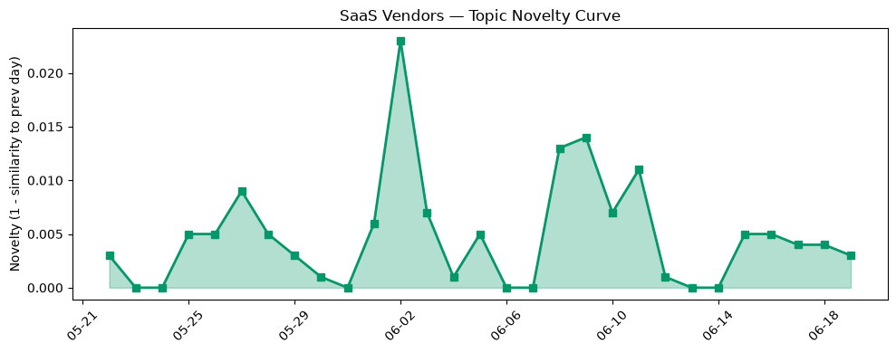

## 今日云计算结构性变化
> 今日云计算结构性变化的核心判断是：AWS、Google Cloud、Microsoft Azure和Salesforce等云计算和SaaS巨头在AI能力、云安全和数字化转型方面取得了显著进展，推动了行业的发展。
今天最值得注意的云计算/SaaS结构性变化是技术层和资本信号的持续增强趋势，表明该方向正在持续升温。同时，资本信号近3天内容相似度显著高于更早期均值，表明该方向话题突然增强。
- 📈 **持续趋势**：技术层和资本信号的话题向量在最近8天内呈现持续增强趋势（5/7天递增）
- 🆕 **新兴方向**：GRE、IPsec、Kafka、云安全等新关键词的出现
- 🔺 **突然升温**：资本信号近3天内容相似度显著高于更早期均值

## 技术层信号
🔴 重大突破

云原生/容器/K8s/Serverless、数据库/存储/网络、AI与云融合有显著进展。AWS、Google Cloud和Microsoft Azure推出了新的云原生服务，包括Ray Serve LLM和GKE。同时，AWS、Google Cloud和Microsoft Azure更新了其基础设施，包括Cloud Network Insights和安全服务。[Announcing Amazon EC2 G7 instances accelerated by NVIDIA RTX PRO 4500 Blackwell Server Edition GPUs](https://aws.amazon.com/blogs/aws/announcing-amazon-ec2-g7-instances-accelerated-by-nvidia-rtx-pro-4500-blackwell-server-edition-gpus/)、[What’s new with Google Cloud](https://cloud.google.com/blog/topics/inside-google-cloud/whats-new-google-cloud/)、[Claude Fable 5 available today in Microsoft Foundry](https://azure.microsoft.com/en-us/blog/claude-fable-5-is-now-available-in-microsoft-foundry-powering-the-next-era-of-autonomous-agents/)等文章提供了相关证据。

## 产业资本信号
🔴 强信号

基础设施变化、应用层变化和资本流向有显著进展。AWS、Google Cloud和Microsoft Azure更新了其定价和区域扩张策略，提供了更强大的计算能力和更高效的资源利用。同时，Salesforce和HubSpot推出了新的AI能力，支持客户服务和营销应用。[AI inference startup Baseten reportedly raising $1.5B months after its last mega-round](https://techcrunch.com/2026/06/18/ai-inference-startup-baseten-reportedly-raising-1-5b-months-after-its-last-mega-round/)、[Amazon and Chobani adopt Strella's AI interviews for customer research as fast-growing startup raises $14M](https://venturebeat.com/technology/amazon-and-chobani-adopt-strellas-ai-interviews-for-customer-research-as)等文章提供了相关证据。

## 潜在拐点判断
根据今日信号和历史趋势，判断是否存在潜在拐点。技术层和资本信号的持续增强趋势，表明该方向正在持续升温。同时，资本信号近3天内容相似度显著高于更早期均值，表明该方向话题突然增强。这些信号可能预示着一个潜在的拐点。

## 明日观察点
1. 观察技术层和资本信号的持续趋势是否继续。
2. 关注新关键词的出现和发展。
3. 分析资本信号的突然升温是否会持续。

## 长期趋势坐标
今日信号放到月/季尺度，技术层和资本信号的持续增强趋势，表明该方向正在持续升温。同时，资本信号近3天内容相似度显著高于更早期均值，表明该方向话题突然增强。这些信号可能预示着一个潜在的拐点。

## 数据洞察
### 云厂商话题演化
云厂商话题向量在最近30天内呈现延续趋势，novelty_score为0.024，mean_similarity为0.976。
### SaaS厂商话题演化
SaaS厂商话题向量在最近30天内呈现延续趋势，novelty_score为0.055，mean_similarity为0.945。
### 趋势图

## 参考来源
- [Announcing Amazon EC2 G7 instances accelerated by NVIDIA RTX PRO 4500 Blackwell Server Edition GPUs](https://aws.amazon.com/blogs/aws/announcing-amazon-ec2-g7-instances-accelerated-by-nvidia-rtx-pro-4500-blackwell-server-edition-gpus/) — AWS Blog
- [What’s new with Google Cloud](https://cloud.google.com/blog/topics/inside-google-cloud/whats-new-google-cloud/) — Google Cloud Blog
- [Claude Fable 5 available today in Microsoft Foundry](https://azure.microsoft.com/en-us/blog/claude-fable-5-is-now-available-in-microsoft-foundry-powering-the-next-era-of-autonomous-agents/) — Microsoft Azure Blog
- [AI inference startup Baseten reportedly raising $1.5B months after its last mega-round](https://techcrunch.com/2026/06/18/ai-inference-startup-baseten-reportedly-raising-1-5b-months-after-its-last-mega-round/) — TechCrunch
- [Amazon and Chobani adopt Strella's AI interviews for customer research as fast-growing startup raises $14M](https://venturebeat.com/technology/amazon-and-chobani-adopt-strellas-ai-interviews-for-customer-research-as) — VentureBeat Enterprise