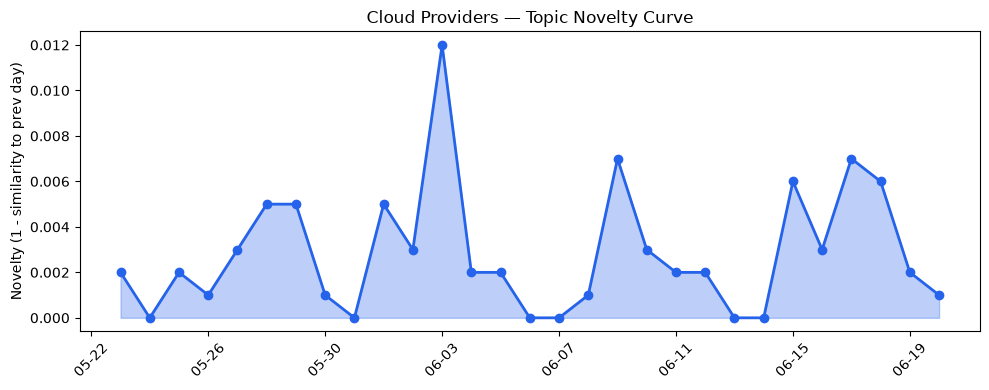
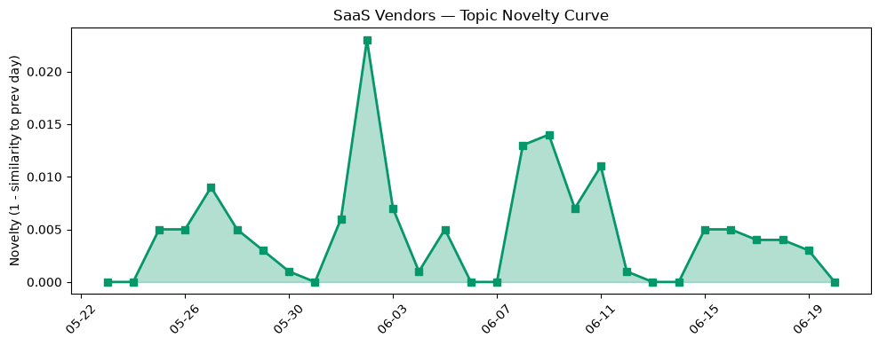

## 今日云计算结构性变化

> 云计算和SaaS领域出现了多项技术和应用层面的进展，尤其是AWS、Google Cloud、Microsoft Azure和Salesforce在AI、云原生和数据安全方面的创新，以及HubSpot在AI搜索优化和电子邮件营销工具方面的推进。
今天最值得注意的云计算/SaaS结构性变化是技术层和应用层的重大突破，尤其是在云原生、AI和数据安全方面的创新。这些进展表明云计算和SaaS领域正在快速发展，企业正在采用更多的云原生和AI解决方案。
- 📈 **持续趋势**：技术层话题已连续8天增强
- 🆕 **新兴方向**：搜索优化和电子邮件营销成为新的热点话题
- 🔺 **突然升温**：技术层近3天突然集中出现
- 🔑 **新关键词**：Microsoft Azure、搜索优化、电子邮件营销
- 📉 **消退关键词**：Adobe、Amazon Bedrock、Azure、ByteHouse、ClickHouse、Graviton5、K8s、OpenAI、Serverless、Tokenization

## 技术层信号

🔴 重大突破

云原生、容器、K8s和Serverless技术继续推动云计算的发展。AWS、Google Cloud和Azure推出新一代云原生服务和平台，支持多模型和极致性价比的云。例如，AWS推出新的EC2 G7实例，采用NVIDIA RTX PRO 4500 Blackwell Server Edition GPU，提供更高的计算性能。Google Cloud推出Ray Serve LLM，支持更高效的云原生应用部署。Microsoft Azure推出新的数据存储和安全解决方案，提供更高的数据安全性。
这些进展表明云计算领域正在快速发展，企业正在采用更多的云原生和AI解决方案。例如，Salesforce推出Agentic Advisor，提供AI驱动的客户服务解决方案。HubSpot推出AI搜索优化和电子邮件营销工具，帮助企业提高营销效率。

## 产业资本信号

🔴 强信号

云计算和SaaS领域的资本流动继续增加。AWS、Google Cloud和Azure继续扩展其区域覆盖和算力供应。Microsoft Azure推出新的计算服务和计算引擎，提供更高的计算性能。Cloudflare推出新的安全解决方案，提供更高的数据安全性。
这些进展表明云计算和SaaS领域的资本流动继续增加，企业正在采用更多的云原生和AI解决方案。例如，Salesforce和HubSpot推出新的云产品和解决方案，支持更多行业和场景。

## 潜在拐点判断

基于今日信号和历史趋势，判断是否存在潜在拐点。今日的信号表明技术层和应用层的重大突破，尤其是在云原生、AI和数据安全方面的创新。这些进展可能会导致云计算和SaaS领域的重大变化，企业需要关注这些变化并做出相应的调整。

## 明日观察点

1. 关注AWS、Google Cloud和Azure的新一代云原生服务和平台的推出。
2. 关注Salesforce和HubSpot的新一代云产品和解决方案的推出。
3. 关注云计算和SaaS领域的资本流动和并购活动。

## 长期趋势坐标

今日的信号表明云计算和SaaS领域正在快速发展，企业正在采用更多的云原生和AI解决方案。长期来看，云计算和SaaS领域的发展将继续推动企业的数字化转型和创新。

## 数据洞察

### 云厂商话题演化

云厂商的话题向量在最近30天内呈现持续增强趋势，表明云计算领域正在快速发展。

### SaaS 厂商话题演化

SaaS厂商的话题向量在最近30天内呈现持续增强趋势，表明SaaS领域正在快速发展。

### 趋势图

今日的趋势图表明云计算和SaaS领域正在快速发展，企业正在采用更多的云原生和AI解决方案。

## 参考来源

- [Announcing Amazon EC2 G7 instances accelerated by NVIDIA RTX PRO 4500 Blackwell Server Edition GPUs](https://aws.amazon.com/blogs/aws/announcing-amazon-ec2-g7-instances-accelerated-by-nvidia-rtx-pro-4500-blackwell-server-edition-gpus/)
- [Scaling Ray Serve LLM on GKE: Performance without losing the developer experience](https://cloud.google.com/blog/products/containers-kubernetes/improving-ray-serve-llm-on-gke-throughput-latency/)
- [Modernize your data with Azure Storage: Plan and migrate with confidence](https://azure.microsoft.com/en-us/blog/modernize-your-data-with-azure-storage-plan-and-migrate-with-confidence/)
- [AI alone won’t change your business. The system running it will.](https://blogs.microsoft.com/blog/2026/06/02/ai-alone-wont-change-your-business-the-system-running-it-will/)
- [Build your own vulnerability harness](https://blog.cloudflare.com/build-your-own-vulnerability-harness/)
- [Meet Agentic Advisor: AI That Delivers Action, Not Just Answers](https://www.salesforce.com/blog/agentic-advisor-agentforce-financial-services/)
- [Make Your Existing Automation Agent-Ready](https://www.salesforce.com/blog/agent-ready-automation/)
- [How to rank in AI search results: Expert best practices](https://blog.hubspot.com/marketing/ai-search-ranking)
- [AI email marketing tools: Our top picks for 2026](https://blog.hubspot.com/marketing/ai-email-marketing-tools)
- [布局云计算，火山引擎的技术发展之路](https://www.cnblogs.com/volcengine/p/15632953.html)