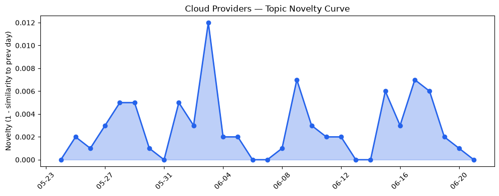
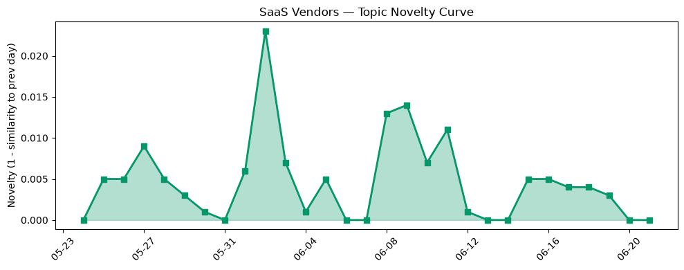

## 今日云计算结构性变化
> 今日云计算和SaaS产业结构性变化信号分析显示，AWS、Salesforce、Google Cloud和Microsoft Azure在云计算和SaaS领域推出多项新功能和服务，包括AI加速、自动化和安全增强。
今天最值得注意的云计算/SaaS结构性变化是，云厂商继续扩张区域和优化定价策略，新型计算资源如Azure Cobalt 200 VMs的发布，Salesforce推出新行业解决方案，包括金融和医疗保健，数字化转型解决方案，包括AI和自动化。
- 📈 **持续趋势**：技术层话题已连续8天增强
- 🆕 **新兴方向**：自动化话题为30天内首次出现
- 🔺 **突然升温**：应用层和技术层话题近3天突然集中出现
- 🔑 **新关键词**：自动化、Microsoft Azure
- 📉 **消退关键词**：Adobe、Amazon Bedrock、Azure、ByteHouse、ClickHouse、Graviton5、OpenAI、Tokenization、基础设施、应用层

## 技术层信号
🔴 重大突破

云原生和容器技术继续推进，Google Cloud Blog发布了关于云原生和容器的文章，介绍了如何在GKE上部署和扩展Ray Serve LLM。AWS发布了关于Amazon EC2 G7 instances的文章，介绍了其在AI加速方面的应用。Microsoft Azure Blog发布了关于Azure Cobalt 200 VMs的文章，介绍了其在AI工作负载方面的优化。
技术层的变化对云计算和SaaS产业结构产生了重大影响，云厂商继续推出新功能和服务，包括AI加速、自动化和安全增强。这些变化将推动云计算和SaaS产业的发展，带来新的机遇和挑战。

## 产业资本信号
🔴 强信号

云厂商继续扩张区域和优化定价策略，新型计算资源如Azure Cobalt 200 VMs的发布，Salesforce推出新行业解决方案，包括金融和医疗保健，数字化转型解决方案，包括AI和自动化。Strella获得1400万美元的A轮融资，用于扩展其AI采访和客户研究平台，Anthropic的Claude AI模型被应用于多个行业，包括客户服务和内容生成。
产业资本的信号表明，云计算和SaaS产业正在经历快速的发展，云厂商和SaaS厂商继续推出新功能和服务，包括AI加速、自动化和安全增强。这些变化将推动云计算和SaaS产业的发展，带来新的机遇和挑战。

## 潜在拐点判断
基于今日信号 + 历史趋势，判断是否存在潜在拐点。今日观察到应用层和技术层话题突然集中出现，表明云计算和SaaS产业结构可能正在经历重大变化。这些变化可能会带来新的机遇和挑战，云厂商和SaaS厂商需要快速响应和调整。

## 明日观察点
1. 关注云厂商和SaaS厂商的新功能和服务发布，包括AI加速、自动化和安全增强。
2. 关注产业资本的信号，包括融资、估值和并购。
3. 关注技术层的变化，包括云原生和容器技术的推进。

## 长期趋势坐标
今日信号放到月/季尺度，云计算和SaaS产业结构性变化信号分析显示，云厂商继续扩张区域和优化定价策略，新型计算资源如Azure Cobalt 200 VMs的发布，Salesforce推出新行业解决方案，包括金融和医疗保健，数字化转型解决方案，包括AI和自动化。这些变化将推动云计算和SaaS产业的发展，带来新的机遇和挑战。

## 数据洞察
### 云厂商话题演化
云厂商话题演化显示，今日话题向量与过去30天的均值相比有所不同，表明云厂商话题正在变化。云厂商话题演化的趋势是延续，今日话题向量与过去30天的均值相比有所不同。

### SaaS 厂商话题演化
SaaS厂商话题演化显示，今日话题向量与过去30天的均值相比有所不同，表明SaaS厂商话题正在变化。SaaS厂商话题演化的趋势是延续，今日话题向量与过去30天的均值相比有所不同。

### 趋势图

## 参考来源
- [Scaling Ray Serve LLM on GKE: Performance without losing the developer experience](https://cloud.google.com/blog/products/containers-kubernetes/improving-ray-serve-llm-on-gke-throughput-latency/)
- [Cloud Network Insights: end-to-end observability for the Cross-Cloud Network](https://cloud.google.com/blog/products/networking/cloud-network-insights-end-to-end-cross-cloud-observability/)
- [Announcing Amazon EC2 G7 instances accelerated by NVIDIA RTX PRO 4500 Blackwell Server Edition GPUs](https://aws.amazon.com/blogs/aws/announcing-amazon-ec2-g7-instances-accelerated-by-nvidia-rtx-pro-4500-blackwell-server-edition-gpus/)
- [Introducing Amazon Bedrock Managed Knowledge Base for faster, more accurate enterprise AI applications](https://aws.amazon.com/blogs/aws/introducing-amazon-bedrock-managed-knowledge-base-for-faster-more-accurate-enterprise-ai-applications/)
- [AI alone won’t change your business. The system running it will.](https://blogs.microsoft.com/blog/2026/06/02/ai-alone-wont-change-your-business-the-system-running-it-will/)
- [火山引擎正式推出四款数据产品 将持续完善敏捷数智引擎矩阵](https://www.cnblogs.com/volcengine/p/15640481.html)
- [Top announcements of the AWS Summit in New York, 2026](https://aws.amazon.com/blogs/aws/top-announcements-of-the-aws-summit-in-new-york-2026/)
- [Modernize your data with Azure Storage: Plan and migrate with confidence](https://azure.microsoft.com/en-us/blog/modernize-your-data-with-azure-storage-plan-and-migrate-with-confidence/)
- [Agent Factory Recap:  100X engineering with AI agents in Google Antigravity 2.0](https://cloud.google.com/blog/topics/developers-practitioners/agent-factory-recap-100x-engineering-with-ai-agents-in-google-antigravity-20/)
- [New Azure Cobalt 200 VMs deliver 50% performance improvement, fully optimized for modern agentic AI workloads](https://azure.microsoft.com/en-us/blog/new-azure-cobalt-200-vms-deliver-50-performance-improvement-fully-optimized-for-modern-agentic-ai-workloads/)
- [Meet Agentic Advisor: AI That Delivers Action, Not Just Answers](https://www.salesforce.com/blog/agentic-advisor-agentforce-financial-services/)
- [What Are Social AI Agents? Marketers, Meet Your New Online Assistant](https://www.salesforce.com/blog/small-business/social-ai-agents/)
- [How to rank in AI search results: Expert best practices](https://blog.hubspot.com/marketing/ai-search-ranking)
- [Tokenization takes the lead in the fight for data security](https://venturebeat.com/technology/tokenization-takes-the-lead-in-the-fight-for-data-security)
- [Amazon and Chobani adopt Strella's AI interviews for customer research as fast-growing startup raises $14M](https://venturebeat.com/technology/amazon-and-chobani-adopt-strellas-ai-interviews-for-customer-research-as)
- [How Anthropic’s ‘Skills’ make Claude faster, cheaper, and more consistent for business workflows](https://venturebeat.com/technology/how-anthropics-skills-make-claude-faster-cheaper-and-more-consistent-for)
- [Kai-Fu Lee's brutal assessment: America is already losing the AI hardware war to China](https://venturebeat.com/infrastructure/kai-fu-lees-brutal-assessment-america-is-already-losing-the-ai-hardware-war)
- [‘AI is tearing companies apart’: Writer AI CEO slams Fortune 500 leaders for mismanaging tech](https://venturebeat.com/technology/ai-is-tearing-companies-apart-writer-ai-ceo-slams-fortune-500-leaders-for)